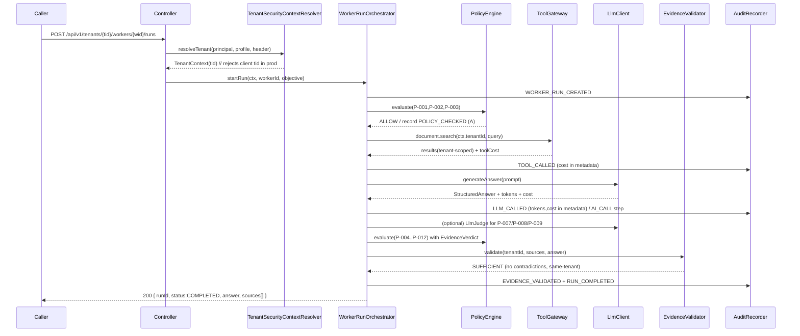
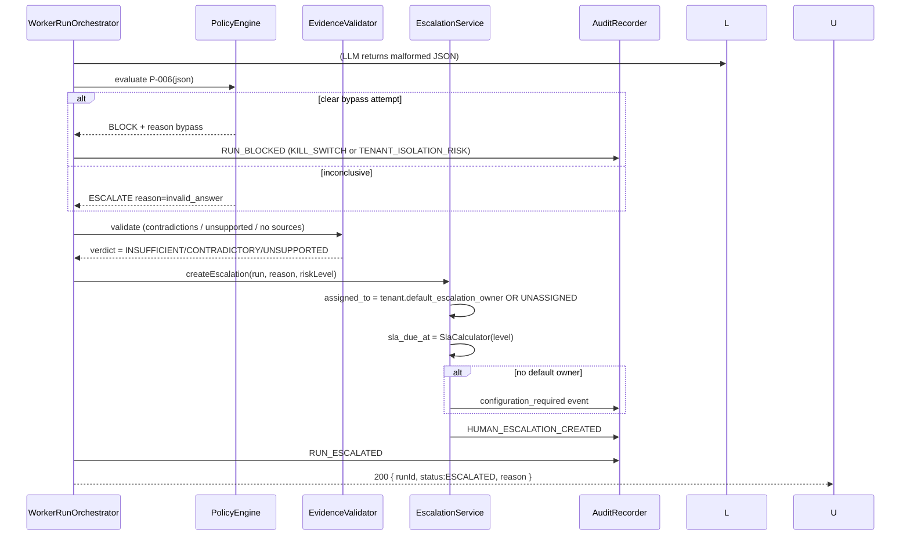
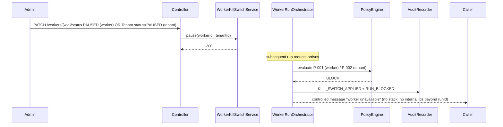

# Design: DocumentalWorkerMVP-v2

> Generated technical artifact — English. Source of truth:
> `docs/analisis-requisitos-documentalworker-mvp-enriquecido.md` (1647 lines) and
> the 17 specs under `openspec/changes/DocumentalWorkerMVP-v2/specs/`.
> Prior change `DocumentalWorkers/design.md` is reused only for package layout
> convention (`com.leovinci.aiworkers.documentalworker` single slice); this
> change supersedes it. The 12 user decisions are honored verbatim and NOT
> re-decided.

## 1. Technical Approach

Hexagonal layout inside the existing Spring Boot module `aiworkers`. The prior
single package `com.leovinci.aiworkers.documentalworker` is refactored into a
**modular monolith** of capability packages (RNF5 worker isolation); each
capability owns its entities, ports (interfaces), and adapters. The domain core
(`run`, `answer`, `evidence`, `policy`) depends only on ports; LLM, tool,
storage, and audit are adapters. The orchestrator of a run is a thin
`WorkerRunOrchestrator` that executes the ordered flow
(policy → search → answer → evidence → respond/escalate) and records every step
and audit event. Policy is deterministic and never defers to LLM confidence
(§1.2 L56-62; spec: policy-engine/spec.md). Tenant is a security frontier
resolved at the auth boundary, not a client field (§1.4 L81; spec:
tenant-management/spec.md). Cost is real from day 1, flowing through
`LlmClient` and `ToolGateway` return values into `WorkerRun.estimated_cost` and
`AuditEvent.metadata` (decision #4; spec: cost-and-observability/spec.md,
llm-client-contract/spec.md).

> Maps to proposal approach: fresh multi-capability spec set; reused code as
> foundation, refactored to new contracts; policy deterministic; tenant as
> security frontier; cost real from day 1.

## 2. Architecture Overview

```text
                         ┌──────────────────────────────────────────┐
  HTTP (REST §13) ──►    │  adapters/inbound (controllers)         │
                         │  + TenantSecurityContextResolver (auth)  │
                         └─────────────────┬────────────────────────┘
                                           │  TenantContext (resolved tenant_id)
                                           ▼
                         ┌──────────────────────────────────────────┐
                         │  run/WorkerRunOrchestrator  (ordered flow) │
                         │  policy/PolicyEngine (P-001..P-012)       │
                         │  answer/StructuredAnswerService           │
                         │  evidence/EvidenceValidator                │
                         │  escalation/EscalationService + SLA        │
                         └───────┬──────────────┬──────────────┬──────┘
                                 │ ports        │ ports        │ ports
                                 ▼              ▼              ▼
                       ┌──────────────┐ ┌──────────────┐ ┌──────────────┐
                       │ LlmClient    │ │ ToolGateway   │ │ AuditRecorder │
                       │ (port)       │ │ (port)        │ │ (port)        │
                       └──────┬───────┘ └──────┬───────┘ └──────┬───────┘
                              │                │               │
                       Fake/Real LLM   Fake/Real Tool     JpaAuditRecorder
                              │                │               │
                              ▼                ▼               ▼
                       ┌──────────────────────────────────────────────┐
                       │  JPA entities + Flyway (PostgreSQL)            │
                       │  all tenant-scoped tables: tenant_id NOT NULL  │
                       └──────────────────────────────────────────────┘
```

**Worker isolation principle (RNF5):** each capability package exposes only its
ports to `run`; it never reaches into another capability's repositories. A new
worker type adds a capability package, not edits to `run`. Cross-capability
coordination happens exclusively through the orchestrator and port interfaces.

## 3. Module / Package Boundaries (RNF5)

Concrete package tree under `aiworkers/src/main/java/com/leovinci/aiworkers/`:

```text
com.leovinci.aiworkers
├── AiworkersApplication                      (existing Spring Boot entry)
├── shared
│   ├── tenant   → TenantContext, TenantSecurityContextResolver, TenantProfileChecker
│   ├── audit    → AuditEventDto, AuditRecorder (port), AuditEventEmitter
│   └── clock    → BusinessClock (laborables SLA date math)
├── tenant       → Tenant, TenantRepository, TenantAdminController      (RF0)
├── worker       → WorkerIdentity, WorkerIdentityRepository, WorkerKillSwitchService  (RF1, RF12)
├── run          → WorkerRun, WorkerRunOrchestrator, RunState            (RF2)
├── step         → WorkerStep, StepRecorder                              (RF3)
├── document     → DocumentSource, DocumentChunk, DocumentSearchService  (RF4)
├── tool         → ToolGateway (port), DocumentSearchTool, ToolCost      (RF5, RF13)
├── llm          → LlmClient (port), FakeLlmClient, ProviderLlmClient, LlmCost  (RF6)
├── answer       → StructuredAnswer, StructuredAnswerParser, StructuredAnswerService  (RF7)
├── evidence     → EvidenceValidator, EvidenceVerdict                    (RF8)
├── policy       → PolicyEngine, PolicyRuleRegistry, P001..P012, HybridDetector, LlmJudgeClient  (RF9)
├── escalation   → HumanEscalation, EscalationService, SlaCalculator, SlaBreachChecker  (RF10)
├── audit        → AuditEvent (entity), AuditEventType, JpaAuditRecorder  (RF11)
├── cost         → CostAggregator, CostThresholdChecker (P-012)           (RNF3, RNF7)
├── minimization → DeletionService, ChunkInvalidator                     (RNF2)
├── pilot        → PilotValidationConfig, PilotValidationService         (RVB1-3)
├── classify     (optional, RF14) → ClassificationTool, ClassificationOutput
└── extract      (optional, RF15) → ExtractionTool, ExtractionRecord, ExtractionField
```

Each package has a sibling `...Repository` (JPA) and a `...` test slice. No
package imports another's entities directly except through DTOs/ports exported
by the owning package. `run` is the only package that wires capabilities
together.

> Source: `spec: worker-identity-and-kill-switch/spec.md`, `spec:
> worker-run-lifecycle/spec.md`; doc §8 RNF5 (L846-855).

## 4. Entity Model

All tenant-scoped entities carry `tenant_id NOT NULL` + index (decision #9;
spec: tenant-management/spec.md). Fields listed exactly per specs.

| Entity | Key fields (spec-verified) | Source |
|---|---|---|
| `Tenant` | id, name, status(ACTIVE/PAUSED/DISABLED), default_escalation_owner, created_at, updated_at | tenant-management |
| `WorkerIdentity` | id, tenant_id, name, worker_type, status(ACTIVE/PAUSED/DISABLED), version, policy_version, allowed_tools(default [document.search]), max_risk_level, created_at, updated_at | worker-identity-and-kill-switch |
| `WorkerRun` | id, tenant_id, worker_id, requested_by, objective, status(RUNNING/COMPLETED/FAILED/ESCALATED/BLOCKED), risk_level, worker_version, policy_version, llm_provider, llm_model, estimated_cost, started_at, finished_at, requires_human_escalation, final_answer_summary, failure_reason | worker-run-lifecycle |
| `WorkerStep` | id, tenant_id, worker_run_id, step_order, step_type(POLICY_CHECK/TOOL_CALL/AI_CALL/EVIDENCE_VALIDATION/ESCALATION/AUDIT), status(PENDING/RUNNING/COMPLETED/FAILED/SKIPPED/BLOCKED), input_summary, output_summary, latency_ms, started_at, finished_at, error_code, error_message | worker-step-traceability |
| `DocumentSource` | id, tenant_id, title, source_type, source_uri, document_date, version_label, checksum, status(ACTIVE/ARCHIVED/DELETED), created_at, updated_at, deleted_at | document-corpus-management |
| `DocumentChunk` | id, tenant_id, document_source_id, chunk_index, content, content_summary, metadata, created_at, deleted_at | document-corpus-management |
| `ToolCall` | id, tenant_id, worker_run_id, worker_step_id, tool_name, input_summary, output_summary, cost, latency_ms, created_at | tool-gateway |
| `LlmCall` | id, tenant_id, worker_run_id, worker_step_id, provider, model, tokens, cost, latency_ms, input_summary, output_summary, created_at | llm-client-contract |
| `StructuredAnswer` | (JSON contract — see §5) | structured-answer-contract |
| `Evidence` | id, tenant_id, worker_run_id, document_source_id, chunk_id, excerpt, relevance_score, contradictions_json, verdict | evidence-validation |
| `PolicyEvaluation` | id, tenant_id, worker_run_id, policy_version, rules_evaluated[], decision(ALLOW/BLOCK/ESCALATE), reasons[], required_action, created_at | policy-engine |
| `HumanEscalation` | id, tenant_id, worker_run_id, reason, risk_level, status(PENDING/IN_REVIEW/APPROVED/REJECTED/RESOLVED/EXPIRED), assigned_to, created_at, reviewed_at, resolved_at, sla_due_at, resolution_type, resolution_notes | human-escalation |
| `AuditEvent` | id, tenant_id, worker_id, worker_run_id, event_type, action, result, policy_version, policy_decision, tool_name, created_at, metadata(jsonb) | audit-traceability |
| `PilotValidationConfig` | id, tenant_id, process_description, process_owner, estimated_current_time, real_questions(jsonb ≥10), success_metric(jsonb target+unit), stop_criterion(jsonb condition+threshold), cost_threshold, status, created_at, updated_at | pilot-validation-config |
| `ClassificationOutput` (opt RF14) | id, tenant_id, worker_run_id, document_id, predicted_type, confidence, sources[], requires_escalation, escalation_reason | document-classification-rf14 |
| `ExtractionRecord` (opt RF15) | id, tenant_id, worker_run_id, document_id, document_type, provider_or_client, dates, costs, activity, priority, status, source_name, source_date, extraction_status, human_review_required, risk_level, field_sources[] | field-extraction-rf15 |

## 5. StructuredAnswer JSON Schema (unified contract)

Consumed/produced by `answer`, `evidence`, `policy` (P-004/P-006/P-007),
`escalation`, and the optional `classify`/`extract` outputs (parallel shape).
Verbatim from spec: structured-answer-contract/spec.md; doc §7 RF7 L520-551.

```json
{
  "answer": "string|null",
  "sources": [
    { "documentId": "string", "chunkId": "string", "title": "string", "excerptUsed": "string" }
  ],
  "requiresEscalation": "boolean",
  "escalationReason": "string|null",
  "riskLevel": "LOW|MEDIUM|HIGH|CRITICAL",
  "unsupportedClaims": ["string"],
  "detectedContradictions": ["string"]
}
```

**Parser rules:** non-JSON or schema-invalid → `requiresEscalation=true`,
`escalationReason="invalid_answer"`, never auto-FAILED (decision #5).
Empty `sources` → cannot COMPLETE (P-004 INSUFFICIENT_EVIDENCE). Non-empty
`unsupportedClaims`/`detectedContradictions` → ESCALATE (P-007). P-006 inspects
the malformed payload for clear bypass signatures (decision #7) → BLOCK; else
ESCALATE. `classify`/`extract` use the same shape minus `answer`.

> Source: spec: structured-answer-contract/spec.md; spec: policy-engine/spec.md
> (P-004/P-006/P-007); doc §7 RF7 L526-550.

## 6. Sequence Diagrams

### 6.1 Happy path: policy → search → answer → evidence → respond



### 6.2 Escalation path: invalid JSON / contradiction / unsupported claims



### 6.3 Kill switch path



## 7. PolicyEngine — Rule Registry & Detection Wiring

Unified registry enumerates P-001..P-012 (decision #3). Evaluation pipeline runs
in **priority order**; first triggered rule short-circuits to its decision
except where rules compose (cost P-012 always re-checked after each priced step).

| Order | Rule | Trigger (deterministic input) | Decision | Emitted AuditEvent |
|---|---|---|---|---|
| 1 | P-001 | worker.status ∈ {PAUSED, DISABLED} | BLOCK | RUN_BLOCKED |
| 2 | P-002 | tenant.status ∈ {PAUSED, DISABLED} | BLOCK | RUN_BLOCKED + KILL_SWITCH_APPLIED |
| 3 | P-003 | requested tool ∉ worker.allowed_tools | BLOCK | RUN_BLOCKED (TOOL_CALL step BLOCKED) |
| 4 | P-005 | evidence.tenant_id ≠ run.tenant_id | BLOCK | RUN_BLOCKED + TENANT_ISOLATION_RISK |
| 5 | P-011 | risk=CRITICAL (irreversible action) | BLOCK | RUN_BLOCKED |
| 6 | P-004 | insufficient evidence (no/empty/contradict) | ESCALATE | RUN_ESCALATED (INSUFFICIENT_EVIDENCE) |
| 7 | P-006 | invalid StructuredAnswer JSON | ESCALATE invalid_answer / **BLOCK** on clear bypass | RUN_ESCALATED or RUN_BLOCKED (both audited) |
| 8 | P-007 | contradiction detected | ESCALATE | RUN_ESCALATED (CONTRADICTORY_SOURCES) |
| 9 | P-008 | sensitive data detected | ESCALATE | RUN_ESCALATED (SENSITIVE_TOPIC) |
| 10 | P-009 | prompt injection detected | BLOCK or ESCALATE | RUN_BLOCKED or RUN_ESCALATED |
| 11 | P-010 | risk=HIGH | ESCALATE | RUN_ESCALATED (HIGH_RISK_ACTION) |
| 12 | P-012 | aggregated estimated_cost > threshold | ESCALATE / BLOCK + inform stop-criterion | RUN_ESCALATED (COST_LIMIT_EXCEEDED) |

**Hybrid detection wiring (P-007/P-008/P-009)** — decision #6:

```text
HybridDetector(ruleId, payload)
  → regex/pattern signals   (deterministic, always runs)
  → LlmJudgeClient.suggest(ruleId, payload)   (LLM only SUGGESTS, never decides)
  → merge: deterministic_signal OR llm_suggestion
  → PolicyEngine override:
        if deterministic_signal present  → decision by P-001..P-012 table (deterministic wins)
        else if only llm_suggestion       → ESCALATE (inconclusive) for P-007/P-008
                                        → P-009 inconclusive → ESCALATE
  → emit AuditEvent with both signals recorded in metadata
```

LLM confidence never flows into the decision set (§1.2 L56-62). The
`LlmJudgeClient` is invoked AFTER the structured answer is produced; it never
runs before the deterministic gates and never executes tools.

> Source: spec: policy-engine/spec.md; doc §1.2 L56-62; §7 RF9 L622-640;
> decisions #3, #5, #6, #7.

## 8. AuditEvent 12-Event Catalog

| event_type | emitted by | mandatory fields | nullable fields |
|---|---|---|---|
| WORKER_RUN_CREATED | run on start | tenant_id, worker_id, worker_run_id, action="create", created_at, metadata{requested_by, objective} | policy_decision, tool_name |
| POLICY_CHECKED | policy (each gate) | tenant_id, worker_run_id, policy_version, policy_decision, result, metadata{rules[], reasons[]} | tool_name |
| TOOL_CALLED | tool gateway | tenant_id, worker_run_id, tool_name, action, result, metadata{cost, latency_ms, input_summary} | policy_decision |
| LLM_CALLED | llm.LlmClient | tenant_id, worker_run_id, metadata{provider, model, tokens, cost, latency_ms, input_summary, output_summary} | tool_name, policy_decision |
| EVIDENCE_VALIDATED | evidence | tenant_id, worker_run_id, result, metadata{verdict, sources_count, contradictions} | tool_name |
| RUN_COMPLETED | run on success | tenant_id, worker_run_id, result, metadata{final_answer_summary, sources_count, cost} | policy_decision |
| RUN_ESCALATED | run / escalation | tenant_id, worker_run_id, result, metadata{reason, risk_level} | tool_name |
| RUN_BLOCKED | policy / kill switch | tenant_id, worker_run_id, policy_version, policy_decision=BLOCK, metadata{gate, reason} | tool_name |
| RUN_FAILED | run on infra failure | tenant_id, worker_run_id, result, metadata{failure_reason, provider_error} | tool_name, policy_decision |
| HUMAN_ESCALATION_CREATED | escalation | tenant_id, worker_run_id, metadata{reason, assigned_to, sla_due_at} | policy_decision |
| HUMAN_ESCALATION_RESOLVED | escalation (review) | tenant_id, worker_run_id, metadata{resolution_type, resolution_notes, reviewed_by} | policy_decision |
| KILL_SWITCH_APPLIED | kill switch | tenant_id, worker_id, metadata{scope: worker|tenant, actor} | worker_run_id |

`metadata` is `JSONB`. Cost-bearing events (LLM_CALLED, TOOL_CALLED) carry
non-zero `tokens`/`cost` (decision #4). Audit stores summaries, never full
sensitive prompts (RNF2; spec: data-minimization-and-retention/spec.md).

> Source: spec: audit-traceability/spec.md; doc §7 RF11 L697-727; §1.3 L64-79.

## 9. Tenant Secure-Context Flow

```text
Request ─► TenantSecurityContextResolver
   if profile == "prod":
       tenant_id = principal.claim("tenant_id")          // from OAuth2/JWT
       if request body/header/path carries tenantId       // REJECT
          → 400 + AuditEvent(field=client_supplied_tenant_rejected)
   if profile == "dev":
       tenant_id = header X-Tenant-Id (only if active) || principal.claim
 TenantContext(tenant_id) propagated as a request-scoped bean
   → every repository method takes tenant_id
   → LlmClient / ToolGateway receive tenant_id explicitly
   → AuditEvent.tenant_id set from context, never from payload
```

MVP isolation = app-layer query filter (`WHERE tenant_id = ?`) on every
repository method. RLS prep schema: `tenant_id NOT NULL` constraint + index on
every tenant-scoped table (composite `(tenant_id, …)` where a secondary key
exists). Real RLS policies deferred to Phase 2 (decision #9). An automated
isolation test (two tenants, mutual query) is mandatory (§1.4 L85).

> Source: spec: tenant-management/spec.md; doc §8 RNF1 L773-789; §13.1 L1135;
> decisions #9, #10.

## 10. Cost Return Path

```text
LlmClient.generateAnswer(prompt)
   └─► returns { StructuredAnswer, tokens, cost, latency }   (cost real, never 0 — decision #4)
ToolGateway.execute(tool, input)
   └─► returns { results, toolCost, latency }               (cost real, never 0)
CostAggregator (in run orchestrator)
   └─► accumulates per step → WorkerRun.estimated_cost
AuditRecorder
   └─► LLM_CALLED.metadata.{tokens,cost}
   └─► TOOL_CALLED.metadata.{cost}
CostThresholdChecker (P-012)
   └─► after each priced step: if estimated_cost > PilotValidationConfig.cost_threshold
        → PolicyEngine.evaluate(P-012) → ESCALATE / BLOCK + stop-criterion feed
```

No stub-zero. Fake clients return a representative non-zero unit price so the
cost pipeline is exercised from day 1 (spec: cost-and-observability/spec.md,
llm-client-contract/spec.md).

> Source: spec: cost-and-observability/spec.md, llm-client-contract/spec.md;
> doc §8 RNF7 L899-908; decision #4.

## 11. HumanEscalation SLA Workflow

```text
EscalationService.create(run, reason, riskLevel):
  assigned_to = tenant.default_escalation_owner OR "UNASSIGNED"
  if unassigned → emit AuditEvent(configuration_required)
  sla_due_at = SlaCalculator(riskLevel, BusinessClock):
        HIGH   = 4h   laborables
        MEDIUM = 1    día laboral
        LOW    = 2    días laborables                      (decision #8)
SlaBreachChecker (scheduled job + check-on-access):
  if now > sla_due_at AND status in {PENDING, IN_REVIEW}:
        status = EXPIRED / SLA_BREACHED
        raise operational flag
Close guard:
  WorkerRun cannot become COMPLETED while HumanEscalation.status ∈ {PENDING, IN_REVIEW, EXPIRED}
Review: PATCH /api/v1/tenants/{tid}/human-escalations/{eid}
        PENDING → IN_REVIEW → APPROVED|REJECTED|RESOLVED
        AuditEvent HUMAN_ESCALATION_RESOLVED; populate reviewed_at, resolved_at
```

> Source: spec: human-escalation/spec.md; doc §7 RF10 L644-692; §11 CU7
> L1082-1100; decisions #8, #11.

## 12. Data Model / Schema Sketch (DDL-ish)

Every tenant-scoped table: `tenant_id VARCHAR NOT NULL`, `INDEX (tenant_id)`,
composite where noted. No RLS policies in MVP (Phase 2).

```sql
-- Flyway V2__DocumentalWorkerMVP_v2 (extends prior V1)
CREATE TABLE tenant (
  id VARCHAR PRIMARY KEY, name VARCHAR NOT NULL,
  status VARCHAR NOT NULL CHECK (status IN ('ACTIVE','PAUSED','DISABLED')),
  default_escalation_owner VARCHAR NULL, created_at TIMESTAMPTZ NOT NULL, updated_at TIMESTAMPTZ NOT NULL);

CREATE TABLE worker_identity (
  id BIGSERIAL PRIMARY KEY, tenant_id VARCHAR NOT NULL, name VARCHAR NOT NULL,
  worker_type VARCHAR NOT NULL, status VARCHAR NOT NULL, version VARCHAR NOT NULL,
  policy_version VARCHAR NOT NULL, allowed_tools JSONB NOT NULL DEFAULT '["document.search"]',
  max_risk_level VARCHAR NOT NULL, created_at TIMESTAMPTZ NOT NULL, updated_at TIMESTAMPTZ NOT NULL);
CREATE INDEX idx_worker_tenant ON worker_identity(tenant_id);

CREATE TABLE worker_run (
  id BIGSERIAL PRIMARY KEY, tenant_id VARCHAR NOT NULL, worker_id BIGINT NOT NULL REFERENCES worker_identity(id),
  requested_by VARCHAR, objective TEXT, status VARCHAR NOT NULL, risk_level VARCHAR, worker_version VARCHAR,
  policy_version VARCHAR, llm_provider VARCHAR, llm_model VARCHAR, estimated_cost NUMERIC(12,6) NOT NULL DEFAULT 0,
  started_at TIMESTAMPTZ NOT NULL, finished_at TIMESTAMPTZ, requires_human_escalation BOOLEAN DEFAULT FALSE,
  final_answer_summary TEXT, failure_reason TEXT);
CREATE INDEX idx_run_tenant ON worker_run(tenant_id);
CREATE INDEX idx_run_tenant_status ON worker_run(tenant_id, status);

CREATE TABLE worker_step (
  id BIGSERIAL PRIMARY KEY, tenant_id VARCHAR NOT NULL, worker_run_id BIGINT NOT NULL REFERENCES worker_run(id),
  step_order INT NOT NULL, step_type VARCHAR NOT NULL, status VARCHAR NOT NULL,
  input_summary TEXT, output_summary TEXT, latency_ms INT, started_at TIMESTAMPTZ, finished_at TIMESTAMPTZ,
  error_code VARCHAR, error_message TEXT);
CREATE INDEX idx_step_run ON worker_step(tenant_id, worker_run_id, step_order);

CREATE TABLE document_source (
  id BIGSERIAL PRIMARY KEY, tenant_id VARCHAR NOT NULL, title VARCHAR, source_type VARCHAR,
  source_uri TEXT, document_date DATE, version_label VARCHAR, checksum VARCHAR, status VARCHAR NOT NULL,
  created_at TIMESTAMPTZ NOT NULL, updated_at TIMESTAMPTZ, deleted_at TIMESTAMPTZ);
CREATE INDEX idx_source_tenant ON document_source(tenant_id);
CREATE INDEX idx_source_status ON document_source(tenant_id, status);

CREATE TABLE document_chunk (
  id BIGSERIAL PRIMARY KEY, tenant_id VARCHAR NOT NULL, document_source_id BIGINT NOT NULL REFERENCES document_source(id),
  chunk_index INT NOT NULL, content TEXT NOT NULL, content_summary TEXT, metadata JSONB,
  created_at TIMESTAMPTZ NOT NULL, deleted_at TIMESTAMPTZ);
CREATE INDEX idx_chunk_source ON document_chunk(tenant_id, document_source_id);
-- ILIKE search MVP (§14 L1229-1245); pgvector deferred
CREATE INDEX idx_chunk_content ON document_chunk USING gin(to_tsvector('simple', content));

CREATE TABLE tool_call (
  id BIGSERIAL PRIMARY KEY, tenant_id VARCHAR NOT NULL, worker_run_id BIGINT NOT NULL, worker_step_id BIGINT NOT NULL,
  tool_name VARCHAR NOT NULL, input_summary TEXT, output_summary TEXT, cost NUMERIC(12,6), latency_ms INT, created_at TIMESTAMPTZ NOT NULL);
CREATE INDEX idx_toolcall_run ON tool_call(tenant_id, worker_run_id);

CREATE TABLE llm_call (
  id BIGSERIAL PRIMARY KEY, tenant_id VARCHAR NOT NULL, worker_run_id BIGINT NOT NULL, worker_step_id BIGINT NOT NULL,
  provider VARCHAR, model VARCHAR, tokens INT, cost NUMERIC(12,6), latency_ms INT, input_summary TEXT, output_summary TEXT, created_at TIMESTAMPTZ NOT NULL);
CREATE INDEX idx_llmcall_run ON llm_call(tenant_id, worker_run_id);

CREATE TABLE evidence (
  id BIGSERIAL PRIMARY KEY, tenant_id VARCHAR NOT NULL, worker_run_id BIGINT NOT NULL,
  document_source_id BIGINT, chunk_id BIGINT, excerpt TEXT, relevance_score NUMERIC(5,2),
  contradictions JSONB, verdict VARCHAR);
CREATE INDEX idx_evidence_run ON evidence(tenant_id, worker_run_id);

CREATE TABLE policy_evaluation (
  id BIGSERIAL PRIMARY KEY, tenant_id VARCHAR NOT NULL, worker_run_id BIGINT NOT NULL,
  policy_version VARCHAR NOT NULL, rules_evaluated JSONB, decision VARCHAR NOT NULL, reasons JSONB,
  required_action VARCHAR, created_at TIMESTAMPTZ NOT NULL);
CREATE INDEX idx_policy_run ON policy_evaluation(tenant_id, worker_run_id);

CREATE TABLE human_escalation (
  id BIGSERIAL PRIMARY KEY, tenant_id VARCHAR NOT NULL, worker_run_id BIGINT NOT NULL REFERENCES worker_run(id),
  reason VARCHAR NOT NULL, risk_level VARCHAR, status VARCHAR NOT NULL, assigned_to VARCHAR,
  created_at TIMESTAMPTZ NOT NULL, reviewed_at TIMESTAMPTZ, resolved_at TIMESTAMPTZ, sla_due_at TIMESTAMPTZ NOT NULL,
  resolution_type VARCHAR, resolution_notes TEXT);
CREATE INDEX idx_esc_tenant_status ON human_escalation(tenant_id, status);

CREATE TABLE audit_event (
  id BIGSERIAL PRIMARY KEY, tenant_id VARCHAR NOT NULL, worker_id BIGINT, worker_run_id BIGINT,
  event_type VARCHAR NOT NULL, action VARCHAR, result VARCHAR, policy_version VARCHAR, policy_decision VARCHAR,
  tool_name VARCHAR, created_at TIMESTAMPTZ NOT NULL, metadata JSONB);
CREATE INDEX idx_audit_run ON audit_event(tenant_id, worker_run_id);
CREATE INDEX idx_audit_type ON audit_event(tenant_id, event_type);

CREATE TABLE pilot_validation_config (
  id BIGSERIAL PRIMARY KEY, tenant_id VARCHAR NOT NULL, process_description TEXT NOT NULL, process_owner VARCHAR,
  estimated_current_time VARCHAR, real_questions JSONB NOT NULL, success_metric JSONB NOT NULL,
  stop_criterion JSONB NOT NULL, cost_threshold NUMERIC(12,6), status VARCHAR, created_at TIMESTAMPTZ NOT NULL,
  updated_at TIMESTAMPTZ NOT NULL, CONSTRAINT chk_min_questions CHECK (jsonb_array_length(real_questions) >= 10));
CREATE INDEX idx_pilot_tenant ON pilot_validation_config(tenant_id);

-- Optional progressive (RF14/RF15)
CREATE TABLE classification_output (... tenant_id NOT NULL ..., index(tenant_id));
CREATE TABLE extraction_record (... tenant_id NOT NULL ..., index(tenant_id));
```

RLS prep invariant: a test inserts a null-tenant row and asserts a constraint
violation (spec: tenant-management/spec.md "NOT NULL constraint enforced").

## 13. Worker Run Lifecycle Orchestration (ordered steps)

`WorkerRunOrchestrator.startRun(ctx, workerId, objective)`:

1. **Resolve tenant** via `TenantSecurityContextResolver`; reject client-supplied
   tid in prod (§9). Persist `WorkerRun(status=RUNNING)`, emit
   `WORKER_RUN_CREATED`. Record `WorkerStep(POLICY_CHECK, RUNNING)`.
2. **Policy pre-check** P-001 (worker), P-002 (tenant), P-003 (predicted tool
   set = `[document.search]`). BLOCK short-circuits → `RUN_BLOCKED`,
   `KILL_SWITCH_APPLIED` if triggered. Step → `COMPLETED` or `BLOCKED`.
3. **(optional RF14) classification** — if PilotValidationConfig gates it ON,
   run `ClassificationTool`; else `WorkerStep(SKIPPED)`. Invalid output → P-006.
4. **`document.search`** via `ToolGateway` (only execution path). Persist
   `ToolCall` + `TOOL_CALLED` audit (cost). Unauthorized tool → P-003 BLOCK.
5. **Structured answer** via `LlmClient.generateAnswer`. Parse to
   `StructuredAnswer` (§5). Invalid JSON → P-006. Persist `LlmCall` + `LLM_CALLED`
   audit (tokens, cost). Store summaries, never full prompts (RNF2).
6. **(optional RF15) extraction** — if gated ON, run `ExtractionTool`; missing
   values → `extraction_status`, never invented; else `SKIPPED`.
7. **LlmJudge** for P-007/P-008/P-009 (suggests only). Deterministic override
   wins (decision #6).
8. **Evidence validation** (`EvidenceValidator`): same-tenant, non-deleted,
   non-duplicate, non-contradicting, backs main claim. Cross-tenant → P-005 BLOCK
   + `TENANT_ISOLATION_RISK`. Insufficient → P-004. Contradiction → P-007.
9. **Policy post-check** P-004..P-012 (risk §9: HIGH→P-010 ESCALATE,
   CRITICAL→P-011 BLOCK).
10. **Cost threshold** P-012 re-check after each priced step against
    `PilotValidationConfig.cost_threshold`.
11. **Final state:** COMPLETED (sufficient evidence + cited source) →
    `RUN_COMPLETED` + respond with answer+sources. Otherwise ESCALATE
    (`EscalationService`, SLA workflow §11) → `RUN_ESCALATED` +
    `HUMAN_ESCALATION_CREATED`. Infra failure → `RUN_FAILED` (never hang).

No later step is treated as successful once an earlier step failed (spec:
worker-run-lifecycle/spec.md). LLM confidence never decides (decision #3).

## 14. Supersede Strategy

- `DocumentalWorkerMVP-v2` **supersedes** `DocumentalWorkers`. The prior change
  folder remains for traceability until v2 verifies (proposal risks).
- `openspec/specs/` is empty (only `.gitkeep`) → archive of v2 creates fresh
  main specs per capability (13 core + 2 progressive-optional), no delta merges
  against orphan specs.
- **Reused code (foundation, refactored):** `aiworkers/.../documentalworker/`
  — `PersistenceEntities.java` (split per capability package, extend fields to
  spec contracts), `PolicyEngine.java` (decompose into `PolicyRuleRegistry` +
  P001..P012 + `HybridDetector`), `AuditRecorder.java` (becomes
  `JpaAuditRecorder` implementing the 12-event port), `ToolGateway`/
  `DocumentAnswerGateway` records (refactor `DocumentAnswerGateway` into
  `LlmClient` returning `StructuredAnswer` + cost).
- **Throwaway:** prior spec deltas in `DocumentalWorkers/specs/` (replaced by v2
  specs). Prior `design.md`/`tasks.md`/`verify-report.md` left intact for audit.
- Conventions preserved from prior design: JPA + Flyway, monolito modular,
  deterministic policy, allowed_tools default `[document.search]`, tenant_id
  NOT NULL + indexes (RLS Phase 2).

## 15. Testing Strategy

| Layer | Scope | Approach |
|---|---|---|
| Unit | PolicyEngine P-001..P-012 (each rule isolated), HybridDetector (deterministic override), StructuredAnswer parser (invalid JSON → ESCALATE), SlaCalculator (laborables), TenantSecurityContextResolver (prod reject / dev accept) | JUnit, no Spring context, Fake ports |
| Integration | Flyway V2 schema, NOT NULL + index enforcement, tenant-filtered repositories, isolation two-tenant test, AuditEvent 12-event stream, cost non-zero propagation | Spring Boot + Testcontainers PostgreSQL |
| API | Run happy/escalation/blocked paths; kill switch controlled message; CARH/X-Tenant-Id profile behavior | MockMvc + Fake LlmClient/ToolGateway returning non-zero cost |
| E2E | Not in MVP — no UI / real LLM provider yet | Deferred |

## 16. Migration / Rollout

- One forward-only Flyway migration `V2__DocumentalWorkerMVP_v2.sql` extending
  prior `V1__documental_worker_lifecycle.sql`. Prior tables either renamed or
  evolved with `ALTER ... ADD COLUMN` to satisfy NOT NULL on `tenant_id`.
- No data migration yet (no production data). Rollout safe while no consumers;
  rollback = revert migration + code.
- Feature flags for RF14/RF15 (progressive optional) via `PilotValidationConfig`
  presence per tenant — no global flag.

## 17. Open Design Questions

- [ ] **RF14/RF15 provenance gap** — neither is enumerated as a standalone RF in
  the enriched doc; they are implied by the classification/extraction step in
  RF3 (§7 L355). Specs encode them as progressive-optional capabilities per
  decision #1. **Stakeholder confirm** this encoding is acceptable as the
  canonical provenance. (spec: document-classification-rf14/spec.md,
  field-extraction-rf15/spec.md; doc §7 RF3 L355.)
- [ ] **P-006 doc wording vs decision #5** — enriched doc §7 RF9 P-006 (L629)
  says invalid JSON could lead to "ESCALATE or FAILED"; decision #5 mandates
  never auto-FAILED; decision #7 adds the BLOCK branch on clear bypass. Design
  resolves: ESCALATE default + BLOCK on clear bypass + always AuditEvent. **Stakeholder
  confirm** this disambiguates the doc inconsistency as intended.
- [ ] **OAuth2 tenant claim name** — prior design left open which claim carries
  `tenant_id` in the token. Spec requires principal.claim("tenant_id"). **Confirm
  the actual claim name with the identity provider** before binding
  `TenantSecurityContextResolver`. (prior `DocumentalWorkers/design.md` open
  question; spec: tenant-management/spec.md; doc §13.1 L1135.)
- [ ] **Laborables calendar source** — `BusinessClock` for SLA math needs a
  regional public-holiday source. Decision #8 fixes hours/days but not the
  calendar. **Default design choice:** a pluggable `BusinessCalendar` port with
  a stubbed no-holidays adapter in MVP; flagged for stakeholder to confirm a
  real calendar provider is a Phase-2 concern (not an MVP blocker).
  (Not in user decisions — flagged here as a design choice.)
- [ ] **`RUN_FAILED` vs `ESCALATED` on infra failure** — spec llm-client-contract
  allows "FAILED or controlled fallback" for provider unavailable. Design choice:
  infra failures (LLM unreachable, ToolGateway timeout) → `RUN_FAILED` with
  reason; business/uncertainty failures → `ESCALATED`. **Confirm** infra FAILED
  should not generate a HumanEscalation (only an AuditEvent RUN_FAILED).
  (spec: llm-client-contract/spec.md "Provider unavailable"; doc §12 CL16 L1122.)

## Source Marker Index

| Decision in design | Source |
|---|---|
| Module/package boundaries | spec: worker-identity-and-kill-switch/spec.md, worker-run-lifecycle/spec.md; doc §8 RNF5 L846-855 |
| StructuredAnswer schema | spec: structured-answer-contract/spec.md; doc §7 RF7 L520-551 |
| Policy registry P-001..P-012, hybrid detection | spec: policy-engine/spec.md; doc §1.2 L56-62, §7 RF9 L622-640 |
| AuditEvent 12-event catalog | spec: audit-traceability/spec.md; doc §7 RF11 L697-727, §1.3 L64-79 |
| Tenant secure-context flow | spec: tenant-management/spec.md; doc §8 RNF1 L773-789, §13.1 L1135 |
| Cost return path | spec: cost-and-observability/spec.md, llm-client-contract/spec.md; doc §8 RNF7 L899-908 |
| SLA workflow | spec: human-escalation/spec.md; doc §7 RF10 L644-692, §11 CU7 L1082-1100 |
| Schema sketch (NOT NULL + indexes) | spec: tenant-management/spec.md, document-corpus-management/spec.md; doc §8 RNF1 L775-788 |
| Run lifecycle orchestration | spec: worker-run-lifecycle/spec.md, evidence-validation/spec.md; doc §11 CU1 L963-990 |
| Supersede strategy | proposal.md; `openspec/specs/` empty; prior `DocumentalWorkers/design.md` |