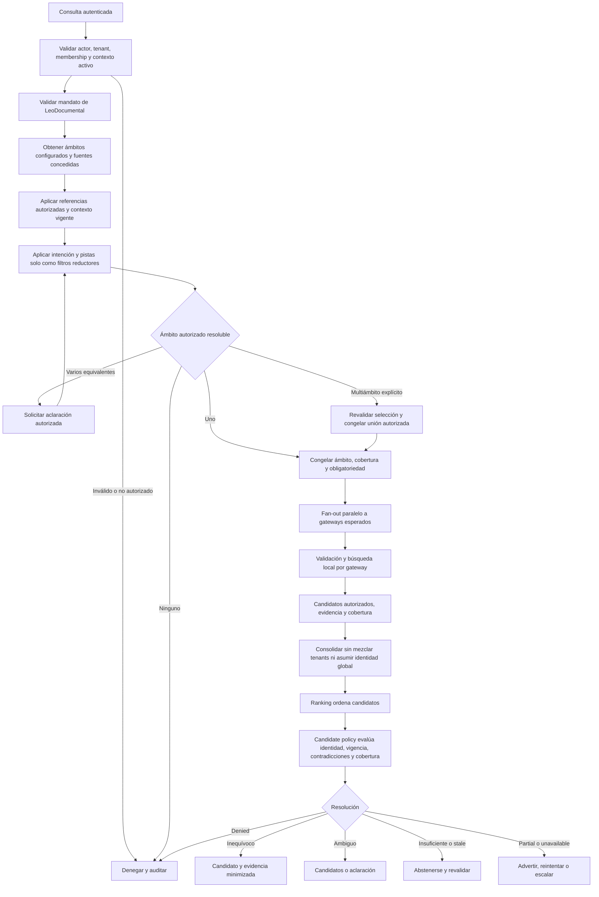
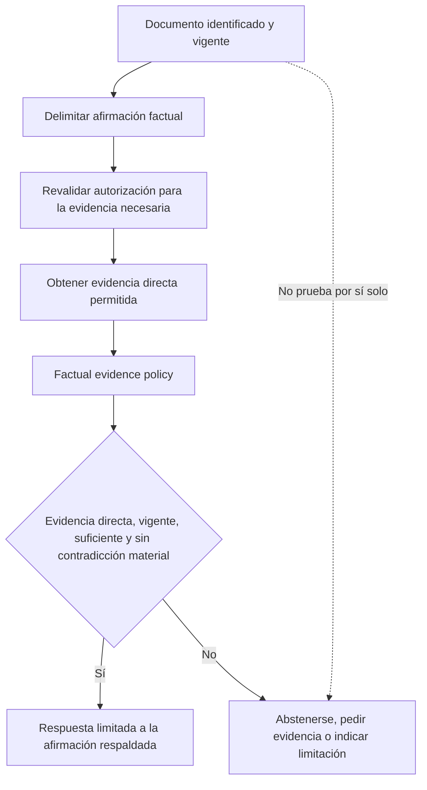

# LC-IA - Ámbito documental, candidatos y evidencia del MVP

Este documento define cómo LC-IA determina el ámbito documental antes de buscar, cómo distingue un candidato inequívoco de una ambigüedad y cómo separa la identidad de un documento de la validación de afirmaciones factuales. El usuario y el modelo aportan intención y pistas; las políticas deterministas, la autorización vigente y la autoridad local toman las decisiones.

No es un artefacto SDD/OpenSpec, no afirma que exista una implementación y no prescribe clases, tablas, APIs, mensajes, productos, motores, modelos, bases vectoriales, fórmulas de score ni umbrales numéricos.

## 1. Lectura rápida

| Tema | Decisión |
| --- | --- |
| Ámbito | LC-IA resuelve antes de buscar el menor ámbito autorizado que satisface inequívocamente la intención y conserva todas las fuentes obligatorias aplicables. |
| Catálogo mínimo | El MVP admite `source scope`, creado automáticamente para una fuente, y `collection scope`, que referencia varias fuentes sin jerarquía, herencia ni reglas dinámicas. |
| Autoridad | Ni el usuario, ni el modelo, ni el orquestador seleccionan fuentes, amplían permisos o alteran obligatoriedad. |
| LeoDocumental | Interpreta solicitudes de recuperación y coordina la presentación y obtención de candidatos, pero solicita a las policies deterministas todas las decisiones de ámbito, autorización y carácter inequívoco. |
| Ambigüedad de ámbito | Si varios ámbitos son igualmente válidos, se solicita aclaración; si ninguno está autorizado, se bloquea y audita. |
| Multiámbito | Es una unión explícita, autorizada y auditada; no se activa por inferencia de LeoDocumental ni del modelo. |
| Ranking | Ordena candidatos; no prueba identidad, autoridad, relevancia suficiente ni carácter inequívoco. |
| Candidato inequívoco | Exige autorización, disponibilidad, vigencia, integridad, identidad documental suficiente, ausencia de alternativas y contradicciones materiales, y ningún gateway obligatorio pendiente. |
| Hash o huella | Prueba una versión e integridad según la política aplicable; no prueba por sí sola identidad ni relevancia. |
| Cobertura | `PARTIAL` nunca prueba inexistencia; la ausencia de un gateway obligatorio siempre escala. |
| Afirmaciones factuales | Identificar un documento y validar una afirmación son decisiones independientes. |
| Alcance actual | El MVP se centra en recuperación documental; la respuesta factual extendida queda como capacidad futura o controlada. |
| Estado | `READY_FOR_SYNTHETIC_DEVELOPMENT`; no preparado para documentos reales, habilitación operativa ni producción. |

## 2. Propósito, alcance, exclusiones y precedencia

### 2.1. Propósito

Este diseño debe permitir que una implementación posterior:

- resuelva el ámbito de forma reproducible antes de realizar búsquedas;
- preserve autorización, obligatoriedad y aislamiento aunque la consulta o el modelo sugieran otra cosa;
- congele una cobertura esperada auditable antes del fan-out;
- diferencie orden de ranking, evidencia de identidad y decisión de candidato;
- se abstenga ante ambigüedad, evidencia insuficiente, obsolescencia o cobertura incompleta relevante;
- evite convertir una coincidencia plausible en una afirmación factual no respaldada;
- pueda evaluarse con un dataset antes de elegir tecnología o calibrar criterios.

### 2.2. Incluido en el MVP

- resolución determinista del ámbito documental;
- uso de tenant activo, membership, permisos por fuente y contexto operativo validados por servidor;
- mandato de LeoDocumental y referencias autorizadas como entradas de política;
- catálogo mínimo de `source scope` y `collection scope`, configuración administrativa de colecciones y obligatoriedad operativa;
- selección explícita y trazable para búsquedas multiámbito;
- fan-out sobre la cobertura congelada del ámbito resuelto;
- consolidación, ranking y resolución de candidatos como responsabilidades separadas;
- evidencia de identidad documental, versión, integridad, procedencia y cobertura;
- tratamiento explícito de contradicciones, duplicados potenciales, extracción deficiente y resultados parciales;
- auditoría minimizada de decisiones de ámbito y candidato;
- separación conceptual entre recuperación documental y soporte directo de afirmaciones factuales.

### 2.3. Fuera del MVP

- permitir que texto libre, prompts o instrucciones del modelo concedan acceso o modifiquen políticas;
- búsqueda libre en rutas, repositorios o fuentes no configurados y autorizados;
- selección automática de varios ámbitos por conveniencia o para aumentar resultados;
- jerarquías, herencia o reglas dinámicas entre ámbitos;
- extracción estructurada de negocio, cálculos, agregaciones, conciliaciones o modificación documental;
- respuesta narrativa general basada en contenido documental completo;
- inferencia de hechos no respaldados directamente por evidencia permitida;
- un catálogo universal de tipos documentales o una ontología general;
- definición de clases, servicios, tablas, APIs, JSON o contratos serializados;
- elección de ranking léxico, semántico, vectorial o híbrido;
- elección de LLM, proveedor, motor de búsqueda, base vectorial o fórmula de score;
- fijación de umbrales numéricos sin dataset y decisión aprobados;
- una plataforma genérica de políticas, agentes o razonamiento probatorio.

### 2.4. Fuentes y precedencia

Este diseño complementa:

- [`LC-IA-piloto-recuperacion-documental-v0.1.md`](LC-IA-piloto-recuperacion-documental-v0.1.md), que prevalece para el objetivo funcional y la evaluación del piloto;
- [`LC-IA-MVP-identidad-tenants-gateways-v0.1.md`](LC-IA-MVP-identidad-tenants-gateways-v0.1.md), que prevalece para identidad, tenant activo, memberships, roles, source grants y confianza de gateways;
- [`LC-IA-MVP-fuentes-indexacion-recuperacion-v0.1.md`](LC-IA-MVP-fuentes-indexacion-recuperacion-v0.1.md), que prevalece para fuentes, extracción, OCR, índice local, referencias opacas y vigencia documental;
- [`LC-IA-MVP-contrato-remoto-gateways-v0.1.md`](LC-IA-MVP-contrato-remoto-gateways-v0.1.md), que prevalece para fan-out, cobertura, obligatoriedad, consolidación y semántica `COMPLETE`/`PARTIAL`;
- [`LC-IA-MVP-arquitectura-remota-local-v0.1.md`](LC-IA-MVP-arquitectura-remota-local-v0.1.md), que prevalece para separación remoto/local, custodia y obtención efímera.

Para resolución de ámbito, suficiencia de evidencia, carácter inequívoco y separación entre identidad documental y afirmaciones factuales prevalecen las decisiones confirmadas de este documento. Una decisión confirmada más específica prevalece sobre una propuesta anterior del mismo alcance. Las preguntas pendientes no deben cerrarse mediante suposiciones ni mediante prompts.

## 3. Estado de las decisiones

- **CONFIRMADO:** obligatorio para una implementación posterior.
- **PROPUESTO:** mecanismo mínimo recomendado que requiere validación antes de fijar contratos.
- **PENDIENTE:** decisión bloqueante que no debe resolverse por suposición.
- **FUERA DEL MVP:** capacidad excluida de esta versión.

## 4. Decisiones confirmadas

| ID | Decisión confirmada |
| --- | --- |
| C-01 | El ámbito documental no lo decide el usuario ni el modelo; LC-IA lo resuelve determinísticamente antes de buscar. |
| C-02 | Las entradas autoritativas son tenant activo validado, membership, permisos por fuente, mandato de LeoDocumental, referencias autorizadas y contexto operativo vigente. |
| C-03 | Usuario y modelo aportan intención y pistas, pero no seleccionan fuentes, amplían permisos ni alteran obligatoriedad. |
| C-04 | Se elige el menor ámbito autorizado que satisface inequívocamente la intención y conserva todas las fuentes obligatorias aplicables. |
| C-05 | Si existen varios ámbitos igualmente válidos, se solicita aclaración. Si ninguno está autorizado, se bloquea y audita. |
| C-06 | La búsqueda multiámbito exige selección explícita, autorización y trazabilidad. |
| C-07 | El contexto activo debe estar validado por servidor; una pista solo reduce o aclara, nunca amplía. |
| C-08 | Un candidato inequívoco exige ámbito autorizado, fuente válida y disponible, versión vigente e integridad verificable, evidencia suficiente de identidad documental, ausencia de otro candidato materialmente plausible, ausencia de contradicciones relevantes y ningún gateway obligatorio pendiente. |
| C-09 | Un hash o huella prueba versión e integridad dentro de la política aplicable, no relevancia ni identidad por sí solo. |
| C-10 | Similitud léxica, semántica o vectorial por sí sola nunca constituye evidencia suficiente. |
| C-11 | Identificar un documento y validar afirmaciones factuales son decisiones independientes. Localizar un documento no autoriza hechos no respaldados directamente. |
| C-12 | Políticas deterministas especializadas toman decisiones de ámbito, permisos, evidencia y carácter inequívoco. El orquestador coordina y el modelo no tiene autoridad. |
| C-13 | `DocumentScopeResolver` y `CandidateResolutionPolicy` pueden usarse como etiquetas de responsabilidad, pero no congelan nombres de clases o servicios. |
| C-14 | Se hereda la semántica `PARTIAL` y la distinción entre gateways obligatorios y opcionales: una ausencia obligatoria siempre escala y `PARTIAL` nunca prueba inexistencia. |
| C-15 | El catálogo mínimo contiene `source scope`, creado automáticamente para una fuente concreta, y `collection scope`, agrupación administrativa que solo referencia varias fuentes, incluso de gateways diferentes. |
| C-16 | En el MVP no existen jerarquías, herencia ni reglas dinámicas entre ámbitos. Una fuente puede pertenecer a varias colecciones sin duplicar documentos ni índices. |
| C-17 | Una colección no concede permisos. Solo es consultable cuando el actor mantiene `source grants` vigentes para todas sus fuentes, incluidas las marcadas como opcionales. |
| C-18 | La opcionalidad expresa disponibilidad y cobertura operativa, nunca autorización. Las fuentes incluidas son obligatorias por defecto conforme al contrato remoto-gateways. |
| C-19 | Las búsquedas multiámbito son uniones explícitas, autorizadas y auditadas. |
| C-20 | LeoDocumental puede interpretar solicitudes de recuperación, solicitar la resolución determinista del ámbito, buscar solo en fuentes autorizadas, presentar candidatos con procedencia y cobertura, pedir aclaración, solicitar la obtención explícita de un candidato autorizado y aplicar la conducta `PARTIAL` de advertencia, reintento o escalado. |
| C-21 | LeoDocumental no puede elegir o ampliar ámbitos, explorar rutas arbitrarias, modificar permisos, fuentes o documentos, ejecutar cálculos, fórmulas o macros, ocultar cobertura incompleta, declarar inequívoco sin policy, afirmar hechos solo por localizar un documento ni saltarse políticas. |
| C-22 | El orquestador coordina y LeoDocumental interpreta; las policies deterministas autorizan y deciden. |

## 5. Propuestas mínimas y pendientes

### 5.1. Propuestas mínimas

| ID | Propuesta | Motivo |
| --- | --- | --- |
| PR-01 | Versionar la configuración administrativa de ámbitos y congelar la versión aplicable al iniciar cada búsqueda. | Hace reproducible la cobertura y evita que un cambio concurrente reinterprete silenciosamente una operación. |
| PR-02 | Conservar un código categórico de inclusión o exclusión por ámbito y fuente, sin contenido de consulta por defecto. | Permite auditar la decisión sin centralizar información sensible. |
| PR-03 | Expresar evidencia de candidato por categorías y procedencia, no como un score único. | Evita que una puntuación o similitud oculte carencias de identidad, vigencia o cobertura. |
| PR-04 | Ante una aclaración, ofrecer solo opciones autorizadas y suficientemente comprensibles para el actor. | Resuelve ambigüedad sin revelar ámbitos o fuentes no autorizados. |
| PR-05 | Mantener separadas la resolución de identidad documental y la evaluación de cada afirmación factual. | Impide heredar autoridad factual de una mera coincidencia documental. |

Estas propuestas no fijan almacenamiento, interfaz, serialización, algoritmo ni estructura de componentes.

### 5.2. Pendientes

**TODO (bloquea `UNEQUIVOCAL` y datos reales):** definir y aprobar la evidencia suficiente por tipo documental. Permanecen también pendientes los metadatos suficientes por tipo documental, la política de contradicciones y deduplicación, el criterio observable de inequívoco, la experiencia de aclaración, la evidencia remota permitida, el alcance factual y la retención de auditoría. Se detallan en la sección 19. El catálogo mínimo y el mandato inicial de LeoDocumental ya están confirmados.

## 6. Mapa de autoridades

| Responsabilidad | Decide | Entradas autoritativas | No decide |
| --- | --- | --- | --- |
| Identidad y autorización | Autoridad de identidad y autorización de LC-IA, con reevaluación local | Actor autenticado, tenant activo validado, membership, roles, source grants, concesiones excepcionales vigentes | Intención, prompts, similitud o ranking |
| Administración del ámbito | Administrador autorizado del tenant | Catálogo de ámbitos, fuentes asociadas, obligatoriedad, vigencia y cambios auditados | Resultado de una consulta concreta ni permisos fuera de su tenant |
| Policy de scope | Política determinista de resolución de ámbito | Autorización vigente, mandato Leo, catálogo, referencias autorizadas, contexto activo e intención/pistas no autoritativas | Ranking, identidad final de documentos o respuesta narrativa |
| Gateway local | Autoridad local final de ejecución | Orden autenticada y vigente, vínculo tenant-gateway, fuentes configuradas, permisos y estado local | Ampliar el ámbito remoto, aceptar rutas libres o rebajar controles obligatorios |
| Ranking | Mecanismo de ordenación bajo política | Coincidencias y señales permitidas de candidatos autorizados | Autoridad, permisos, identidad probada, probabilidad, suficiencia o decisión final |
| Candidate policy | Política determinista de resolución de candidatos | Ámbito, cobertura, procedencia, identidad documental, versión, integridad, contradicciones y alternativas plausibles | Crear evidencia ausente o ignorar gateways obligatorios |
| Factual evidence policy | Política determinista por afirmación | Afirmación delimitada, evidencia directa autorizada, procedencia, vigencia, cobertura y contradicciones | Inferir hechos por haber localizado el documento o por confianza del modelo |
| Orquestador | Coordinación del flujo | Decisiones producidas por las autoridades y políticas especializadas | Reescribir reglas de scope, autorización, evidencia o carácter inequívoco |
| LeoDocumental | Interpretación documental y conducción de la interacción de recuperación | Texto del usuario, contexto permitido y decisiones de policies especializadas | Autorizar, elegir o ampliar ámbitos, declarar un candidato inequívoco, alterar fuentes o documentos, ejecutar cálculos o eludir policies |
| Modelo | Interpretación asistida y formulación dentro de LeoDocumental | Texto del usuario y contexto permitido | Seleccionar fuentes, autorizar, cambiar obligatoriedad, declarar identidad o validar hechos |

La autoridad no se transfiere por delegación técnica. El orquestador puede invocar una policy y el modelo puede producir pistas, pero la decisión sigue perteneciendo a la policy determinista correspondiente.

### 6.1. Capacidades de LeoDocumental

| Permitido | Prohibido |
| --- | --- |
| Interpretar solicitudes de recuperación. | Elegir o ampliar ámbitos por sí mismo. |
| Solicitar a las policies de LC-IA la resolución determinista del ámbito. | Explorar rutas arbitrarias o buscar fuera de fuentes autorizadas. |
| Ejecutar búsquedas solo en las fuentes autorizadas del ámbito resuelto. | Modificar permisos, fuentes o documentos. |
| Presentar candidatos autorizados, procedencia y cobertura. | Ejecutar cálculos, fórmulas o macros. |
| Pedir aclaración ante una ambigüedad declarada por policy. | Ocultar cobertura incompleta o presentar `PARTIAL` como completo. |
| Solicitar la obtención explícita de un candidato autorizado. | Declarar un candidato inequívoco sin `CandidateResolutionPolicy`. |
| Advertir, reintentar o escalar según la policy `PARTIAL`. | Afirmar hechos solo por localizar un documento o saltarse policies. |

LeoDocumental interpreta y conduce la interacción; no absorbe autoridad por hacerlo. El orquestador coordina el flujo y las policies deterministas autorizan y deciden.

## 7. Modelo conceptual mínimo

El modelo expresa significados e invariantes. No define clases, tablas, servicios ni mensajes.

| Concepto | Significado mínimo | Invariantes |
| --- | --- | --- |
| User intent | Necesidad expresada por la persona. | Orienta la tarea; no concede acceso ni selecciona fuentes por sí sola. |
| Scope hint | Pista sobre ubicación, organización, proyecto, tipo o contexto documental. | Puede reducir o aclarar entre opciones autorizadas; nunca amplía el conjunto autorizado. |
| Active context | Contexto operativo vigente validado por servidor. | Está ligado a actor, tenant y estado actual; el cliente o modelo no puede sustituirlo. |
| Leo mandate | Mandato operativo que delimita qué función documental puede ejecutar LeoDocumental. | Debe ser vigente, autorizado y compatible con la intención; no reemplaza permisos por fuente. |
| Authorized reference | Referencia previamente emitida o aprobada dentro de un contexto autorizado. | No concede acceso indefinido; se revalida y solo puede reducir el ámbito aplicable. |
| Source scope | Ámbito creado automáticamente para una fuente concreta. | Representa una sola fuente; su existencia no sustituye el `source grant` vigente. |
| Collection scope | Agrupación administrativa que referencia varias fuentes, incluso de gateways diferentes. | No duplica documentos ni índices, no concede permisos y solo es consultable con grants vigentes para todas sus fuentes. |
| Resolved scope | Menor ámbito autorizado elegido para una operación. | Se decide antes de buscar, conserva fuentes obligatorias aplicables y queda congelado para la operación. |
| Coverage requirement | Conjunto esperado de fuentes y gateways, con obligatoriedad. | Se deriva del ámbito resuelto; una ausencia no reduce retroactivamente la cobertura. |
| Explicit scope union | Unión de varios ámbitos solicitada expresamente para una búsqueda. | Requiere autorización independiente, trazabilidad y cobertura congelada; no crea jerarquía ni un ámbito persistente. |
| Candidate evidence | Evidencia permitida asociada a un candidato autorizado. | Conserva procedencia y categorías; no se resume como autoridad por un score. |
| Document identity evidence | Evidencia que vincula el candidato con el documento solicitado. | Su suficiencia depende del tipo documental o dataset y de contradicciones conocidas. |
| Version/integrity evidence | Evidencia de que se observa una versión concreta e íntegra. | No prueba relevancia ni identidad por sí sola y debe ser vigente. |
| Contradiction | Evidencia incompatible con una identidad, versión, cobertura o afirmación propuesta. | Una contradicción relevante impide declarar inequívoco hasta resolverla. |
| Resolution decision | Resultado determinista de scope o candidato. | Incluye motivo categórico y evidencia evaluada; no procede de texto generativo. |
| Factual claim | Afirmación delimitada sobre un hecho. | Se evalúa independientemente de la localización o identidad documental. |
| Supporting evidence | Evidencia directa que respalda una afirmación factual concreta. | Debe ser autorizada, vigente, trazable y suficiente para esa afirmación; no se hereda del ranking. |

### 7.1. Catálogo mínimo de ámbitos

| Tipo | Creación | Contenido | Autorización |
| --- | --- | --- | --- |
| `source scope` | Automática al configurar una fuente concreta. | Una fuente. | Exige `source grant` vigente sobre esa fuente. |
| `collection scope` | Administrativa. | Referencias a varias fuentes, incluso de gateways diferentes. | Exige `source grants` vigentes para todas las fuentes integrantes, incluidas las opcionales. |

No hay jerarquías, herencia ni reglas dinámicas en el MVP. Una fuente puede aparecer en varias colecciones sin duplicar documentos ni índices. La opcionalidad solo modifica la expectativa operativa de disponibilidad y cobertura; nunca concede ni relaja autorización.

## 8. Algoritmo conceptual para resolver el ámbito

La resolución es determinista respecto de las mismas entradas autoritativas y la misma configuración vigente. El orden de precedencia y filtros es el siguiente:

1. Validar actor, tenant activo, membership y contexto operativo en servidor. Ante ausencia, revocación o discrepancia, denegar sin buscar.
2. Validar el mandato vigente de LeoDocumental para la intención reconocida. Si la operación queda fuera del mandato, bloquear o derivar sin ampliar el alcance.
3. Obtener los `source scope` de fuentes con `source grants` vigentes y las colecciones vigentes del tenant. Una colección solo es elegible si el actor tiene grants vigentes para todas sus fuentes, incluidas las opcionales. No incorporar ámbitos por texto libre.
4. Aplicar referencias autorizadas vigentes cuando existan. Una referencia puede acotar candidatos de ámbito, pero no recuperar permisos revocados ni añadir fuentes.
5. Aplicar restricciones del contexto activo validado, como instalación, proyecto o expediente cuando estén administrativamente vinculadas y vigentes.
6. Interpretar user intent y scope hints como filtros no autoritativos sobre el conjunto restante. Una coincidencia con una fuente no autorizada no la hace visible ni elegible.
7. Eliminar todo ámbito no autorizado íntegramente o cuya cobertura no pueda definirse de forma íntegra. La opcionalidad no evita la comprobación de autorización.
8. Comparar los ámbitos restantes por su conjunto explícito de fuentes y elegir el menor que satisfaga inequívocamente la intención. No aplicar jerarquía, herencia ni reglas dinámicas.
9. Si un único ámbito cumple, congelar su configuración, cobertura esperada y obligatoriedad antes del fan-out.
10. Si varios ámbitos igualmente válidos cumplen, no elegir por score ni por preferencia del modelo: solicitar una aclaración limitada a opciones autorizadas.
11. Si la intención exige varios ámbitos, requerir selección multiámbito explícita, revalidar cada ámbito y cada fuente, y congelar la unión autorizada y auditada sin duplicar fuentes repetidas.
12. Si ningún ámbito autorizado cumple, denegar o bloquear según la causa y auditarla sin revelar ámbitos no visibles.

### 8.1. Precedencia de entradas

| Precedencia | Entrada | Efecto permitido |
| --- | --- | --- |
| 1 | Identidad, tenant activo, membership y source grants vigentes | Define el máximo autorizado; falla de forma cerrada. |
| 2 | Mandato de LeoDocumental | Define la operación admitida dentro de la autorización. |
| 3 | Catálogo mínimo, configuración administrativa y obligatoriedad | Define ámbitos elegibles y cobertura operativa que debe preservarse; no concede permisos. |
| 4 | Referencia autorizada vigente | Acota dentro de lo autorizado y configurado. |
| 5 | Contexto activo validado por servidor | Acota o desambigua dentro del máximo permitido. |
| 6 | Intención y scope hints | Filtran o aclaran; nunca amplían ni alteran obligatoriedad. |

### 8.2. Casos ambiguos

- Una pista coincide con dos ámbitos autorizados equivalentes: solicitar aclaración.
- Una pista coincide con un ámbito autorizado y otro no autorizado: considerar solo el autorizado sin confirmar la existencia del otro.
- El contexto activo y una pista discrepan: prevalece el contexto validado; si la intención no puede satisfacerse, solicitar corrección o bloquear.
- Una referencia autorizada está vencida o ligada a otro contexto: no usarla; revalidar o solicitar una nueva acción autorizada.
- Un ámbito amplio contiene uno menor suficiente: elegir el menor solo si conserva todas las fuentes obligatorias aplicables.
- Una colección contiene una fuente opcional sin grant vigente: la colección completa no es autorizada y no puede consultarse.
- Una fuente pertenece a varias colecciones: cada colección se evalúa por sus referencias explícitas, sin herencia ni duplicación documental.
- La intención no permite distinguir entre ámbitos, aunque uno tenga mejor ranking histórico: solicitar aclaración; el ranking no resuelve autoridad de ámbito.

## 9. Multiámbito y configuración administrativa

### 9.1. Búsqueda multiámbito

Una búsqueda multiámbito no es un fallback automático para obtener más resultados. Requiere:

- intención que justifique consultar más de un ámbito;
- selección explícita por la persona entre ámbitos visibles y autorizados;
- revalidación independiente de autorización y vigencia para cada ámbito;
- `source grants` vigentes para todas las fuentes integrantes de cada ámbito, incluidas las opcionales;
- unión explícita de las fuentes autorizadas, sin duplicar una fuente presente en más de un ámbito;
- cobertura congelada para la unión seleccionada antes del fan-out;
- procedencia separada por ámbito, gateway y fuente en candidatos y auditoría;
- resultado que no oculte ambigüedades ni cobertura parcial de uno de los ámbitos.

LeoDocumental puede explicar la necesidad de aclarar o resumir las opciones permitidas. Ni LeoDocumental ni el modelo pueden activar multiámbito, añadir un ámbito ni interpretar una falta de resultados como autorización para ampliar la búsqueda.

### 9.2. Configuración administrativa mínima

El administrador autorizado del tenant debe poder:

- mantener colecciones comprensibles que solo referencien fuentes configuradas de su tenant;
- consultar los `source scope` creados automáticamente para fuentes concretas;
- asociar a una colección fuentes vigentes, incluso de gateways diferentes, sin duplicar documentos ni índices;
- incluir una misma fuente en varias colecciones;
- marcar una fuente incluida como opcional mediante acción explícita; las fuentes son obligatorias por defecto;
- conocer el efecto de la opcionalidad sobre resultados `PARTIAL` antes de confirmar;
- activar, retirar o sustituir colecciones con vigencia y auditoría;
- revisar qué ámbitos quedarían afectados por una fuente o gateway no disponible;
- verificar que una colección no concede permisos y que su consulta exige grants vigentes para todas sus fuentes.

No se admiten jerarquías, herencia ni reglas dinámicas entre ámbitos en el MVP. Tampoco se requiere un motor genérico de reglas, ABAC ni constructor visual de políticas. Un cambio administrativo no debe reinterpretar silenciosamente una operación ya congelada; el tratamiento exacto de operaciones en curso permanece pendiente.

## 10. Taxonomía de evidencia de identidad documental

| Categoría | Qué puede aportar | Limitación |
| --- | --- | --- |
| Identificadores autoritativos | Número de contrato, expediente, factura, albarán, activo u otro identificador gobernado por el dominio. | Debe validarse formato, emisor, alcance y posibles reutilizaciones; una cadena coincidente aislada puede ser insuficiente. |
| Tipo documental | Evidencia de que el candidato pertenece a la clase solicitada. | El nombre, extensión o clasificación automática pueden ser erróneos y requerir señales adicionales. |
| Entidad relacionada | Cliente, proveedor, proyecto, equipo, persona u organización vinculada. | Nombres homónimos, alias y OCR pueden introducir ambigüedad. |
| Fecha o periodo | Emisión, firma, vigencia, recepción o periodo documental. | Debe distinguirse qué fecha representa y tolerar solo la incertidumbre aprobada por tipo. |
| Fuente | Repositorio configurado y autorizado del que procede el candidato. | La procedencia autoriza el origen, pero no demuestra que sea el documento solicitado. |
| Versión e integridad | Huella, versión observable, estado vigente y comprobación de integridad. | Demuestra una versión concreta según política; no demuestra identidad ni relevancia por sí sola. |
| Procedencia | Cadena trazable de tenant, ámbito, gateway, fuente, índice y proceso de extracción aplicable. | La trazabilidad no corrige metadatos incorrectos ni cobertura incompleta. |

No todos los campos son necesarios en todos los casos. La evidencia suficiente se define por tipo documental o dataset aprobado: debe indicar qué combinación distingue materialmente un documento, qué fuentes son autoritativas para cada dato, qué incertidumbre se admite y qué contradicciones obligan a abstenerse. La similitud, cualquiera que sea su técnica, solo aporta una señal de recuperación.

## 11. Contradicciones relevantes

Una contradicción es relevante cuando puede cambiar la identidad, vigencia, cobertura o decisión que se presentaría. Como mínimo deben tratarse:

| Contradicción | Efecto mínimo |
| --- | --- |
| Múltiples candidatos materialmente plausibles | Resultado ambiguo; no declarar candidato inequívoco. |
| Versiones activas incompatibles | Resultado stale o ambiguo hasta resolver cuál está vigente. |
| Identificadores en conflicto | Evidencia insuficiente o contradictoria, aunque otras señales sean similares. |
| Fuente no vigente, pausada o revocada | Excluir de una decisión positiva y reflejar denegación, obsolescencia o indisponibilidad según la causa. |
| OCR o extracción insuficiente | No afirmar ausencia del dato ni identidad inequívoca si la parte necesaria no fue cubierta con fiabilidad. |
| Índice parcial o no listo | Marcar cobertura técnica insuficiente; no tratar cero coincidencias como ausencia. |
| Cobertura incompleta | Aplicar `PARTIAL`; una ausencia obligatoria siempre escala. |
| Procedencia o versión discrepante | Revalidar el candidato y abstenerse si no puede demostrarse una versión coherente. |
| Duplicados no resueltos | Mantener candidatos separados hasta que una política aprobada permita consolidarlos. |

Las contradicciones no se compensan acumulando score. La policy debe evaluar su materialidad según el tipo documental, el dataset y la decisión solicitada.

## 12. Ranking separado de la decisión

El ranking recibe únicamente candidatos ya autorizados y los ordena mediante señales permitidas. Puede ayudar a presentar primero las coincidencias más útiles, pero:

- un score no equivale a probabilidad calibrada;
- un score no equivale a autoridad ni permiso;
- el primer resultado no es automáticamente inequívoco;
- un margen de score no sustituye evidencia de identidad;
- similitud léxica, semántica o vectorial aislada no satisface la policy;
- ranking no elimina contradicciones, gateways esperados ni candidatos plausibles;
- ranking no convierte `PARTIAL` en `COMPLETE`;
- la policy de candidato puede abstenerse aunque exista un primer resultado destacado.

La normalización entre fuentes, criterios de desempate, señales admitidas y calibración se deciden con el dataset. Este documento no fija motor, pesos, fórmula ni umbrales.

## 13. Tabla de decisión de candidatos y resultados

La primera condición aplicable de mayor precedencia determina el resultado. `PARTIAL` describe cobertura y puede coexistir con candidatos, pero nunca con una declaración de inexistencia.

| Resultado | Condición determinante | Comportamiento mínimo |
| --- | --- | --- |
| `DENIED` | Contexto, ámbito, fuente, referencia o permiso no autorizado o no vigente. | No buscar o detener; auditar sin revelar existencia o detalles no autorizados. |
| `UNAVAILABLE` | Gateway, fuente o dependencia necesaria no puede consultarse. | Informar indisponibilidad; no convertirla en cero candidatos. Si es obligatorio, escalar. |
| `PARTIAL` | Una o más contribuciones esperadas no completaron válidamente. | Mostrar cobertura incompleta. Ausencia obligatoria: escalar siempre. Ausencias solo opcionales: aplicar la policy sin afirmar inexistencia. |
| `STALE` | Referencia, versión, índice, permiso o configuración relevante cambió respecto de la evidencia evaluada. | Invalidar la decisión previa y exigir revalidación o nueva búsqueda. |
| `AMBIGUOUS` | Existen varios candidatos materialmente plausibles o contradicciones no resueltas entre ellos. | Presentar candidatos autorizados o pedir aclaración; no elegir arbitrariamente. |
| `INSUFFICIENT` | No existe evidencia suficiente de identidad documental, aunque haya coincidencias, o la extracción/OCR no cubre lo necesario. | Abstenerse, explicar la categoría de evidencia faltante y no afirmar inexistencia. |
| `UNEQUIVOCAL` | Se cumplen todas las condiciones de C-08; con `PARTIAL`, solo faltan gateways opcionales y se conserva advertencia explícita. | Presentar el candidato, procedencia y justificación categórica minimizada. |

Reglas adicionales:

- `COMPLETE` sin candidatos suficientes permite afirmar únicamente que no se localizó el documento en todas las fuentes autorizadas del ámbito consultado, no que no exista universalmente.
- `PARTIAL` sin candidatos requiere reintento acotado o escalado.
- `PARTIAL` con varios candidatos conserva `AMBIGUOUS` y la advertencia de cobertura.
- `PARTIAL` con candidato aparentemente inequívoco nunca completa si falta un gateway obligatorio.
- Un candidato puede pasar de `UNEQUIVOCAL` a `STALE` antes de la obtención; la autorización y versión se reevalúan.

Mientras el TODO de evidencia suficiente por tipo documental permanezca abierto, sobre datos reales deben seguir deshabilitados `UNEQUIVOCAL`, la selección o entrega automática del primer candidato, completar `PARTIAL` por un candidato aparentemente inequívoco, las conclusiones negativas basadas en evidencia insuficiente y los factual claims. En desarrollo con datos exclusivamente sintéticos, la conducta conservadora debe producir `AMBIGUOUS` o `INSUFFICIENT`.

## 14. Flujo de ámbito, búsqueda y resolución

## 15. Flujo separado de respuesta factual

El MVP actual es principalmente de recuperación documental. La respuesta factual extendida debe tratarse como una capacidad futura o controlada y no amplía el alcance de extracción, cálculo o respuesta narrativa definido para el MVP.

Para cada factual claim, la policy debe comprobar de manera independiente:

- que la afirmación está delimitada y dentro de una capacidad autorizada;
- que la evidencia procede de contenido o metadatos directamente pertinentes y permitidos;
- que versión, procedencia y cobertura son vigentes;
- que no existen contradicciones materiales;
- que la respuesta no generaliza más allá de la evidencia observada.

Localizar el contrato correcto no prueba que una cláusula diga algo concreto. Localizar una factura no autoriza sumar importes. Un hash coincidente no prueba que una afirmación factual sea verdadera. Hasta que exista un diseño aprobado para respuesta factual, la salida del MVP debe centrarse en recuperar o presentar candidatos.

## 16. Auditoría mínima y minimización

Cada decisión debe poder reconstruirse con evidencia categórica, sin registrar contenido sensible por defecto.

### 16.1. Resolución de ámbito

Registrar como mínimo:

- identificadores opacos de correlación, actor, tenant y operación;
- versión de configuración y contexto validado aplicados;
- ámbitos considerados dentro de lo autorizado;
- código categórico de inclusión o exclusión;
- ámbito resuelto o motivo de aclaración, denegación o bloqueo;
- cobertura esperada y obligatoriedad congeladas;
- indicación de selección multiámbito explícita cuando corresponda.

### 16.2. Resolución de candidato

Registrar como mínimo:

- ámbito y cobertura resultantes;
- procedencia opaca por gateway y fuente;
- cantidad de candidatos evaluados;
- categorías de evidencia presentes y ausentes;
- estado de versión e integridad;
- contradicciones categóricas detectadas;
- decisión `UNEQUIVOCAL`, `AMBIGUOUS`, `INSUFFICIENT`, `STALE`, `PARTIAL`, `DENIED` o `UNAVAILABLE`;
- razón categórica de selección, abstención, aclaración o escalado.

No se registran por defecto consultas completas, contenido documental, fragmentos, texto extraído u OCR, rutas, nombres sensibles, credenciales, secretos ni razonamiento libre del modelo. La retención, acceso, integridad, localización y excepciones de auditoría deben aprobarse antes de usar datos reales.

## 17. Dataset requerido para evaluar scope y candidatos

El dataset debe estar versionado, autorizado y revisado por personas que conozcan el corpus y la política de acceso. Cada caso debe incluir, como mínimo:

- consulta representativa;
- intención esperada y pistas presentes;
- actor, tenant, membership y permisos efectivos de prueba;
- mandato Leo y contexto activo aplicables;
- ámbitos configurados elegibles y ámbito esperado;
- fuentes y gateways obligatorios u opcionales;
- documentos objetivo, candidatos también plausibles y resultado esperado;
- evidencia de identidad relevante por tipo documental;
- versión, integridad, procedencia, estado de extracción y cobertura;
- contradicciones preparadas y explicación de verdad de referencia;
- decisión esperada de ámbito y candidato.

El conjunto debe cubrir:

| Familia | Casos requeridos |
| --- | --- |
| Consultas unívocas | Un único ámbito y un único candidato respaldado por evidencia suficiente. |
| Consultas ambiguas | Varios ámbitos equivalentes, varios candidatos plausibles y pistas insuficientes. |
| Multiámbito | Selección explícita válida, intento implícito rechazado y cobertura distinta entre ámbitos. |
| Denegadas | Tenant, membership, source grant, referencia o contexto inválidos y fuentes no visibles. |
| Referencias inválidas | Vencidas, revocadas, alteradas, de otro tenant o ligadas a otra versión. |
| Versiones | Vigente, sustituida, concurrente, cambiada tras búsqueda y versiones activas incompatibles. |
| Duplicados | Mismos nombres, mismos bytes, copias legítimas y posibles duplicados entre fuentes o gateways. |
| OCR deficiente | Texto incompleto, identificadores mal leídos, páginas no cubiertas y extracción parcial. |
| `PARTIAL` obligatorio | Con y sin candidatos; siempre debe escalar. |
| `PARTIAL` opcional | Candidato inequívoco, varios candidatos y ningún candidato, con advertencia y conducta heredadas. |
| Contradicciones | Identificadores, entidad, fecha, tipo, fuente, versión, procedencia y cobertura incompatibles. |
| Similitud engañosa | Alta similitud sin identidad suficiente y baja similitud con identificador autoritativo válido. |
| Factual claims | Documento correcto con afirmación respaldada, no respaldada, contradictoria o fuera del alcance actual. |

El dataset debe permitir evaluar por separado resolución de ámbito, ranking, decisión de candidato, abstención y, cuando se habilite de forma controlada, evidencia factual. No debe elegirse tecnología ni umbral antes de revisar estos casos.

## 18. Criterios de aceptación observables

| ID | Criterio |
| --- | --- |
| CA-01 | La misma configuración y entradas autoritativas producen la misma decisión de ámbito, independientemente de la redacción generativa usada para explicarla. |
| CA-02 | Una consulta no puede añadir fuentes, cambiar obligatoriedad ni seleccionar tenant mediante texto, ruta, prompt o salida del modelo. |
| CA-03 | El tenant activo, membership, source grants y contexto operativo se validan en servidor antes de resolver ámbito. |
| CA-04 | El ámbito resuelto es el menor autorizado que satisface inequívocamente la intención y conserva todas las fuentes obligatorias aplicables. |
| CA-05 | Dos ámbitos igualmente válidos producen una aclaración limitada a opciones autorizadas, no una selección por ranking o modelo. |
| CA-06 | Ningún ámbito autorizado produce denegación o bloqueo auditable sin revelar ámbitos no visibles. |
| CA-07 | Una búsqueda multiámbito no comienza sin selección explícita, autorización vigente y cobertura trazable. |
| CA-08 | La cobertura y obligatoriedad quedan congeladas antes del fan-out y una ausencia no reduce el alcance esperado. |
| CA-09 | El gateway local puede denegar una operación autorizada remotamente y esa denegación no se convierte en cero candidatos. |
| CA-10 | Ranking y candidate policy son observables como decisiones separadas; el primer resultado o mayor score no implica candidato inequívoco. |
| CA-11 | Similitud léxica, semántica o vectorial aislada nunca basta para declarar `UNEQUIVOCAL`. |
| CA-12 | Hash o huella se usa como evidencia de versión e integridad y no como prueba aislada de identidad o relevancia. |
| CA-13 | Un candidato solo es `UNEQUIVOCAL` cuando cumple todas las condiciones de C-08. |
| CA-14 | Varios candidatos materialmente plausibles o una contradicción relevante producen `AMBIGUOUS` o `INSUFFICIENT`, nunca selección arbitraria. |
| CA-15 | Una referencia o versión cambiada produce `STALE` y obliga a revalidar antes de obtener el documento. |
| CA-16 | `PARTIAL` nunca permite afirmar inexistencia y la ausencia de un gateway obligatorio siempre escala. |
| CA-17 | Con gateways opcionales ausentes, solo un candidato inequívoco con evidencia puede completarse y siempre muestra cobertura incompleta. |
| CA-18 | OCR o extracción insuficiente permanece visible y no se transforma en evidencia de ausencia. |
| CA-19 | La decisión conserva procedencia por tenant, ámbito, gateway, fuente y versión sin asumir identidad documental global. |
| CA-20 | Identificar un documento no valida automáticamente ninguna afirmación factual sobre su contenido. |
| CA-21 | Cada factual claim habilitado se acepta o rechaza mediante evidencia directa, vigente, autorizada y sin contradicciones materiales. |
| CA-22 | El orquestador coordina decisiones de policies especializadas sin implementar reglas alternativas ni delegarlas al modelo. |
| CA-23 | La auditoría explica categóricamente inclusión o exclusión de scope y selección o abstención de candidato sin contenido sensible por defecto. |
| CA-24 | El dataset permite reproducir casos unívocos, ambiguos, multiámbito, denegados, stale, partial, OCR deficiente, duplicados y contradicciones. |
| CA-25 | Cada fuente configurada dispone de un `source scope` automático y una colección solo contiene referencias a fuentes, sin duplicar documentos ni índices. |
| CA-26 | No existe resolución por jerarquía, herencia ni reglas dinámicas; una fuente puede pertenecer a varias colecciones. |
| CA-27 | Una colección se rechaza si falta un `source grant` vigente para cualquiera de sus fuentes, aunque esa fuente sea opcional. |
| CA-28 | La opcionalidad solo afecta a disponibilidad y cobertura `PARTIAL`; no concede permisos y toda fuente incluida es obligatoria por defecto. |
| CA-29 | Una búsqueda multiámbito conserva evidencia de selección explícita, autorización de cada fuente y unión auditada sin duplicados. |
| CA-30 | LeoDocumental busca únicamente tras recibir un ámbito autorizado por policy y no puede elegirlo, ampliarlo ni explorar rutas arbitrarias. |
| CA-31 | LeoDocumental presenta candidatos, procedencia y cobertura; pide aclaración o solicita obtención explícita sin declarar por sí mismo el carácter inequívoco. |
| CA-32 | Ante `PARTIAL`, LeoDocumental mantiene visible la cobertura incompleta y advierte, reintenta o escala según la policy aplicable. |
| CA-33 | LeoDocumental no modifica permisos, fuentes o documentos, no ejecuta cálculos, fórmulas o macros y no afirma hechos solo por localizar un documento. |

## 19. Decisiones cerradas y preguntas bloqueantes

### 19.1. Decisiones cerradas

| ID | Estado | Decisión |
| --- | --- | --- |
| P-01 | CERRADA | El catálogo mínimo contiene `source scope` automático y `collection scope` administrativo. No admite jerarquía, herencia ni reglas dinámicas; una fuente puede pertenecer a varias colecciones. |
| P-02 | CERRADA | El mandato inicial de LeoDocumental queda limitado a recuperación documental: interpreta y conduce la interacción, mientras las policies deterministas autorizan y deciden conforme a C-20, C-21 y C-22. |

### 19.2. Preguntas aún bloqueantes

| ID | Pregunta que debe cerrarse |
| --- | --- |
| P-03 | ¿Qué metadatos de identidad están disponibles y son autoritativos para cada tipo documental o dataset? |
| P-04 | **TODO (bloquea `UNEQUIVOCAL` y datos reales):** ¿Qué combinación de evidencia se considera suficiente por tipo documental y quién aprueba esa definición? |
| P-05 | ¿Qué hace material una contradicción y qué fuentes de evidencia prevalecen para resolverla? |
| P-06 | ¿Cómo se distinguen copias legítimas, duplicados, renombrados, movimientos y una misma identidad entre fuentes o gateways? |
| P-07 | ¿Qué criterio observable declara un candidato inequívoco sin convertir un score en autoridad ni fijar un umbral arbitrario? |
| P-08 | ¿Cómo se presentan y responden las aclaraciones de ámbito y candidato sin revelar opciones no autorizadas ni crear fatiga innecesaria? |
| P-09 | ¿Qué evidencia de identidad, versión, ranking, contradicción y cobertura puede salir del gateway sin revelar contenido, rutas o metadatos sensibles? |
| P-10 | ¿Qué factual claims, si alguno, se permiten de forma controlada en el MVP y qué evidencia directa exige cada uno? |
| P-11 | ¿Qué eventos de ámbito, candidato y evidencia se auditan, quién puede consultarlos, cuánto se retienen y cómo se protege su integridad? |
| P-12 | ¿Cómo afectan a operaciones ya iniciadas los cambios de scope, obligatoriedad, source grants, contexto activo o mandato? |

Estas preguntas no autorizan a fijar nombres de componentes, contratos, tecnologías, fórmulas ni cifras por conveniencia.

## 20. Gate previo a implementación

No debe comenzar la implementación de esta capacidad con documentos reales hasta que todos los puntos aplicables tengan una respuesta verificable:

Se autoriza desarrollo ejecutable con datos exclusivamente sintéticos para validar contratos conceptuales, estados, aislamiento, idempotencia, resolución de ámbito y abstención. Esta autorización no habilita identidades, fuentes, metadatos ni documentos reales, ni demuestra que los controles de seguridad estén terminados.

- [x] catálogo mínimo de `source scope` y `collection scope`, sin jerarquía, herencia ni reglas dinámicas, aprobado;
- [ ] inventario de fuentes y colecciones reales del piloto, sus solapamientos y responsables aprobado;
- [ ] tenant activo, membership, source grants y contexto operativo validables en servidor;
- [x] mandato inicial de LeoDocumental definido para recuperación documental;
- [ ] relación entre ámbitos, fuentes, gateways y obligatoriedad administrable y auditable;
- [ ] algoritmo conceptual de scope revisado con casos unívocos, ambiguos, denegados y multiámbito;
- [ ] experiencia de selección explícita multiámbito y aclaraciones aprobada;
- [ ] cobertura esperada congelable antes del fan-out;
- [ ] **TODO (bloquea `UNEQUIVOCAL` y datos reales):** metadatos permitidos y evidencia suficiente definidos por los tipos documentales iniciales;
- [ ] política de versión, integridad, vigencia, contradicciones y extracción parcial aprobada;
- [ ] política de duplicados y candidatos entre fuentes o gateways aprobada;
- [ ] separación entre ranking y decisión de candidato verificable;
- [ ] criterio de candidato inequívoco evaluable sin autoridad del modelo ni score aislado;
- [ ] semántica `COMPLETE`/`PARTIAL` y gateways obligatorios/opcionales preservada;
- [ ] alcance de factual claims confirmado como excluido, futuro o controlado con evidencia propia;
- [ ] evidencia remota permitida y minimización aprobadas;
- [ ] auditoría, acceso, integridad y retención aprobados;
- [ ] dataset versionado con todas las familias de la sección 17 y verdad de referencia revisada;
- [ ] criterios de aceptación revisados por producto, seguridad y responsables documentales;
- [ ] ninguna elección depende de prompts para seguridad ni fija tecnología o umbrales sin evidencia.

Si falta una decisión sobre autorización, inventario real de ámbitos, obligatoriedad, evidencia suficiente, contradicciones o cobertura, solo puede trabajarse con datos sintéticos para cerrar esas decisiones. No debe presentarse una prueba técnica como una política de seguridad o evidencia terminada. El readiness actual es `READY_FOR_SYNTHETIC_DEVELOPMENT`, no readiness para documentos reales, habilitación operativa ni producción.

## 21. Próximos pasos mínimos

1. Inventariar las fuentes y colecciones reales del piloto, sus gateways, solapamientos, responsables y obligatoriedad, usando únicamente el catálogo mínimo confirmado.
2. Validar el mandato inicial de LeoDocumental contra los casos de recuperación del piloto y definir los contextos activos que pueden acotar cada scope sin ampliar su autoridad.
3. Seleccionar los tipos documentales iniciales y acordar su evidencia de identidad suficiente, vigencia y contradicciones.
4. Construir el dataset versionado con casos de scope, candidatos, OCR, duplicados, cobertura y referencias inválidas.
5. Revisar sobre ese dataset la separación entre ranking, decisión de candidato y evidencia factual, sin elegir motor ni umbrales anticipadamente.
6. Aprobar la experiencia mínima de aclaración y multiámbito, junto con auditoría y evidencia remota permitida.
7. Superar el gate antes de convertir este diseño conceptual en contratos implementables.

La primera validación debe demostrar una sola vertical: consulta autenticada, ámbito determinista congelado, fan-out sobre cobertura esperada, candidatos autorizados ordenados y una policy que declare candidato inequívoco o se abstenga con una razón reproducible. La respuesta factual extendida espera una necesidad y un diseño aprobados.
