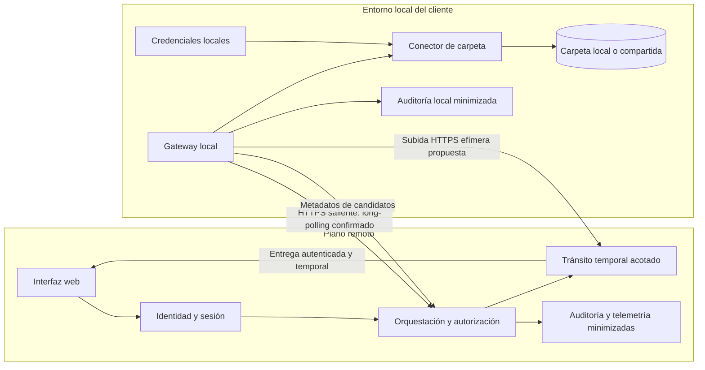
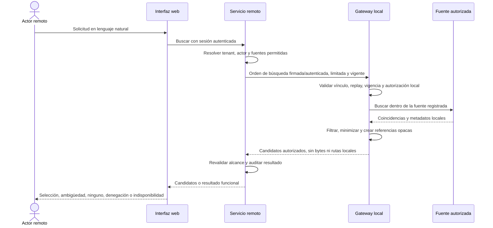

# LC-IA - Arquitectura mínima remota/local del MVP

Este documento define la arquitectura mínima del MVP de recuperación documental de LC-IA. Separa un servicio remoto de interacción y orquestación de un gateway instalado en el entorno local del cliente. La búsqueda devuelve únicamente candidatos autorizados; el contenido de un documento solo sale del entorno local ante una solicitud de obtención explícita, autorizada, cifrada, limitada y auditada.

No es un artefacto SDD/OpenSpec, no prescribe clases ni APIs definitivas y no afirma que exista una implementación.

## 1. Lectura rápida

| Tema | Definición |
| --- | --- |
| Experiencia | Interfaz web ofrecida como servicio remoto. |
| Acceso local | Gateway instalado en el entorno del cliente, con las credenciales y conectores locales. |
| Conectividad | El gateway inicia conexiones salientes; no se abren puertos entrantes en la red local. |
| Primera fuente | Carpeta local o compartida registrada y autorizada. |
| Búsqueda | Devuelve metadatos y candidatos autorizados, nunca el documento. |
| Obtención | Transfiere el documento solo por petición explícita y tras autorización remota y reevaluación local. |
| Custodia remota | Tránsito temporal sin copia persistente; se permiten buffers efímeros, acotados y eliminados. |
| Regla de diseño | Construir una sola vertical verificable antes de añadir conectores, infraestructura o capacidades. |
| Estado | `READY_FOR_SYNTHETIC_DEVELOPMENT`; no preparado para documentos reales, habilitación operativa ni producción. |

## 2. Alcance y fuentes

### 2.1. Incluido

- recuperación general de documentos mediante lenguaje natural;
- interfaz, sesión y orquestación en el plano remoto;
- gateway, conectores, credenciales y acceso a fuentes en el plano local;
- primer conector para una carpeta local o compartida;
- búsqueda de candidatos sin transferir contenido documental;
- obtención remota explícita de un documento autorizado;
- controles mínimos de identidad, autorización, integridad, expiración, auditoría y eliminación temporal;
- estados funcionales y fallos necesarios para operar la vertical.

### 2.2. Fuera del MVP

- extracción estructurada de campos;
- cálculos, agregaciones o suma de facturas;
- modificación, traslado, renombrado o borrado de documentos;
- conectores adicionales al de carpeta local o compartida;
- clasificación o antivirus no justificados por una decisión posterior; OCR local está incluido conforme al diseño especializado de fuentes e indexación;
- elección de LLM, framework frontend, proveedor cloud, broker, object storage o protocolo permanente;
- una plataforma genérica de agentes, microservicios o coordinación multi-Leo.

### 2.3. Fuentes y precedencia

La fuente funcional principal es [`LC-IA-piloto-recuperacion-documental-v0.1.md`](LC-IA-piloto-recuperacion-documental-v0.1.md). Para fuentes, extracción, OCR e indexación prevalece [`LC-IA-MVP-fuentes-indexacion-recuperacion-v0.1.md`](LC-IA-MVP-fuentes-indexacion-recuperacion-v0.1.md); para transporte y entrega de trabajo prevalece [`LC-IA-MVP-contrato-remoto-gateways-v0.1.md`](LC-IA-MVP-contrato-remoto-gateways-v0.1.md). El documento maestro v0.5 aporta contexto y decisiones previas de gobierno, pero su inventario arquitectónico general no se traslada automáticamente a este MVP. El inventario de clases v0.1 se consultó únicamente para evitar reproducir su nivel de detalle.

Ante conflicto, las decisiones confirmadas de este documento y la especificación funcional del piloto prevalecen para esta vertical.

## 3. Etiquetas de decisión

- **CONFIRMADO:** forma parte del alcance acordado y condiciona la implementación.
- **PROPUESTO:** camino mínimo recomendado; requiere validación antes de fijar el contrato técnico.
- **PENDIENTE:** decisión abierta que no debe resolverse por suposición.
- **FUERA DEL MVP:** capacidad que no debe incorporarse en esta vertical.

## 4. Decisiones confirmadas

| ID | Decisión confirmada |
| --- | --- |
| C-01 | El MVP recupera documentos de propósito general mediante solicitudes en lenguaje natural. |
| C-02 | La interfaz web se ofrece como servicio remoto. |
| C-03 | El gateway se instala en el entorno local del cliente. |
| C-04 | El plano remoto contiene interfaz, sesión y orquestación. |
| C-05 | El plano local contiene gateway, conectores, credenciales y acceso a fuentes. |
| C-06 | El gateway inicia la conexión saliente y no requiere puertos entrantes en la red local. |
| C-07 | El primer conector accede a una carpeta local o compartida mediante un contrato conceptual ampliable. |
| C-08 | Una búsqueda devuelve solo metadatos y candidatos autorizados; no transfiere el documento. |
| C-09 | Un actor remoto autorizado puede solicitar explícitamente la obtención de un documento. |
| C-10 | La obtención se autoriza tanto en remoto como de nuevo en local, y es cifrada y auditada. |
| C-11 | El servicio remoto actúa como tránsito temporal y no conserva una copia persistente del documento. |
| C-12 | La referencia de un candidato es opaca y estable dentro de su vigencia; nunca expone una ruta local. |
| C-13 | Extracción, cálculos, sumas, modificaciones y conectores adicionales quedan fuera del MVP. |

## 5. Propuestas mínimas

| ID | Propuesta | Motivo |
| --- | --- | --- |
| PR-01 | HTTPS saliente con long-polling, propuesta original confirmada por el contrato remoto-gateways. | Reduce infraestructura y evita un canal entrante o un túnel permanente. |
| PR-02 | Usar una subida HTTPS efímera para la obtención, asociada a una única solicitud de transferencia. | Mantiene búsqueda y contenido separados y permite límites, expiración e integridad. |
| PR-03 | Añadir WebSocket o túnel permanente solo si una latencia medida demuestra que long-polling no cumple el objetivo. | Evita complejidad operativa anticipada. |
| PR-04 | Emitir referencias opacas ligadas a tenant, fuente, identidad local del archivo y versión observable. | Permite seleccionar un candidato sin revelar rutas ni confiar en datos manipulables del navegador. |
| PR-05 | Descargar desde el navegador mediante un canal autenticado de un solo uso y corta duración. | Limita reutilización y exposición, aunque el mecanismo concreto sigue pendiente. |
| PR-06 | Tratar los registros remotos y locales como evidencia correlacionada mediante identificadores no sensibles. | Permite reconstruir una operación sin centralizar contenido ni rutas. |

Estas propuestas no eligen framework, proveedor, broker, almacenamiento, antivirus, motor OCR ni LLM.

## 6. Límites de confianza y responsabilidades

El servicio remoto y el gateway local son límites de confianza distintos. La autorización remota habilita una intención; no obliga al gateway a ejecutarla. El gateway conserva la autoridad final sobre el acceso efectivo a la fuente local.

| Zona | Confía en | No debe confiar en | Responsabilidades mínimas |
| --- | --- | --- | --- |
| Navegador | Sesión autenticada y respuestas del servicio remoto. | Tenant, permisos, referencias o rutas aportados por el usuario como autoridad. | Presentar consulta, candidatos y progreso; solicitar obtención explícita; no custodiar credenciales locales. |
| Servicio remoto | Identidad autenticada, configuración vigente y vínculo registrado con el gateway. | Metadatos del navegador sin validar ni una autorización remota como prueba de acceso local actual. | Resolver tenant y actor, autorizar la operación, orquestar, limitar, expirar y auditar; no persistir documentos. |
| Canal remoto/local | Identidad verificable de ambos extremos, cifrado e integridad. | Mensajes repetidos, vencidos, alterados o fuera del vínculo tenant-gateway. | Correlación, autenticación mutua o equivalente, anti-replay, idempotencia y cancelación. |
| Gateway local | Identidad del servicio remoto verificada y configuración local aprobada. | Una ruta, fuente o permiso indicado libremente por remoto. | Reevaluar autorización, resolver referencias opacas, aplicar límites, acceder a fuentes y transferir solo lo permitido. |
| Fuente autorizada | Credenciales locales y reglas de acceso configuradas. | El texto de la consulta como permiso o ruta autoritativa. | Proporcionar candidatos y bytes solo dentro de su alcance registrado. |

Las credenciales de las fuentes permanecen en el entorno local y no se envían al servicio remoto. Una pista de ubicación escrita por el actor se interpreta como criterio de búsqueda, nunca como ampliación de permisos.

## 7. Componentes mínimos



`TMP` no representa almacenamiento documental permanente. Puede usar memoria, disco temporal u otro buffer técnico, pero debe estar acotado por tamaño y tiempo y eliminarse al completar, expirar, cancelar o fallar.

## 8. Flujos funcionales

### 8.1. Búsqueda sin transferencia documental



Una búsqueda satisfactoria no autoriza por sí sola una transferencia posterior. Los candidatos deben incluir solo metadatos necesarios para reconocerlos, su procedencia presentable y una referencia opaca. No deben incluir rutas locales, credenciales, contenido completo ni extractos sensibles por defecto.

### 8.2. Obtención explícita del documento

```mermaid
sequenceDiagram
    actor A as Actor remoto
    participant W as Interfaz web
    participant R as Servicio remoto
    participant G as Gateway local
    participant F as Fuente autorizada
    participant T as Tránsito temporal

    A->>W: Solicita obtener un candidato
    W->>R: Referencia opaca + clave idempotente
    R->>R: Reautenticar contexto y autorizar obtención
    R->>G: Solicitud única, limitada, cancelable y con expiración
    G->>G: Validar canal, replay, vigencia y autorización local actual
    G->>F: Abrir documento por identidad local resuelta
    F-->>G: Bytes y atributos actuales
    G->>G: Comprobar cambio, tamaño e integridad; calcular hash
    G->>T: Subida cifrada asociada a la solicitud
    T-->>R: Disponibilidad temporal y hash recibido
    R->>R: Verificar integridad y emitir entrega de un solo uso
    R-->>W: Iniciar descarga autenticada
    W-->>A: Documento
    R->>T: Eliminar buffer al completar/expirar/fallar/cancelar
    R-->>G: Resultado final para auditoría correlacionada
```

La implementación no debe declarar éxito hasta verificar la integridad extremo a extremo y registrar el resultado. Si el archivo cambió desde la búsqueda, la transferencia se detiene o exige una nueva confirmación según la política que se acuerde; nunca se entrega silenciosamente una versión distinta.

## 9. Modelo conceptual mínimo

Este modelo expresa información e invariantes, no clases, tablas ni servicios.

| Concepto | Significado mínimo | Relaciones e invariantes |
| --- | --- | --- |
| Tenant | Organización aislada que posee la configuración remota y vincula instalaciones y actores. | Se deriva del contexto autenticado; no lo elige la consulta. |
| Actor | Persona o sistema autenticado que busca u obtiene documentos. | Pertenece a un tenant y recibe permisos explícitos; su autorización se comprueba por operación. |
| Instalación/gateway | Instancia local enrolada para un tenant y un entorno concretos. | Tiene identidad revocable, inicia conexiones salientes y solo opera sobre fuentes locales vinculadas. |
| Fuente autorizada | Repositorio local registrado y permitido, inicialmente una carpeta local o compartida. | Pertenece a una instalación y tiene alcance, estado y configuración local; una ruta del usuario no crea una fuente. |
| Candidato | Representación minimizada de una coincidencia autorizada. | Contiene referencia opaca y estable durante su vigencia, metadatos presentables y versión/hash observable; no contiene ruta local ni documento. |
| Solicitud de transferencia | Intención explícita de obtener un candidato concreto. | Está ligada a tenant, actor, gateway, candidato, autorización, idempotencia, expiración, límites y resultado. No puede reutilizarse para otro documento. |
| Evento de auditoría | Hecho inmutable y minimizado de seguridad u operación. | Correlaciona actor, operación, gateway, fuente lógica, tiempos y resultado sin registrar contenido ni rutas sensibles por defecto. |

La estabilidad de la referencia opaca no significa validez indefinida. Debe permitir reconocer el mismo candidato durante una ventana definida y detectar que el archivo fue sustituido, modificado o eliminado.

## 10. Estados funcionales mínimos

No se pretende definir una máquina de estados exhaustiva. Estos estados bastan para que usuario y operación distingan progreso, resultado y fallo.

### 10.1. Búsqueda

| Estado | Significado |
| --- | --- |
| Pendiente | Aceptada por remoto, todavía no ejecutada por el gateway. |
| En curso | El gateway está validando o consultando fuentes. |
| Completada | Terminó con uno o varios candidatos autorizados, o con resultado vacío verificable. |
| Denegada | La autorización remota o local no permite la búsqueda. |
| No disponible | Gateway o fuente necesarios no están disponibles; no equivale a cero resultados. |
| Expirada/cancelada | Superó su vigencia o fue cancelada antes de completar. |
| Fallida | Un error técnico distinto de indisponibilidad impidió concluir. |

### 10.2. Transferencia

| Estado | Significado |
| --- | --- |
| Solicitada | El actor pidió explícitamente obtener un candidato. |
| Autorizando | Se comprueban permisos remotos y locales actuales. |
| Transfiriendo | Los bytes atraviesan el canal cifrado y el buffer temporal. |
| Disponible | El documento está listo temporalmente para la entrega autorizada. |
| Completada | La entrega terminó, se verificó integridad y se inició la eliminación temporal. |
| Denegada | La autorización fue rechazada o revocada. |
| Expirada/cancelada | La solicitud dejó de ser válida; se detiene la transferencia y se eliminan buffers. |
| Fallida | Cambio de archivo, interrupción, hash distinto u otro error impidió completar. |

## 11. Controles imprescindibles

### 11.1. Enrollment e identidad del gateway

- El alta debe requerir una acción administrativa autenticada y un secreto o código de un solo uso, de vigencia corta.
- El resultado debe vincular de forma inequívoca tenant, instalación y gateway.
- El gateway debe obtener una identidad técnica rotatoria y revocable; el material secreto se protege localmente.
- Reenrollment, rotación y revocación deben quedar auditados.
- Un gateway revocado o asignado a otro tenant falla de forma cerrada.

El mecanismo exacto de enrollment y custodia de claves está **PENDIENTE**.

### 11.2. Canal remoto/local

- Se requiere autenticación mutua o un mecanismo equivalente que autentique al servicio y al gateway en cada intercambio.
- Todo mensaje de trabajo debe incluir identificador único, tenant e instalación vinculados, operación, emisión, expiración y datos protegidos contra alteración.
- El gateway rechaza mensajes vencidos, repetidos, de otro vínculo o con integridad inválida.
- TLS protege el tránsito; los secretos y credenciales de fuentes nunca abandonan el entorno local.

HTTPS saliente con long-polling está **CONFIRMADO** por [`LC-IA-MVP-contrato-remoto-gateways-v0.1.md`](LC-IA-MVP-contrato-remoto-gateways-v0.1.md). WebSocket, broker o túnel permanente quedan fuera del MVP según ese documento.

### 11.3. Autorización en dos límites

- Remoto autentica al actor y autoriza búsqueda u obtención para tenant, instalación y fuentes permitidas.
- Local verifica de nuevo que la orden pertenece a su tenant e instalación, sigue vigente y se limita a una fuente local habilitada.
- Antes de abrir los bytes, local reevalúa permisos, estado de la fuente, identidad/versionado del candidato y límites de transferencia.
- Una revocación conocida antes de completar detiene la operación y elimina cualquier buffer temporal.
- Ningún dato aportado por el navegador, incluido tenant, ruta o referencia manipulada, amplía permisos.

### 11.4. Anti-replay e idempotencia

- Cada búsqueda y transferencia tiene una clave idempotente con alcance de tenant y operación.
- Repetir la misma petición devuelve el resultado existente o continúa la misma operación; no crea una segunda transferencia.
- Tokens, órdenes y canales de entrega son de un solo uso o tienen nonce y ventana temporal verificable.
- El gateway conserva el mínimo estado temporal necesario para rechazar replays durante la ventana de riesgo.

### 11.5. Integridad, límites y cancelación

- El gateway calcula un hash del contenido transferido y remoto lo verifica antes de declarar disponibilidad o éxito.
- Se registra tamaño esperado y recibido; una diferencia o hash distinto falla de forma cerrada.
- Deben existir tamaños máximos por documento, tiempos máximos, límites de concurrencia y cuotas por tenant.
- Si el tamaño conocido supera el límite, se rechaza antes de transferir; si se descubre durante el flujo, se cancela y purga.
- La cancelación debe propagarse a gateway, subida, buffer y canal de entrega cuando sea técnicamente posible.
- Las operaciones tienen expiración absoluta; no permanecen pendientes indefinidamente.

Los valores concretos y la estrategia de reanudación están **PENDIENTES**.

### 11.6. Tránsito temporal y eliminación

"Sin persistencia" no significa "sin buffers". La transferencia necesita buffers temporales acotados en memoria, disco o infraestructura equivalente.

- El buffer contiene solo lo necesario para una entrega concreta.
- Tiene límite de tamaño, expiración corta y aislamiento por tenant y solicitud.
- No participa en backups, índices, analítica, entrenamiento ni replicación no necesaria.
- Se elimina al completar, expirar, cancelar o fallar, incluidos fragmentos parciales.
- La eliminación se registra como resultado operativo sin conservar el contenido.
- Un proceso de limpieza recupera buffers huérfanos tras caídas, con alerta si supera el tiempo objetivo.

La región, tecnología de buffer, garantía técnica de borrado y temporalidad exacta están **PENDIENTES**.

### 11.7. Auditoría y telemetría minimizadas

Se auditan, como mínimo: enrollment, rotación y revocación del gateway; búsquedas; decisiones de autorización; selección de candidato; solicitud, inicio, cancelación, expiración y resultado de transferencia; comprobación de integridad; y eliminación temporal.

La telemetría puede incluir identificadores opacos, tenant, gateway, operación, estado, código de error, duración, conteo de candidatos, tamaño, hash cuando su tratamiento sea aceptable y timestamps. Nunca incluye por defecto:

- contenido documental;
- texto completo de consultas sensibles;
- rutas locales o nombres de recurso sensibles;
- credenciales, tokens o material criptográfico;
- nombres de archivo si no son imprescindibles para la operación autorizada.

La retención de metadatos y el acceso a auditoría están **PENDIENTES**. Los logs técnicos no sustituyen a la auditoría de seguridad.

## 12. Modos de fallo y respuesta mínima

| Fallo | Comportamiento mínimo |
| --- | --- |
| Gateway desconectado | Marcar búsqueda u obtención como no disponible o pendiente dentro de una vigencia limitada; no afirmar que no hay documentos. |
| Fuente indisponible | Identificar indisponibilidad sin filtrar detalles sensibles; no convertirla en resultado vacío. |
| Archivo cambiado entre búsqueda y obtención | Detectar mediante identidad/versionado/hash observable; detener y exigir nueva búsqueda o confirmación según política. |
| Archivo borrado entre búsqueda y obtención | Fallar como candidato no vigente, sin intentar rutas alternativas ni revelar ubicaciones. |
| Transferencia interrumpida | Marcar fallo controlado, cancelar el canal y purgar fragmentos; reanudar solo si existe una estrategia explícita y segura. |
| Autorización revocada | Denegar o cancelar en la siguiente reevaluación disponible y eliminar buffers temporales. |
| Hash distinto | No entregar ni declarar éxito; purgar, auditar incidente y permitir un nuevo intento solo con una nueva validación. |
| Solicitud expirada | Rechazar en remoto y local, cancelar trabajo pendiente y eliminar buffers; una nueva operación requiere nueva autorización. |

Los mensajes al actor deben diferenciar denegación, indisponibilidad, expiración y fallo técnico sin revelar existencia, rutas o metadatos fuera de su alcance.

## 13. Preguntas abiertas que bloquean implementación con datos reales

| ID | Decisión pendiente | Debe cerrar |
| --- | --- | --- |
| P-01 | ¿Cuál es el proveedor y contrato de identidad del actor, incluido el claim fiable de tenant? | Autenticación remota y aislamiento. |
| P-02 | ¿Cómo se enrola, identifica, rota y revoca un gateway? | Confianza entre planos y recuperación operativa. |
| P-03 | ¿Qué política autoriza búsqueda y obtención por actor, fuente y documento? | Reglas remotas y reevaluación local. |
| P-04 | ¿Cómo recibe el navegador el documento: respuesta directa, URL de un solo uso u otro canal autenticado? | Contrato de entrega y controles del navegador. |
| P-05 | ¿Cuál es el tamaño máximo por documento y qué cuotas/concurrencia se permiten? | Rechazo temprano, buffers y capacidad. |
| P-06 | ¿Cuánto duran búsquedas, candidatos, solicitudes de transferencia y canales de entrega? | Expiración, replay y limpieza. |
| P-07 | ¿En qué región transitan los bytes y cuál es la temporalidad y garantía de eliminación? | Privacidad, cumplimiento y operación. |
| P-08 | ¿Se exige análisis antivirus antes de entregar y dónde se ejecuta, si aplica? | Flujo de seguridad y latencia; no se elige producto. |
| P-09 | ¿Qué metadatos y eventos se retienen, durante cuánto tiempo y quién puede consultarlos? | Auditoría, privacidad y soporte. |
| P-10 | ¿Las transferencias interrumpidas se reinician o se reanudan, y bajo qué prueba de integridad? | Idempotencia, buffers parciales y experiencia. |

Estas preguntas deben responderse con decisiones explícitas y criterios verificables. No justifican elegir anticipadamente un proveedor o construir capacidades fuera del MVP.

## 14. Vertical de implementación propuesta

Los incrementos son cortes funcionales pequeños, no tareas de código ni compromisos de tecnología.

1. **Vínculo seguro mínimo:** enrolar un gateway de prueba, autenticar ambos extremos, comprobar revocación y recibir una orden saliente sin acceder aún a documentos.
2. **Búsqueda local controlada:** registrar una carpeta autorizada, ejecutar una consulta y devolver candidatos con referencias opacas, sin rutas ni contenido.
3. **Búsqueda remota de extremo a extremo:** autenticar actor y tenant, aplicar autorización remota y local, mostrar resultados funcionales y auditar correlación.
4. **Transferencia efímera limitada:** solicitar un candidato explícitamente, aplicar límites, verificar hash y entregar mediante buffer temporal con eliminación comprobable.
5. **Fallos y operación del piloto:** cubrir desconexión, revocación, cambios de archivo, expiración, cancelación, limpieza de huérfanos y telemetría minimizada sobre el dataset aceptado.

No se añade un segundo conector ni un canal permanente hasta que esta vertical produzca evidencia y una necesidad medida.

## 15. Gate de preparación para implementar con datos reales

La implementación con datos o documentos reales y su habilitación operativa puede comenzar solo cuando todos los puntos aplicables tengan una respuesta verificable:

Se autoriza desarrollo ejecutable con datos exclusivamente sintéticos para validar contratos conceptuales, estados, aislamiento, idempotencia, resolución de ámbito y abstención. Esta autorización no habilita identidades, fuentes, metadatos ni documentos reales, ni demuestra que los controles de seguridad estén terminados.

- [ ] tenant, actores y responsables del piloto identificados;
- [ ] identidad del actor y claim fiable de tenant acordados;
- [ ] flujo de enrollment, rotación y revocación del gateway acordado;
- [ ] autenticación mutua o mecanismo equivalente definido;
- [ ] política de autorización remota y reevaluación local definida;
- [ ] primera carpeta registrada, autorizada y accesible en un entorno de prueba;
- [ ] metadatos permitidos para candidatos y formato de referencia opaca acordados;
- [ ] canal de entrega al navegador decidido;
- [ ] tamaño máximo, cuotas, concurrencia y expiraciones fijados;
- [ ] región, temporalidad, buffers y garantía de eliminación aprobados;
- [ ] necesidad o exclusión de antivirus decidida para el corpus inicial;
- [ ] retención y acceso a auditoría y telemetría aprobados;
- [ ] estrategia de reinicio o reanudación de transferencias decidida;
- [ ] dataset, métricas y resultados funcionales del piloto aceptados;
- [ ] respuestas esperadas para todos los modos de fallo de este documento revisadas;
- [ ] no existen elecciones tecnológicas que amplíen el alcance sin evidencia.

Si falta un control de identidad, autorización, integridad, límites o eliminación, no debe habilitarse la obtención remota de documentos. Puede validarse antes la búsqueda sin contenido, pero no simular que ambos riesgos son equivalentes.

## 16. Criterio de cierre del diseño

Este diseño está listo para desarrollo ejecutable exclusivamente sintético bajo la etiqueta `READY_FOR_SYNTHETIC_DEVELOPMENT`. Solo estará listo para documentos reales y habilitación operativa cuando las preguntas bloqueantes estén cerradas, el gate esté aprobado y exista una prueba de concepto de la vertical que demuestre:

- conexión exclusivamente saliente desde el gateway;
- búsqueda limitada a una fuente autorizada sin exponer rutas ni contenido;
- autorización independiente en remoto y local;
- transferencia explícita con integridad y límites;
- ausencia de copia persistente y eliminación verificable de buffers temporales;
- auditoría y telemetría suficientes sin contenido ni rutas sensibles por defecto.

Hasta entonces, WebSocket, túneles, brokers, almacenamiento de objetos, antivirus, LLM y conectores adicionales son decisiones no justificadas para el MVP. OCR local ya está confirmado y se rige por [`LC-IA-MVP-fuentes-indexacion-recuperacion-v0.1.md`](LC-IA-MVP-fuentes-indexacion-recuperacion-v0.1.md).
