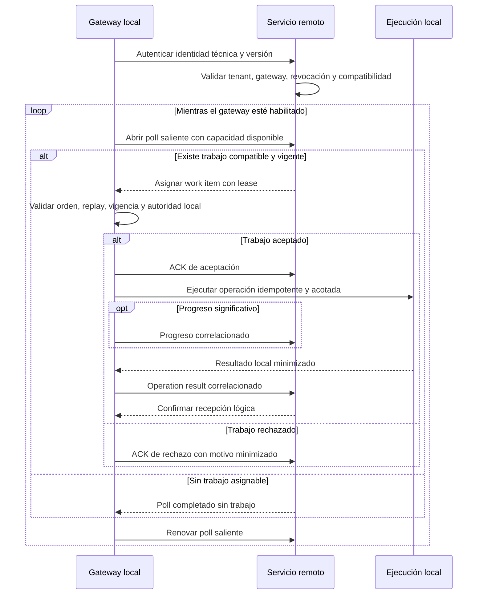
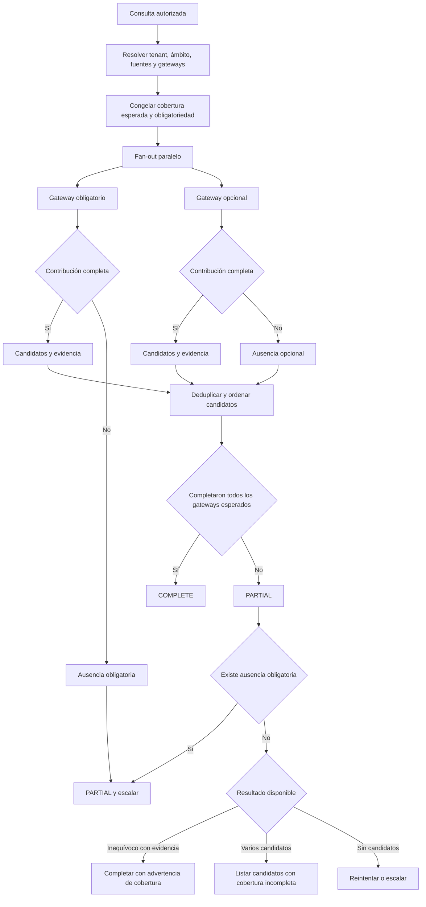
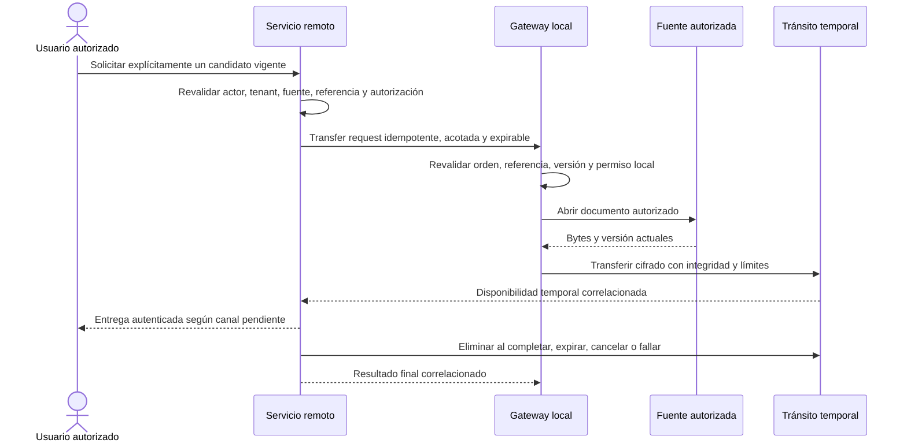

# LC-IA - Contrato remoto con gateways del MVP

Este documento define el contrato conceptual mínimo entre el servicio remoto de LC-IA y los gateways locales del MVP. Fija HTTPS saliente con long-polling, entrega al menos una vez, fan-out paralelo, cobertura por gateway, consolidación determinista y tratamiento explícito de fallos. No define mensajes serializados, endpoints, clases, tablas ni una implementación concreta.

## 1. Lectura rápida

| Tema | Decisión |
| --- | --- |
| Transporte | HTTPS saliente con long-polling iniciado por el gateway. |
| Entrega | Al menos una vez; toda operación debe ser idempotente. No se promete `exactly-once`. |
| Distribución | LC-IA envía en paralelo la búsqueda a todos los gateways autorizados del ámbito documental. |
| Cobertura | `COMPLETE` solo si completan todos los gateways esperados; cualquier ausencia produce `PARTIAL`. |
| Regla crítica | La ausencia de un gateway obligatorio siempre escala. |
| Resultado parcial | Nunca prueba inexistencia y siempre muestra cobertura incompleta. |
| Búsqueda | Devuelve candidatos y evidencia minimizada, sin transferir bytes documentales. |
| Obtención | Operación posterior y explícita con tránsito temporal, sin persistencia documental remota. |
| Autoridad local | El gateway decide finalmente si puede acceder a una fuente o entregar un documento. |
| Estado | Diseño sujeto a las preguntas bloqueantes y al gate de la sección 18. |

## 2. Propósito, alcance, exclusiones y precedencia

### 2.1. Propósito

El contrato debe permitir que LC-IA:

- entregue trabajo acotado a gateways que solo establecen conexiones salientes;
- tolere desconexiones, reintentos y duplicados sin ejecutar dos veces el efecto lógico;
- busque en paralelo en todos los gateways autorizados del ámbito documental;
- distinga ausencia de candidatos de cobertura incompleta;
- consolide candidatos sin mezclar tenants ni asumir identidades documentales globales;
- obtenga un documento únicamente tras una solicitud explícita y separada;
- produzca evidencia operativa y de auditoría minimizada y correlacionable.

### 2.2. Incluido en el MVP

- sesión técnica del gateway y presencia derivada del long-poll;
- asignación, lease, acknowledgement, progreso, cancelación y resultado de trabajo;
- reconexión, expiración, idempotencia, anti-replay y versionado del protocolo;
- fan-out paralelo, cobertura por gateway y consolidación agregada;
- obligatoriedad u opcionalidad administrativa por fuente o gateway;
- búsqueda sin bytes documentales;
- solicitud separada de obtención efímera;
- límites operativos, backpressure, reintentos acotados y auditoría minimizada;
- estados y respuestas ante los fallos de red relevantes para el MVP.

### 2.3. Fuera del MVP

- puertos entrantes en la red local;
- WebSocket, broker, túnel permanente o canal bidireccional persistente;
- garantía de entrega `exactly-once`;
- sincronización remota del corpus, texto extraído, OCR o índice local;
- transferencia de bytes durante la búsqueda;
- persistencia documental remota;
- rutas locales, credenciales de fuentes o tokens humanos dentro de órdenes al gateway;
- definición de JSON, OpenAPI, protobuf, endpoints, clases, tablas o base de datos;
- elección de algoritmo criptográfico, JWT, framework, proveedor o infraestructura concreta;
- valores numéricos de tiempos, tamaños, cuotas, concurrencia o reintentos;
- una plataforma genérica de mensajería o coordinación de agentes.

### 2.4. Fuentes y precedencia

Este diseño complementa:

- [`LC-IA-MVP-arquitectura-remota-local-v0.1.md`](LC-IA-MVP-arquitectura-remota-local-v0.1.md), que prevalece para la separación remoto/local, la obtención efímera y la custodia documental;
- [`LC-IA-MVP-identidad-tenants-gateways-v0.1.md`](LC-IA-MVP-identidad-tenants-gateways-v0.1.md), que prevalece para identidad humana, tenants, membresías, concesiones y ciclo de confianza del gateway;
- [`LC-IA-MVP-fuentes-indexacion-recuperacion-v0.1.md`](LC-IA-MVP-fuentes-indexacion-recuperacion-v0.1.md), que prevalece para fuentes, índice local, extracción, OCR, candidatos y referencias opacas;
- [`LC-IA-piloto-recuperacion-documental-v0.1.md`](LC-IA-piloto-recuperacion-documental-v0.1.md), que prevalece para el objetivo funcional y la evaluación del piloto.

Para transporte, entrega de trabajo, fan-out, cobertura y consolidación prevalecen las decisiones confirmadas de este documento. Una decisión confirmada posterior prevalece sobre una propuesta anterior del mismo alcance. Las preguntas pendientes no deben resolverse por suposición durante la implementación.

## 3. Estado de las decisiones

- **CONFIRMADO:** acordado y obligatorio para una implementación posterior.
- **PROPUESTO:** mecanismo mínimo recomendado que requiere validación antes de fijar el contrato técnico.
- **PENDIENTE:** decisión bloqueante que no debe cerrarse sin evidencia o aprobación.
- **FUERA DEL MVP:** capacidad excluida de esta versión.

## 4. Decisiones confirmadas

| ID | Decisión |
| --- | --- |
| C-01 | El transporte inicial es HTTPS saliente con long-polling iniciado por el gateway. |
| C-02 | El MVP no requiere puertos entrantes, WebSocket, broker ni túnel permanente. |
| C-03 | El protocolo soporta reconexión, expiración, cancelación, idempotencia, anti-replay y versionado. |
| C-04 | La semántica de entrega es al menos una vez; no se promete `exactly-once`. |
| C-05 | LC-IA realiza fan-out paralelo a todos los gateways autorizados asociados al ámbito documental resuelto para la consulta. |
| C-06 | El servicio consolida candidatos y registra cobertura individual por gateway. |
| C-07 | Si uno o más gateways esperados no completan, la cobertura agregada es `PARTIAL`. |
| C-08 | `PARTIAL` nunca permite afirmar inexistencia; solo permite indicar que no se localizó el documento en las fuentes disponibles. |
| C-09 | Un resultado `PARTIAL` puede completarse funcionalmente solo si todos los gateways ausentes son opcionales y existe un candidato inequívoco respaldado por evidencia. |
| C-10 | `PARTIAL` con varios candidatos devuelve la lista disponible e indica cobertura incompleta. |
| C-11 | `PARTIAL` sin candidatos se reintenta o escala; nunca concluye inexistencia. |
| C-12 | La ausencia de cualquier gateway obligatorio prevalece sobre otros resultados y siempre escala. |
| C-13 | El administrador del tenant configura obligatoriedad u opcionalidad por fuente o gateway dentro del ámbito documental. El usuario final y el modelo no pueden cambiarla durante la consulta. |
| C-14 | Toda fuente incluida es obligatoria por defecto. El administrador puede marcarla opcional mediante un control simple que explique el efecto sobre resultados parciales. |
| C-15 | Búsqueda y obtención documental son operaciones separadas. La búsqueda no transfiere bytes. |
| C-16 | La obtención explícita utiliza tránsito temporal sin persistencia documental remota. |
| C-17 | El gateway conserva autoridad local final sobre permisos, fuentes y acceso efectivo. |

## 5. Propuestas mínimas y decisiones pendientes

### 5.1. Propuestas mínimas

| ID | Propuesta | Motivo |
| --- | --- | --- |
| PR-01 | Tratar cada poll válido como solicitud de trabajo y señal de presencia, sin añadir un canal de heartbeat separado. | El long-poll ya aporta contacto autenticado suficiente para el MVP. |
| PR-02 | Mantener un solo resultado lógico por combinación de operación e idempotencia, aunque existan varios intentos de entrega. | Hace segura la semántica al menos una vez. |
| PR-03 | Asignar cada trabajo mediante una lease renovable y acotada, sin transferir propiedad definitiva al gateway. | Permite recuperar trabajos tras desconexión o reinicio. |
| PR-04 | Aplicar backpressure dejando de asignar trabajo cuando el gateway declara o alcanza su capacidad admitida. | Evita colas locales sin límite y timeouts inducidos por sobrecarga. |
| PR-05 | Ordenar candidatos con señales locales minimizadas y criterios de desempate estables definidos por el servicio. | Permite consolidación reproducible sin trasladar texto documental. |
| PR-06 | Representar la cobertura esperada antes del fan-out y conservarla sin rebajas durante toda la operación. | Impide convertir una ausencia operativa en un alcance aparentemente menor. |

### 5.2. Decisiones pendientes

Permanecen pendientes los valores y criterios concretos de poll, lease, expiración, concurrencia, tamaño de mensajes, reintentos, cancelación, compatibilidad, evidencia, deduplicación, selección de ámbito, retención, descarga al navegador y operación offline. Se enumeran como preguntas bloqueantes en la sección 17.

## 6. Límites de confianza y responsabilidades

Una autorización remota habilita una intención; nunca obliga al gateway a ejecutarla. Cada límite valida su propio contexto y falla de forma cerrada si no puede demostrar tenant, gateway, fuentes, vigencia e integridad.

| Límite | Responsabilidades | No debe aceptar como autoridad |
| --- | --- | --- |
| Navegador | Presentar la consulta, progreso, cobertura, candidatos y solicitud explícita de obtención. | Tenant, gateway, fuentes, rutas, obligatoriedad o permisos aportados libremente por la persona. |
| Servicio remoto | Resolver actor, tenant, ámbito y gateways; autorizar; crear trabajo acotado; realizar fan-out; consolidar; limitar; cancelar; expirar y auditar. | Una pista de ubicación como permiso, una respuesta de otro tenant o la disponibilidad como prueba de cobertura completa. |
| Canal remoto/local | Autenticar ambos extremos o aplicar garantía equivalente; proteger confidencialidad, integridad, vigencia y replay. | Mensajes alterados, repetidos fuera de política, vencidos o ligados a otro tenant o gateway. |
| Gateway local | Autenticar al servicio, validar la orden, aplicar límites y autorización local, operar solo sobre fuentes registradas y devolver resultados minimizados. | Rutas, credenciales, permisos o fuentes indicados libremente por remoto, navegador, usuario o modelo. |
| Fuente e índice local | Resolver identidad documental, búsqueda, evidencia y bytes dentro del alcance configurado. | Una consulta o referencia opaca como concesión suficiente de acceso. |

Las credenciales de fuentes, rutas, corpus, texto extraído, texto OCR e índice permanecen en el entorno local. El servicio remoto conserva autoridad sobre orquestación y autorización remota; el gateway conserva la decisión final sobre ejecución local.

## 7. Modelo conceptual mínimo

Este modelo expresa significado e invariantes. No define clases, tablas, endpoints ni mensajes serializados.

| Concepto | Significado mínimo | Invariantes |
| --- | --- | --- |
| Gateway session | Contexto técnico autenticado y revocable de un gateway enrolado. | Está ligado a un tenant, instalación, gateway y versión compatible; no es una sesión humana. |
| Poll | Solicitud saliente y acotada del gateway para recibir trabajo o una respuesta vacía. | Renueva presencia observada; su repetición es normal y no crea por sí sola una nueva operación. |
| Work item | Unidad de trabajo autorizada que representa búsqueda, obtención u otra operación admitida. | Está ligada a tenant, gateway, fuentes, operación, correlación, idempotencia, emisión, expiración y versión. |
| Lease | Derecho temporal de un gateway a procesar un intento de un work item. | Su vencimiento permite reasignar o cerrar el intento, pero no elimina la obligación de idempotencia. |
| Acknowledgement | Confirmación de recepción y aceptación o rechazo inicial del trabajo. | No equivale a resultado ni a éxito; puede duplicarse o perderse sin cambiar el efecto lógico. |
| Operation result | Resultado terminal o progreso de una operación ejecutada por un gateway. | Se acepta solo con contexto, vigencia y correlación válidos; duplicados compatibles no crean nuevos efectos. |
| Search request | Intención de buscar candidatos en un ámbito documental autorizado. | No contiene rutas ni transfiere bytes; el ámbito se resuelve antes del fan-out. |
| Gateway coverage | Evidencia del estado de la contribución esperada de un gateway. | Conserva obligatoriedad, fuentes esperadas y resultado; una ausencia no se convierte en resultado vacío. |
| Aggregate result | Consolidación de cobertura y candidatos de todos los gateways esperados. | Es `COMPLETE` o `PARTIAL`, no mezcla tenants y no oculta contribuciones ausentes. |
| Candidate | Coincidencia local autorizada y minimizada. | Incluye referencia opaca, procedencia, versión o huella observable y evidencia permitida; no contiene ruta, texto ni bytes. |
| Transfer request | Intención explícita de obtener un candidato vigente. | Es independiente de la búsqueda, acotada a un candidato y su contexto, idempotente, cancelable y expirable. |
| Protocol version | Identificación de capacidades y semántica de intercambio compatibles. | Una versión no compatible impide asignar o aceptar trabajo cuyo significado no pueda preservarse. |
| Correlation/audit event | Evidencia minimizada de un hecho de protocolo o de negocio. | Correlaciona tenant, gateway, operación, intento, estado y tiempo sin registrar contenido, rutas ni secretos por defecto. |

## 8. Semántica de entrega y órdenes acotadas

### 8.1. Entrega al menos una vez

La red puede perder una respuesta después de que el receptor haya actuado. Por ello, tanto una orden como un acknowledgement, progreso o resultado pueden recibirse más de una vez.

- El servicio puede volver a ofrecer un work item no confirmado o con lease vencida.
- El gateway debe reconocer la misma operación e idempotencia y reutilizar su estado o resultado lógico cuando siga disponible.
- La repetición de una transferencia no puede producir dos entregas documentales independientes.
- El servicio debe aceptar resultados duplicados compatibles como la misma conclusión y rechazar duplicados contradictorios para revisión.
- Ningún componente debe inferir `exactly-once` a partir de un ACK, una conexión HTTPS o una lease.

### 8.2. Contenido autoritativo de una orden

Cada orden debe proteger contra manipulación y acotar, como mínimo:

- tenant derivado del contexto autorizado;
- gateway destinatario;
- fuentes registradas permitidas para esa operación;
- tipo de operación admitida;
- identificador único de mensaje o intento;
- identificador de correlación de extremo a extremo;
- clave de idempotencia con alcance de tenant y operación;
- instante de emisión;
- expiración absoluta;
- versión del protocolo.

La orden no incluye rutas locales, credenciales de fuentes ni tokens de autenticación humana reenviados. El gateway resuelve fuentes y referencias mediante su configuración local y recibe solo la evidencia mínima verificable del contexto autorizado.

### 8.3. Validaciones obligatorias

Antes de aceptar trabajo, el gateway comprueba identidad del servicio, vínculo tenant-gateway, integridad, versión, emisión, expiración, replay, idempotencia, operación admitida, fuentes locales vinculadas, capacidad y autorización local vigente. El servicio aplica validaciones equivalentes a polls, ACK, progreso y resultados recibidos del gateway.

## 9. Flujo de long-polling

El cierre normal o accidental del poll no cancela automáticamente una operación ya aceptada. La lease, la expiración absoluta y una cancelación explícita determinan si puede continuar.

## 10. Fan-out, cobertura y consolidación

### 10.1. Flujo agregado

### 10.2. Reglas exactas de cobertura

La cobertura esperada se fija antes del fan-out con los gateways y fuentes autorizados del ámbito documental. No se reduce porque un gateway esté desconectado, lento, no disponible, cancelado o falle.

| Cobertura | Condición exacta |
| --- | --- |
| `COMPLETE` | Todos los gateways esperados produjeron una contribución terminal válida que cubre las fuentes asignadas del ámbito. |
| `PARTIAL` | Al menos un gateway esperado no produjo una contribución terminal válida para el ámbito, cualquiera que sea su obligatoriedad. |

Una contribución denegada, expirada, cancelada, fallida, incompatible, desconectada, no disponible o aún en curso no cuenta como completa. Un resultado válido sin candidatos sí puede completar la contribución de un gateway, siempre que haya cubierto todas sus fuentes esperadas y no oculte fallos locales relevantes.

### 10.3. Política acordada de LeoDocumental

| Cobertura y candidatos | Comportamiento funcional |
| --- | --- |
| `COMPLETE` con candidato inequívoco | Puede presentar el candidato inequívoco con su evidencia y procedencia. |
| `COMPLETE` con varios candidatos | Presenta la lista ordenada y conserva la ambigüedad. |
| `COMPLETE` sin candidatos | Puede indicar que no se localizó el documento en todas las fuentes autorizadas del ámbito consultado; no afirma inexistencia universal. |
| `PARTIAL` con cualquier gateway obligatorio ausente | Escala siempre, aunque exista un candidato aparentemente inequívoco. La ausencia obligatoria prevalece. |
| `PARTIAL` con solo gateways opcionales ausentes y candidato inequívoco respaldado por evidencia | Puede completar funcionalmente la recuperación, mostrando de forma inequívoca que la cobertura fue incompleta. |
| `PARTIAL` con varios candidatos | Devuelve la lista disponible y muestra cobertura incompleta; no elige arbitrariamente. |
| `PARTIAL` sin candidatos | Reintenta de forma acotada o escala; nunca concluye inexistencia. |

En cualquier `PARTIAL`, la formulación permitida es que el documento no se localizó en las fuentes disponibles o que los candidatos proceden solo de la cobertura alcanzada. No se permite afirmar que el documento no existe.

### 10.4. Obligatoriedad por defecto y administración mínima

- Toda fuente incluida en un ámbito documental es obligatoria por defecto.
- El administrador del tenant puede marcar una fuente o gateway como opcional dentro del ámbito que administra.
- El cambio requiere una acción explícita y persistida fuera de la consulta.
- El control debe explicar, antes de confirmar, que la ausencia de una fuente o gateway opcional permitirá completar determinados resultados con cobertura parcial.
- La vista administrativa debe mostrar estado guardado, ámbito afectado y si cada fuente o gateway es obligatorio u opcional, sin requerir reglas, herencia ni un constructor de políticas.
- El usuario final, el modelo y el texto de la consulta no pueden rebajar obligatoriedad ni excluir silenciosamente cobertura esperada.
- Todo cambio genera auditoría y solo afecta operaciones iniciadas bajo la configuración vigente que corresponda; el comportamiento exacto sobre operaciones ya iniciadas queda pendiente.

## 11. Consolidación determinista de candidatos

La consolidación conserva procedencia, evidencia y cobertura. No convierte similitud en identidad global.

1. Rechazar cualquier contribución cuyo tenant, gateway, operación, correlación, vigencia o versión no coincida.
2. Mantener cada candidato ligado a su tenant, gateway, fuente, referencia opaca y versión observable.
3. Detectar posibles duplicados solo mediante evidencia permitida y una política aprobada; hasta entonces, conservar candidatos separados.
4. No asumir que nombres iguales, bytes iguales o metadatos similares representan una única identidad documental global.
5. Ordenar mediante señales locales minimizadas y reglas de desempate estables, sin trasladar texto extraído, OCR o fragmentos coincidentes.
6. Conservar la evidencia local que justifica ranking y carácter inequívoco dentro del conjunto permitido.
7. Ante empate o evidencia insuficiente, devolver varios candidatos en lugar de elegir arbitrariamente.
8. No mezclar candidatos, cobertura, configuración ni auditoría entre tenants.
9. No eliminar de la cobertura un gateway ausente por el hecho de haber encontrado candidatos en otros gateways.
10. No rebajar `PARTIAL` a `COMPLETE` mediante deduplicación, ranking o decisión del modelo.

La evidencia mínima admisible para un candidato, la normalización de puntuaciones y la política de deduplicación se deciden con el dataset real antes de implementar.

## 12. Obtención documental efímera y separada

La búsqueda termina con candidatos y referencias opacas. Obtener bytes requiere una nueva autorización y un work item independiente. Las garantías completas de custodia, integridad, buffers y eliminación se mantienen en [`LC-IA-MVP-arquitectura-remota-local-v0.1.md`](LC-IA-MVP-arquitectura-remota-local-v0.1.md); este documento solo fija su relación con el protocolo de trabajo.

La referencia opaca no concede acceso. Una búsqueda idempotente no implica que la obtención esté autorizada, y una obtención repetida con la misma idempotencia no debe crear otra transferencia lógica ni ampliar su vigencia.

## 13. Estados mínimos

### 13.1. Work item

| Estado | Significado |
| --- | --- |
| Pendiente | Autorizado y disponible para asignación, aún sin intento aceptado vigente. |
| Ofrecido | Entregado a un gateway bajo una lease, sin ACK de aceptación confirmado. |
| Aceptado | ACK válido recibido; el gateway puede estar ejecutando dentro de lease y expiración. |
| En curso | Existe progreso válido o evidencia de ejecución local. |
| Completado | Resultado terminal válido aceptado para la operación lógica. |
| Rechazado | El gateway no aceptó el trabajo por una causa válida y minimizada. |
| Cancelado | La cancelación es efectiva para la operación; un resultado posterior no la revierte. |
| Expirado | Se alcanzó la expiración absoluta; no puede producir un nuevo éxito. |
| Fallido | Un error terminal impidió completar y no queda un reintento admitido dentro de la política. |

Una lease vencida no es por sí sola un estado terminal del work item: termina un intento y permite reofrecerlo si la operación sigue vigente y la política de reintentos lo admite.

### 13.2. Gateway contribution

| Estado | Significado |
| --- | --- |
| Esperada | El gateway forma parte de la cobertura congelada y todavía no tiene resultado terminal válido. |
| En curso | El gateway aceptó o está procesando el trabajo. |
| Completa | Produjo resultado válido para todas sus fuentes esperadas, con candidatos o sin ellos. |
| Denegada | La autoridad local rechazó la operación. |
| No disponible | El gateway respondió, pero no puede ejecutar el alcance por estado operativo o de sus fuentes. |
| Desconectada | No existe contacto válido suficiente para asignar o continuar el trabajo. |
| Lenta | Mantiene contacto o progreso válido, pero no completa dentro del umbral operativo acordado. |
| Cancelada | La contribución terminó por cancelación. |
| Expirada | La contribución no llegó a resultado válido antes de la expiración. |
| Fallida | Un error terminal impidió una contribución válida. |
| Incompatible | La versión no permite preservar la semántica requerida. |

Solo `Completa` satisface la cobertura esperada. Los demás estados producen o mantienen `PARTIAL` cuando la búsqueda agregada termina.

### 13.3. Aggregate search

| Estado | Significado |
| --- | --- |
| Preparando | Se resuelven autorización, ámbito y cobertura esperada. |
| Distribuyendo | Se crean y ofrecen contribuciones en paralelo. |
| En curso | Al menos una contribución sigue activa dentro de la vigencia. |
| `COMPLETE` | Todas las contribuciones esperadas están completas y el resultado fue consolidado. |
| `PARTIAL` | La consolidación terminó con una o más contribuciones no completas. |
| Cancelada | La búsqueda agregada fue cancelada y no admite un nuevo resultado de éxito. |
| Expirada | Venció antes de obtener una conclusión admitida. |
| Fallida | No fue posible producir un resultado agregado fiable por un error no representable solo como cobertura parcial. |

## 14. Presencia, capacidad y control de carga

La presencia se deriva de polls autenticados, ACK, progreso, resultados y último contacto válido. No se introduce un heartbeat independiente en el MVP salvo que la evidencia operativa demuestre que el long-poll no basta.

| Estado operativo | Interpretación |
| --- | --- |
| Connected | Existe un poll o contacto válido reciente y el gateway puede recibir trabajo según su capacidad. |
| Disconnected | No existe contacto válido dentro del criterio acordado; no puede asumirse que el gateway recibió cancelaciones o revocaciones. |
| Unavailable | Existe contacto, pero el gateway o una dependencia local declara que no puede aceptar o completar el trabajo. |
| Slow | Existe contacto o progreso, pero la operación supera el umbral esperado sin haber expirado ni quedado desconectada. |

Estos estados no se deducen solo de latencia de red ni se convierten en resultados vacíos. Sus umbrales quedan pendientes.

- El gateway informa capacidad disponible de forma no manipulable o el servicio la deriva de límites acordados.
- El servicio aplica rate limits por identidades y ámbitos relevantes sin mezclar cuotas entre tenants.
- El servicio no asigna más trabajo que la capacidad admitida y aplica backpressure cuando no existe capacidad.
- Gateway y servicio aplican límites de concurrencia y tamaño antes de aceptar trabajo cuando sea posible.
- Las leases y expiraciones impiden que el trabajo permanezca reservado indefinidamente.
- Los timeouts distinguen espera de poll, lease, operación y expiración absoluta.
- Los reintentos son acotados, respetan idempotencia y usan una dispersión conceptual para evitar reconexiones sincronizadas; cantidad, espera y variación quedan pendientes.
- La cancelación se propaga en el siguiente contacto disponible y no depende de mantener abierto un canal permanente.

## 15. Política ante fallos y carreras

| Situación | Comportamiento obligatorio |
| --- | --- |
| ACK perdido | El servicio puede reofrecer el mismo trabajo. El gateway reconoce operación e idempotencia, no duplica el efecto y devuelve su estado o ACK vigente. |
| Resultado duplicado | El servicio conserva un único resultado lógico. Si el duplicado es compatible, lo reconoce; si contradice el resultado aceptado, no lo sustituye y registra revisión. |
| Gateway reiniciado | Se autentica de nuevo, abre otro poll y recupera o informa el estado idempotente disponible. El servicio no supone que una lease anterior sigue ejecutándose. |
| Lease vencida | El intento deja de poseer la lease. El servicio puede reofrecer el trabajo si sigue vigente; cualquier ejecución concurrente debe converger por idempotencia. |
| Cancelación tardía | Si la operación ya completó antes de la cancelación efectiva, se informa esa carrera sin inventar reversión. Si la cancelación fue efectiva primero, un resultado posterior no cambia el estado cancelado. |
| Resultado tras expiración | No se acepta como éxito nuevo ni amplía la vigencia. Se descarta funcionalmente, se registra de forma minimizada y se limpian recursos aplicables. |
| Versiones incompatibles | No se asigna o acepta trabajo cuyo significado no pueda preservarse. Se marca contribución incompatible, se refleja en cobertura y se escala si es obligatoria. |
| Poll interrumpido | El gateway abre otro poll según la política acotada. La interrupción no crea trabajo nuevo ni cancela automáticamente trabajo aceptado. |
| Mensaje repetido | Se valida anti-replay e idempotencia. Un replay inválido se rechaza; una repetición legítima recupera el mismo efecto lógico. |
| Gateway desconectado durante cancelación | El servicio marca la cancelación y deja de aceptar un éxito posterior cuando ya sea efectiva. El gateway la aplica al reconectar o detiene por expiración local. |
| Fuente local deja de estar disponible | El gateway devuelve indisponibilidad explícita; no devuelve cero candidatos como si hubiera buscado completamente. |

La precedencia entre finalización, cancelación y expiración debe basarse en eventos verificables y ordenables dentro de la operación, no en la hora presentada libremente por un participante.

## 16. Seguridad, observabilidad y auditoría minimizadas

### 16.1. Controles de protocolo

- autenticación mutua o mecanismo equivalente para verificar servicio y gateway en cada intercambio;
- confidencialidad e integridad de polls, órdenes, ACK, progreso, resultados y transferencias;
- identidad revocable del gateway ligada a tenant e instalación;
- anti-replay mediante identidad de mensaje, vigencia y estado mínimo necesario;
- idempotencia con alcance inequívoco de tenant y operación;
- rechazo cerrado de tenant, gateway, fuente, versión, emisión o expiración discrepantes;
- rate limits, backpressure, concurrencia y tamaños máximos en ambos extremos;
- leases, ACK, cancelación, timeouts y reintentos acotados;
- reevaluación local antes de buscar y antes de abrir bytes;
- invalidación ante revocación de gateway, membership, concesión, fuente o referencia.

Los mecanismos y valores concretos se eligen después del gate. Este documento no prescribe algoritmos criptográficos, formato de credenciales ni tipo de sesión.

### 16.2. Observabilidad mínima por gateway y operación

Como mínimo se observa:

- identidad opaca de tenant, gateway, operación, mensaje, intento y correlación;
- versión negociada y resultado de compatibilidad;
- apertura y cierre de poll, último contacto válido y estado derivado;
- asignación y vencimiento de lease;
- ACK de aceptación o rechazo;
- progreso cuando sea necesario para operación;
- estado terminal, motivo categórico y cobertura aportada;
- cantidad de candidatos, nunca su contenido documental;
- cancelación, expiración, reintento, duplicado e incompatibilidad;
- para transferencia, tamaño operativo permitido, comprobación de integridad y eliminación temporal cuando su tratamiento esté aprobado.

No se registran por defecto:

- texto completo de consultas;
- contenido documental, fragmentos coincidentes, texto extraído o texto OCR;
- rutas locales, raíces, credenciales o secretos;
- tokens de autenticación humana o material criptográfico;
- nombres de archivo u otros metadatos sensibles salvo necesidad aprobada y minimizada.

Los logs técnicos no sustituyen eventos de auditoría. La retención, acceso, integridad y localización de ambos quedan pendientes.

## 17. Preguntas bloqueantes

| ID | Pregunta que debe cerrarse |
| --- | --- |
| P-01 | ¿Cuánto duran la espera de poll, la lease y la expiración absoluta de cada tipo de operación, y qué relación deben mantener? |
| P-02 | ¿Qué límites de concurrencia se aplican por gateway, tenant, fuente y tipo de operación, y cómo declara o deriva el servicio la capacidad? |
| P-03 | ¿Cuál es el tamaño máximo de órdenes, progreso, resultados, lotes de candidatos y transferencias, medido con el corpus real? |
| P-04 | ¿Cuántos reintentos se permiten por fallo, con qué espera, dispersión y condiciones de abandono? |
| P-05 | ¿Qué latencia de cancelación es aceptable, qué puntos la hacen efectiva y qué trabajo local puede no ser interrumpible de inmediato? |
| P-06 | ¿Qué política de compatibilidad, negociación, despliegue, retirada y soporte se aplica a versiones del protocolo? |
| P-07 | ¿Qué evidencia mínima puede salir del gateway para justificar ranking y declarar un candidato inequívoco sin revelar contenido? |
| P-08 | ¿Cómo se detectan posibles candidatos duplicados entre fuentes o gateways sin asumir identidad documental global? |
| P-09 | ¿Cómo se selecciona y congela el ámbito documental de una consulta cuando existen varias fuentes y gateways autorizados? |
| P-10 | ¿Cuánto se retienen idempotencia, anti-replay, resultados, cobertura, auditoría, telemetría y referencias opacas? |
| P-11 | ¿Cómo recibe el navegador la descarga autenticada, temporal y de uso acotado sin persistencia documental remota? |
| P-12 | ¿Qué puede hacer un gateway offline con trabajo previamente aceptado, permisos o revocaciones no comprobables y resultados pendientes? |
| P-13 | ¿Qué umbrales distinguen `Disconnected`, `Unavailable` y `Slow`, y cómo evitan falsos cambios de estado? |
| P-14 | ¿Cómo afecta un cambio administrativo de obligatoriedad a búsquedas ya iniciadas? |
| P-15 | ¿Qué criterio verificable ordena finalización, cancelación y expiración cuando sus mensajes se cruzan? |

No deben fijarse valores por conveniencia. Deben derivarse del corpus, la red del piloto, los límites operativos, la experiencia aceptada y el modelo de amenazas.

## 18. Gate previo a implementación

No debe comenzar la implementación del contrato remoto hasta que todos los puntos aplicables tengan una respuesta verificable:

- [ ] tenant, instalaciones, gateways, fuentes y responsables del piloto identificados;
- [ ] ámbitos documentales y cobertura esperada definibles sin intervención del modelo;
- [ ] obligatoriedad por defecto y flujo administrativo de opcionalidad aprobados;
- [ ] autenticación mutua o mecanismo equivalente y ciclo de revocación definidos;
- [ ] formato conceptual protegido de órdenes y respuestas revisado sin rutas ni tokens humanos;
- [ ] semántica al menos una vez e idempotencia validables para búsqueda y obtención;
- [ ] poll, lease, ACK, progreso, expiración, cancelación y reintentos definidos con criterios observables;
- [ ] límites de concurrencia, tamaño, rate limit y backpressure medidos y aprobados;
- [ ] política de presencia y umbrales de desconexión, indisponibilidad y lentitud acordados;
- [ ] compatibilidad y ciclo de versiones definidos;
- [ ] ámbito, evidencia, ranking, ambigüedad y deduplicación evaluables con dataset;
- [ ] reglas `COMPLETE`/`PARTIAL` y política de LeoDocumental revisadas por producto y seguridad;
- [ ] comportamiento ante ACK perdido, duplicados, reinicio, lease vencida, carreras y expiración probado conceptualmente;
- [ ] canal de descarga al navegador y eliminación temporal aprobados en el diseño remoto/local;
- [ ] política offline y aplicación de revocaciones decididas;
- [ ] eventos, minimización, acceso, integridad y retención de observabilidad y auditoría aprobados;
- [ ] escenarios de aislamiento entre tenants, gateways y fuentes preparados;
- [ ] criterios de aceptación de la sección 19 revisados;
- [ ] ninguna elección añade WebSocket, broker, túnel, persistencia documental remota o infraestructura no justificada.

Si falta una decisión de identidad, autorización, idempotencia, expiración, cobertura, aislamiento o eliminación temporal, no debe habilitarse trabajo con documentos reales. Puede validarse el protocolo con trabajo sintético, pero no presentarlo como control de seguridad terminado.

## 19. Criterios de aceptación observables

| ID | Criterio |
| --- | --- |
| CA-01 | Un gateway recibe trabajo usando únicamente HTTPS saliente con long-polling y sin puerto entrante, WebSocket, broker ni túnel permanente. |
| CA-02 | Interrumpir y renovar un poll no crea una nueva operación lógica ni cancela automáticamente la aceptada. |
| CA-03 | Repetir una orden por ACK perdido produce el mismo estado o resultado lógico y no duplica efectos. |
| CA-04 | Un resultado duplicado compatible se reconoce como el mismo; uno contradictorio no sustituye silenciosamente al aceptado. |
| CA-05 | Un mensaje vencido, repetido fuera de política, alterado, incompatible o ligado a otro tenant o gateway se rechaza. |
| CA-06 | Una orden contiene el alcance autoritativo mínimo y no contiene rutas locales, credenciales de fuentes ni tokens humanos reenviados. |
| CA-07 | El gateway puede rechazar una orden autorizada remotamente cuando la autorización, fuente o estado local no la permite. |
| CA-08 | LC-IA realiza fan-out en paralelo a todos los gateways autorizados del ámbito congelado. |
| CA-09 | Cada gateway esperado conserva una contribución observable y su ausencia nunca se convierte en cero candidatos. |
| CA-10 | `COMPLETE` solo se produce cuando todas las contribuciones esperadas son válidas y completas. |
| CA-11 | La ausencia de cualquier gateway esperado produce `PARTIAL`, aunque sea opcional. |
| CA-12 | La ausencia de un gateway obligatorio escala siempre y prevalece sobre cualquier candidato recibido. |
| CA-13 | Con solo gateways opcionales ausentes, un candidato inequívoco puede completarse únicamente con evidencia y advertencia de cobertura incompleta. |
| CA-14 | `PARTIAL` con varios candidatos muestra la lista disponible y no elige arbitrariamente. |
| CA-15 | `PARTIAL` sin candidatos reintenta de forma acotada o escala y nunca afirma inexistencia. |
| CA-16 | Una fuente nueva es obligatoria por defecto y solo el administrador del tenant puede hacerla opcional mediante una acción explícita y explicada. |
| CA-17 | Usuario final, modelo y consulta no pueden cambiar ámbito, fuentes esperadas ni obligatoriedad. |
| CA-18 | La consolidación no mezcla tenants, conserva procedencia y no fusiona candidatos solo por nombre, bytes o similitud. |
| CA-19 | Ranking o deduplicación no eliminan gateways de cobertura ni convierten `PARTIAL` en `COMPLETE`. |
| CA-20 | La búsqueda devuelve candidatos sin transferir bytes, rutas, texto extraído, texto OCR ni fragmentos documentales. |
| CA-21 | Obtener un documento requiere una operación explícita, nueva autorización y reevaluación local. |
| CA-22 | Repetir una solicitud de obtención con la misma idempotencia no crea otra transferencia lógica. |
| CA-23 | Un resultado recibido tras expiración o cancelación efectiva no revive la operación ni produce un nuevo éxito. |
| CA-24 | Reiniciar un gateway y vencer una lease permiten recuperación controlada sin confiar en ejecución única. |
| CA-25 | Rate limits, concurrencia, backpressure, tamaños y timeouts pueden observarse sin valores codificados por este diseño. |
| CA-26 | `Disconnected`, `Unavailable` y `Slow` se distinguen y ninguno se presenta como fuente vacía. |
| CA-27 | Auditoría y telemetría correlacionan gateway y operación sin consultas completas, rutas, contenido ni secretos por defecto. |
| CA-28 | Una versión incompatible impide ejecutar semántica desconocida y afecta explícitamente la cobertura. |

## 20. Próximos pasos mínimos

1. Identificar los gateways, fuentes, ámbitos y responsables reales del piloto.
2. Medir red, corpus, tamaños, concurrencia y latencias para cerrar poll, lease, expiración, límites y reintentos sin inventar cifras.
3. Definir evidencia mínima, criterio inequívoco, ranking y deduplicación sobre el dataset autorizado.
4. Aprobar el control administrativo de obligatoriedad y los mensajes funcionales de `PARTIAL` con producto y seguridad.
5. Cerrar compatibilidad, política offline, cancelación, retención y descarga temporal al navegador.
6. Preparar escenarios reproducibles para duplicados, ACK perdido, reinicio, lease vencida, expiración, incompatibilidad y fan-out parcial.
7. Superar el gate antes de convertir este diseño conceptual en un contrato técnico serializado o comenzar implementación con documentos reales.

La primera validación debe demostrar una sola vertical: gateway autenticado que abre long-poll saliente, recibe una búsqueda idempotente, participa en fan-out, devuelve candidatos sin bytes y produce una cobertura agregada honesta ante éxito, duplicado, desconexión y ausencia obligatoria u opcional.
