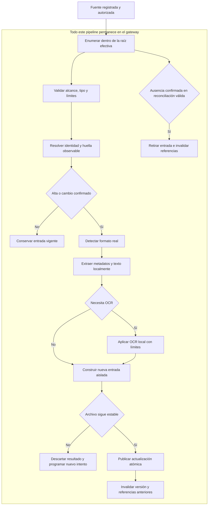
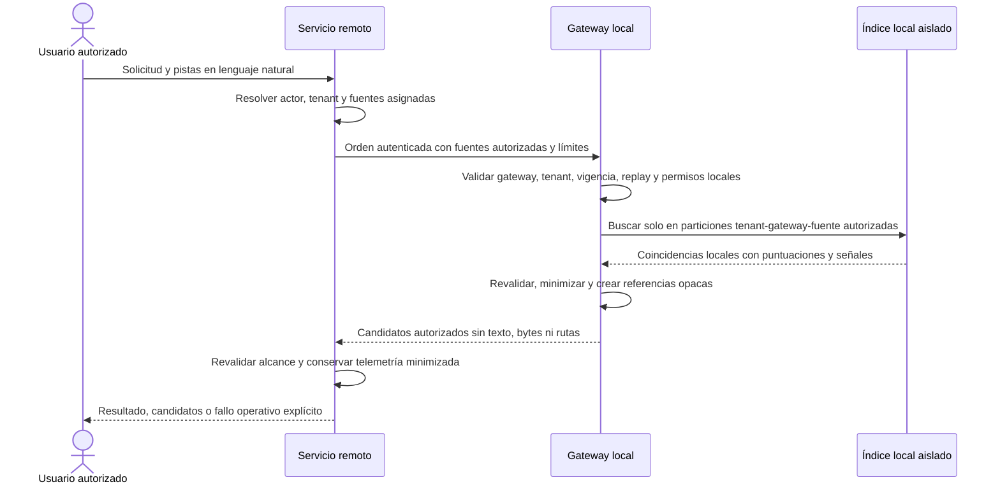

# LC-IA - Fuentes, indexación y recuperación documental del MVP

Este documento define el diseño conceptual mínimo para registrar fuentes documentales, extraer e indexar su contenido localmente y recuperar candidatos autorizados desde LC-IA. Cada gateway mantiene un índice persistente aislado por tenant, gateway y fuente; el servicio remoto nunca recibe el corpus ni el texto extraído o indexado durante la indexación o la búsqueda.

No es un artefacto SDD/OpenSpec, no afirma que exista una implementación y no prescribe clases, tablas, APIs, productos, motores, frameworks ni librerías. Las preguntas marcadas como pendientes no deben cerrarse por suposición durante la implementación.

## 1. Lectura rápida

| Tema | Definición actual |
| --- | --- |
| Primera fuente | Carpeta local o compartida registrada y autorizada. |
| Custodia | Documentos, texto extraído, texto OCR, índice y rutas permanecen en el gateway. |
| Indexación | Previa, persistente e incremental; no se extrae ni se ejecuta OCR en cada consulta. |
| Detección de cambios | Reconciliación periódica fiable; un watcher puede optimizar la latencia, pero no ser la única garantía. |
| Aislamiento | Tenant, gateway y fuente forman parte obligatoria del alcance de toda indexación y búsqueda. |
| Autorización | Las fuentes se asignan por usuario y el gateway reevalúa permisos antes de buscar o entregar. |
| Resultado remoto | Referencias opacas, metadatos mínimos y señales de coincidencia; nunca rutas ni texto documental. |
| OCR | Local e incluido en el MVP para documentos escaneados sin texto seleccionable. |
| Contenido activo | No se ejecutan fórmulas, macros, cálculos ni contenido activo. |
| Estado | Diseño condicionado por preguntas bloqueantes y el gate de la sección 16. |

## 2. Propósito, alcance y precedencia

### 2.1. Propósito

El diseño debe permitir una primera vertical que:

- registre una carpeta local o compartida sin aceptar rutas arbitrarias durante una consulta;
- construya y mantenga un índice local persistente a partir de formatos autorizados;
- detecte altas, cambios y borrados sin reprocesar todo el corpus en cada búsqueda;
- aplique extracción y OCR local con límites y fallos visibles;
- busque únicamente dentro de fuentes autorizadas para el actor;
- devuelva candidatos reconocibles sin revelar contenido ni ubicaciones locales al servicio remoto;
- invalide resultados obsoletos cuando cambien documentos, permisos, fuentes o gateways.

### 2.2. Incluido en el MVP

- primer conector para una carpeta local o compartida registrada;
- contrato conceptual de conector extensible a fuentes futuras;
- índice documental local, persistente y aislado por tenant, gateway y fuente;
- escaneo inicial y reconciliación incremental de altas, cambios y borrados;
- extracción local para PDF con texto, DOCX y XLSX;
- OCR local para PDF escaneado, PNG, JPEG y TIFF sin texto seleccionable;
- huella o versión observable por documento;
- búsqueda sobre nombre, metadatos, texto extraído, texto OCR y pistas permitidas;
- candidatos autorizados con referencia opaca, metadatos mínimos y señales de coincidencia;
- estados y resultados operativos suficientes para administrar fuentes, indexación y búsqueda;
- controles frente a archivos y contenedores potencialmente hostiles.

### 2.3. Fuera del MVP

- conectores distintos de la carpeta local o compartida;
- rastreo libre del sistema de archivos o acceso a una ruta aportada por el usuario;
- extracción estructurada de campos de negocio;
- respuesta narrativa basada en el contenido completo de los documentos;
- modificación, traslado, renombrado o borrado de archivos de la fuente;
- ejecución o evaluación de fórmulas, macros, scripts, enlaces activos u otro contenido ejecutable;
- clasificación de negocio, sumas, agregaciones, conciliaciones o cálculos;
- sincronización del corpus, del texto extraído, del texto OCR o del índice con el servicio remoto;
- elección de almacenamiento, motor de búsqueda, motor OCR, parser, watcher, base vectorial, framework o proveedor;
- una máquina de estados exhaustiva o una plataforma genérica de ingesta.

### 2.4. Fuentes y precedencia

Este diseño complementa:

- `docs/LC-IA-piloto-recuperacion-documental-v0.1.md`;
- `docs/LC-IA-MVP-arquitectura-remota-local-v0.1.md`;
- `docs/LC-IA-MVP-identidad-tenants-gateways-v0.1.md`;
- `docs/LC-IA-documento-maestro-contexto-requisitos-casos-uso-hitos-TDD-SDD-v0.5.md`.

Para fuentes, extracción, OCR, indexación y recuperación prevalecen las decisiones confirmadas de este documento. En particular, OCR local forma parte del MVP y la extracción documental necesaria para buscar se realiza antes de las consultas, de manera incremental. Esto sustituye, solo para este alcance, las referencias anteriores que dejaban OCR fuera o pendiente y no traslada las elecciones de persistencia o búsqueda del documento maestro.

## 3. Estado de las decisiones

- **CONFIRMADO:** acordado y obligatorio para una implementación posterior.
- **PROPUESTO:** mecanismo mínimo recomendado que debe validarse antes de fijar contratos técnicos.
- **PENDIENTE:** decisión bloqueante que no debe resolverse por suposición.
- **FUERA DEL MVP:** capacidad excluida de esta versión.

## 4. Decisiones confirmadas

| ID | Decisión |
| --- | --- |
| C-01 | Cada gateway mantiene un índice documental local persistente, aislado por tenant, gateway y fuente. |
| C-02 | Durante indexación y búsqueda, el servicio remoto recibe únicamente metadatos mínimos y candidatos autorizados; nunca recibe corpus, texto extraído, texto OCR ni texto indexado. |
| C-03 | El primer conector es una carpeta local o compartida registrada y autorizada; el contrato conceptual permite conectores futuros. |
| C-04 | Extracción e indexación son previas e incrementales: procesan altas, cambios y borrados sin ejecutar extracción u OCR en cada consulta. |
| C-05 | Cada documento conserva una huella o versión observable que permite detectar y correlacionar altas, cambios, sustituciones y borrados. |
| C-06 | OCR local forma parte del MVP para documentos escaneados sin texto seleccionable; su texto permanece local. |
| C-07 | Los formatos iniciales son PDF con texto, PDF escaneado, PNG, JPEG, TIFF, DOCX y XLSX. |
| C-08 | Para XLSX se indexan nombre de archivo, nombres de hojas visibles, valores visibles de celdas y metadatos disponibles. No se indexan hojas ocultas. |
| C-09 | No se ejecutan fórmulas, macros, cálculos ni contenido activo. Los valores ya almacenados y visibles pueden indexarse sin recalcularlos, pero no se presentan como resultados recién calculados. |
| C-10 | DOCX y XLSX se tratan como contenedores potencialmente hostiles, aunque su extensión y estructura aparente sean válidas. |
| C-11 | La ubicación aportada por el usuario es una pista y nunca autoriza rutas, repositorios ni fuentes arbitrarias. |
| C-12 | Las fuentes se asignan explícitamente por usuario. El gateway reevalúa permisos y vigencia antes de buscar y antes de entregar un documento. |
| C-13 | Un resultado de búsqueda contiene referencias opacas, metadatos mínimos y señales de coincidencia; nunca contiene rutas locales. |
| C-14 | Revocar una fuente, retirar una asignación, revocar un gateway o detectar una versión distinta invalida las referencias afectadas. |

## 5. Propuestas mínimas

| ID | Propuesta | Motivo |
| --- | --- | --- |
| PR-01 | Usar una reconciliación periódica completa o segmentada como garantía de convergencia del índice. | Tolera eventos perdidos, caídas, recursos compartidos intermitentes y cambios mientras el gateway no estaba activo. |
| PR-02 | Usar un watcher, si se incorpora, solo para adelantar la detección y activar reconciliaciones acotadas. | Los watchers pueden perder eventos o comportarse de forma distinta en carpetas locales y compartidas; no deben ser la fuente de verdad. |
| PR-03 | Publicar una nueva versión de índice de forma atómica por documento y conservar la anterior hasta completar la sustitución. | Evita que una búsqueda observe una mezcla entre extracción anterior y nueva o un documento parcialmente indexado. |
| PR-04 | Mantener el último estado válido de otros documentos cuando uno falle y registrar el fallo de forma aislada. | Un archivo corrupto o hostil no debe inutilizar toda la fuente. |
| PR-05 | Aplicar límites antes y durante lectura, descompresión, extracción, OCR e indexación, con cancelación y limpieza de temporales. | El tamaño declarado o la extensión no son suficientes para controlar consumo de recursos. |
| PR-06 | Emitir señales de coincidencia por categoría, como nombre, metadatos, texto u OCR, sin enviar fragmentos del contenido. | Permite explicar el orden de candidatos sin trasladar texto documental al plano remoto. |

Estas propuestas no eligen periodicidad, algoritmo, almacenamiento, librería ni producto.

## 6. Límites de confianza y localización de datos

El servicio remoto autoriza una intención y coordina la experiencia, pero el gateway conserva la autoridad final sobre la fuente y el índice local. La consulta remota no puede crear una fuente, ampliar una raíz ni convertir una pista de ubicación en permiso.

| Dato o capacidad | Entorno local del gateway | Servicio remoto |
| --- | --- | --- |
| Credenciales y configuración técnica del conector | Se conservan y usan localmente. | No se reciben. |
| Ruta raíz y rutas internas | Se resuelven y protegen localmente. | No se reciben ni se muestran. |
| Corpus y bytes de documentos | Permanecen en la fuente; solo salen en el flujo explícito de obtención definido por la arquitectura remota/local. | No se reciben durante indexación o búsqueda. |
| Texto extraído y texto OCR | Se generan, almacenan e indexan localmente. | No se reciben durante indexación o búsqueda. |
| Índice y estado técnico detallado | Persisten aislados por tenant, gateway y fuente. | No se replican. |
| Identidad del actor, tenant activo y asignaciones | Se recibe el contexto mínimo verificable y se reevalúa localmente. | Se autentican y autorizan según el diseño de identidad. |
| Consulta y pistas permitidas | Se usan solo dentro de fuentes autorizadas. | Se reciben desde la interacción autenticada y se envían al gateway autorizado. |
| Candidatos | Se filtran, minimizan y vinculan a referencias opacas localmente. | Recibe solo candidatos autorizados, metadatos mínimos y señales de coincidencia. |
| Auditoría | Conserva evidencia local minimizada cuando corresponda. | Conserva correlación y resultado minimizados, sin corpus, texto indexado ni rutas. |

El nombre de archivo puede ser un metadato mínimo presentable cuando sea necesario para que el actor autorizado reconozca un candidato. Su inclusión exacta, junto con el resto de metadatos remotos, debe aprobarse antes de implementar.

## 7. Modelo conceptual mínimo

Este modelo expresa significado e invariantes. No define clases, tablas, servicios ni mensajes concretos.

| Concepto | Significado mínimo | Invariantes |
| --- | --- | --- |
| Source | Repositorio registrado y autorizado operado por un gateway; inicialmente, una carpeta local o compartida. | Pertenece a un tenant y gateway, tiene una raíz configurada localmente y no nace de una ruta aportada en una consulta. |
| Connector | Capacidad local que valida, enumera, lee y describe elementos de una fuente mediante un contrato común. | No amplía la raíz, aplica límites y devuelve fallos distinguibles; futuras implementaciones no cambian las garantías de autorización y minimización. |
| Document identity | Identidad local estable o correlacionable de un documento dentro de una fuente. | Está acotada por tenant, gateway y fuente; no se expone como ruta ni se considera globalmente única. |
| Document version/fingerprint | Evidencia observable de una versión concreta del documento. | Permite detectar cambio, sustitución y obsolescencia; su algoritmo y tratamiento de renombrados están pendientes. |
| Extraction result | Resultado local de procesar una versión documental. | Indica formato detectado, texto o metadatos obtenidos, OCR aplicado, cobertura, advertencias y fallos parciales; el contenido no sale del gateway durante búsqueda. |
| Index entry | Representación local recuperable derivada de una identidad, versión y extracción. | Incluye obligatoriamente tenant, gateway y fuente; solo se publica tras una actualización válida y atómica. |
| Indexing job/status | Ejecución y estado observable de validación, escaneo, extracción, OCR, actualización o reconciliación. | Permite distinguir progreso, éxito parcial, fallo, pausa y cancelación sin modelar una máquina exhaustiva. |
| Candidate | Coincidencia autorizada y minimizada producida por el índice local. | Contiene metadatos permitidos, señales de coincidencia y una referencia opaca; no contiene ruta ni texto documental. |
| Opaque reference | Identificador no interpretable por el cliente que permite al gateway resolver un candidato vigente. | Está ligado al tenant, gateway, fuente, identidad y versión; no concede acceso y se invalida ante cambios o revocaciones. |

Una misma secuencia de bytes en dos ubicaciones no implica necesariamente una única identidad documental. La política de duplicados, renombrados y movimientos debe cerrarse junto con el algoritmo de huella.

## 8. Ciclo de vida de una fuente

### 8.1. Registrar

1. Un administrador autorizado selecciona o configura una carpeta local o compartida desde el entorno controlado del gateway.
2. El gateway vincula la fuente al tenant, instalación y gateway actuales.
3. Se registra una raíz canónica local y la configuración mínima del conector sin exponerla al servicio remoto.
4. La fuente queda pendiente de validación; registrarla no concede acceso a ningún usuario.

### 8.2. Validar

El gateway comprueba, sin indexar aún como lista la fuente, que:

- la raíz existe o el recurso compartido puede alcanzarse;
- las credenciales locales permiten el acceso previsto;
- la raíz resuelta corresponde a la ubicación registrada;
- la política de symlinks y junctions puede aplicarse;
- no existe discrepancia entre tenant, gateway y fuente;
- los límites y formatos aceptados están definidos.

Un fallo de validación deja la fuente no lista y produce un resultado operativo explícito; no se degrada silenciosamente a una búsqueda vacía.

### 8.3. Escaneo inicial

1. Enumerar de forma acotada los elementos dentro de la raíz efectiva.
2. Rechazar escapes, tipos no admitidos y entradas que excedan límites antes de procesarlas cuando sea posible.
3. Determinar identidad y huella observable.
4. Extraer metadatos y texto; aplicar OCR local cuando proceda.
5. Crear entradas aisladas y publicar cada documento de forma atómica.
6. Registrar fallos por documento sin ocultar que el escaneo global fue parcial.
7. Ejecutar una reconciliación final antes de declarar la fuente lista.

### 8.4. Lista

Una fuente lista puede participar en búsquedas autorizadas. "Lista" significa que existe un índice utilizable y que se conoce el resultado de la última reconciliación; no garantiza que todos los archivos sean extraíbles ni que el recurso compartido permanezca siempre disponible.

### 8.5. Pausar

Pausar impide nuevos trabajos de indexación y nuevas búsquedas sobre la fuente. El índice puede conservarse localmente según la política pendiente de retención, pero no se usa para producir candidatos mientras la fuente esté pausada.

### 8.6. Reindexar

Una reindexación vuelve a procesar el alcance requerido por cambios de extractor, OCR, configuración o índice. La versión anterior utilizable no se sustituye hasta que la nueva sea válida. Si la reindexación falla, el estado debe mostrarlo sin presentar una mezcla como completa.

### 8.7. Revocar o eliminar

Revocar deshabilita inmediatamente nuevas búsquedas y obtenciones en la siguiente reevaluación disponible e invalida candidatos y referencias asociados. Eliminar añade la purga local del índice, resultados de extracción, texto OCR, temporales y metadatos según una política de retención y borrado aún pendiente. Ninguna de las dos operaciones borra archivos del repositorio fuente.

## 9. Ciclo incremental y consistencia

### 9.1. Mecanismo mínimo

La reconciliación periódica fiable es la garantía de convergencia. En cada ejecución, el gateway compara el estado observable de la fuente con el último estado indexado y clasifica:

- **Alta:** identidad no conocida o documento nuevo según la política acordada.
- **Cambio:** identidad conocida con huella o versión distinta.
- **Sin cambio:** identidad y huella compatibles con la versión indexada.
- **Borrado o ausencia confirmada:** identidad previamente indexada que ya no aparece tras una reconciliación válida.
- **Indeterminado:** no puede confirmarse presencia o ausencia por indisponibilidad, permisos, error de enumeración o archivo cambiante.

La ausencia solo se convierte en borrado cuando la reconciliación puede considerarse válida. Un recurso compartido no disponible o un escaneo incompleto nunca provoca una purga masiva ni falsos borrados.

### 9.2. Watcher como optimización

Un watcher puede avisar de altas, cambios o borrados y solicitar una reconciliación acotada. Sus eventos son pistas operativas: deben deduplicarse y confirmarse contra el estado actual de la fuente. Perder un evento no puede impedir que la siguiente reconciliación detecte el cambio.

### 9.3. Actualización de un documento

1. Descubrir una identidad candidata dentro de la raíz autorizada.
2. Capturar atributos suficientes para iniciar la comprobación de estabilidad.
3. Calcular o derivar la huella según el algoritmo aprobado.
4. Detectar el formato real y aplicar límites.
5. Extraer metadatos y texto localmente.
6. Ejecutar OCR local solo cuando corresponda.
7. Construir la nueva entrada fuera del índice visible a búsquedas.
8. Comprobar que el archivo no cambió durante el procesamiento.
9. Publicar atómicamente la nueva versión y retirar la anterior.
10. Invalidar referencias ligadas a versiones anteriores.

Si el archivo cambia durante el procesamiento, el resultado se descarta o se marca para nuevo intento; nunca se publica como representación de una versión que no existió de forma consistente.

### 9.4. Borrado e invalidación

Un borrado confirmado retira las entradas activas y hace que referencias previas fallen como no vigentes. También se invalidan referencias cuando:

- cambia la huella o versión del documento;
- la fuente se pausa, revoca o elimina;
- se retira la asignación del usuario;
- se suspende o revoca la membresía aplicable;
- se cambia el tenant activo;
- se revoca el gateway;
- la referencia no coincide con el contexto actual.

La invalidación no revela si el documento sigue existiendo fuera del alcance del actor.

## 10. Pipeline local de extracción e indexación

No existe una etapa de envío remoto del contenido. La observabilidad remota, si se aprueba, se limita a estados y metadatos operativos minimizados.

## 11. Flujo de búsqueda sin contenido remoto

La ubicación escrita por el usuario participa únicamente como pista de ranking o selección entre fuentes ya asignadas. Si no corresponde a una fuente autorizada, no se explora, no se registra como nueva fuente y no se confirma la existencia de ubicaciones no visibles.

## 12. Extracción por formato y fallos parciales

### 12.1. Estrategia inicial

| Formato detectado | Contenido local indexable | Reglas mínimas |
| --- | --- | --- |
| PDF con texto | Nombre, metadatos disponibles y texto seleccionable. | Procesar páginas con límites; no ejecutar elementos activos ni seguir referencias externas. |
| PDF escaneado | Nombre, metadatos disponibles y texto obtenido por OCR local. | Aplicar OCR solo a páginas que lo requieran según la política acordada; conservar advertencias de cobertura y calidad. |
| PNG y JPEG | Nombre, metadatos permitidos y texto OCR local. | Validar formato real, dimensiones y recursos antes de decodificar u OCR. |
| TIFF | Nombre, metadatos permitidos y texto OCR local de sus páginas admitidas. | Tratar como potencialmente multipágina y aplicar límites por documento y página. |
| DOCX | Nombre, metadatos disponibles y texto visible recuperable del documento. | Tratar el paquete como contenedor hostil; no ejecutar contenido activo, enlaces, macros ni objetos incrustados. |
| XLSX | Nombre, metadatos disponibles, nombres de hojas visibles y valores visibles de celdas de hojas visibles. | Excluir hojas ocultas; no ejecutar fórmulas, macros ni cálculos; tratar el paquete como contenedor hostil. |

La extensión no prueba el formato. El gateway debe contrastar la firma o estructura real con el tipo admitido y rechazar o marcar discrepancias. Un archivo protegido, cifrado, corrupto o con variante no soportada produce un resultado de extracción explícito, no una entrada aparentemente completa.

### 12.2. Fórmulas y valores almacenados en XLSX

El MVP no evalúa fórmulas. Cuando una celda contiene fórmula, solo puede indexarse el valor visible ya almacenado en el archivo si puede obtenerse sin ejecutar ni recalcular; dicho valor puede estar desactualizado y debe conservar esa limitación operativa. La expresión de la fórmula, macros, hojas ocultas y resultados que requieran cálculo no se indexan.

### 12.3. Fallos parciales

Los fallos se aíslan en el menor alcance que permita mantener un resultado honesto:

- un archivo fallido no detiene la indexación de otros archivos;
- una página fallida puede dejar un documento parcialmente extraído si el estado indica cobertura incompleta;
- una hoja visible fallida puede dejar un XLSX parcial si se identifica la omisión sin exponer contenido;
- una hoja oculta se excluye por decisión, no se registra como fallo;
- un timeout o límite excedido termina el trabajo afectado y limpia temporales;
- un resultado parcial no se presenta como extracción completa y su elegibilidad para búsqueda debe decidirse antes de implementar.

No se conserva una entrada nueva vacía que sustituya silenciosamente a una versión anterior válida. Si una actualización falla, la versión anterior puede seguir disponible solo si representa el mismo archivo aún vigente y el estado deja claro que existe una actualización pendiente o fallida.

## 13. Seguridad y robustez de la ingesta

### 13.1. Raíz y traversal

- Canonicalizar la raíz registrada y cada destino antes de abrirlo.
- Rechazar rutas absolutas aportadas por documentos, consultas o metadatos.
- Rechazar componentes de traversal y cualquier resolución fuera de la raíz efectiva.
- Comprobar de nuevo el alcance al abrir el archivo para reducir cambios entre validación y uso.
- No seguir enlaces externos, relaciones remotas ni referencias a recursos fuera de la fuente.

### 13.2. Symlinks y junctions

Symlinks, junctions y mecanismos equivalentes pueden convertir una entrada aparentemente interna en un escape. La política exacta está pendiente, pero ninguna opción puede permitir salir de la raíz autorizada. Si se permiten, el destino real debe resolverse y validarse en cada acceso; ante duda, se rechaza.

### 13.3. Recursos y archivos hostiles

- Aplicar límites pendientes a tamaño de archivo, páginas, dimensiones, celdas, hojas, profundidad y cantidad de elementos internos, bytes descomprimidos, relación de expansión, memoria, CPU, tiempo y concurrencia.
- Interrumpir lectura, descompresión, parsing u OCR cuando se alcance un límite, incluso si las cabeceras declaraban valores menores.
- Tratar PDF, DOCX, XLSX, TIFF y cualquier contenedor comprimido como entrada no confiable.
- Defenderse de zip bombs, expansión recursiva, estructuras cíclicas o profundamente anidadas y cantidades extremas de entradas.
- No ejecutar macros, fórmulas, scripts, objetos incrustados, enlaces activos, plantillas remotas ni contenido activo.
- Detectar formatos falsificados mediante firma o estructura, no solo por extensión o tipo declarado.
- Aislar corrupción y excepciones del parser por documento, con timeout y limpieza de recursos.

### 13.4. Recursos compartidos y archivos cambiantes

- Distinguir fuente indisponible de fuente vacía y de acceso denegado.
- No confirmar borrados a partir de una enumeración incompleta o un recurso compartido caído.
- Comprobar estabilidad antes y después de extracción; un cambio invalida el resultado en curso.
- Evitar bloqueos destructivos o modificaciones del archivo fuente.
- Reintentar solo mediante una política acotada aún pendiente; no crear bucles indefinidos.

### 13.5. Contenido documental no confiable

El texto extraído u OCR es dato, nunca instrucción. No puede modificar permisos, raíz, configuración, límites, consultas posteriores ni comportamiento del gateway. Su indexación no autoriza a enviarlo al servicio remoto ni a registrarlo en logs o auditoría.

## 14. OCR local

OCR se ejecuta durante indexación para imágenes y páginas escaneadas sin texto seleccionable, no durante cada búsqueda. Los bytes de imagen y el texto resultante permanecen en el gateway.

Antes de implementar deben decidirse y validarse con el corpus real:

- idioma o idiomas admitidos;
- criterio para determinar que una página requiere OCR;
- umbral o señal de calidad suficiente;
- detección y corrección de rotación;
- tratamiento de documentos y TIFF multipágina;
- timeout por trabajo y comportamiento ante timeout parcial;
- límites de páginas, dimensiones, recursos y concurrencia;
- metadatos de calidad y cobertura que conservará el resultado;
- motor OCR y condiciones de despliegue, sin elegirlo en este documento.

Una calidad OCR baja o una página no procesada debe quedar visible como limitación de indexación. No debe convertirse en afirmación de que el documento no contiene la información buscada.

## 15. Ranking, estados y resultados operativos

### 15.1. Criterios conceptuales de ranking

El ranking puede considerar, sin fijar motor ni fórmula:

- coincidencias en el nombre del archivo;
- coincidencias en metadatos permitidos;
- coincidencias en texto extraído;
- coincidencias en texto OCR;
- pistas de tipo, fecha aproximada, entidad, asunto o fuente autorizada;
- vigencia de la versión indexada y calidad o cobertura de extracción;
- señales de ambigüedad, duplicidad o coincidencia parcial.

La presencia de una pista no amplía permisos. El orden final, pesos, normalización, umbral de suficiencia, tratamiento de OCR y definición de ambigüedad quedan pendientes. No se elige entre búsqueda léxica, vectorial o híbrida ni se fija una fórmula definitiva.

El servicio remoto puede recibir categorías de señal y puntuaciones minimizadas necesarias para ordenar o explicar candidatos, pero no términos extraídos, fragmentos coincidentes ni texto OCR.

### 15.2. Estados mínimos de fuente

| Estado | Significado operativo |
| --- | --- |
| Pendiente de validación | Registrada, todavía no habilitada para escaneo o búsqueda. |
| Escaneando | Ejecutando el escaneo inicial o una reconciliación que aún no deja resultado completo. |
| Lista | Tiene un índice utilizable y puede buscarse si la autorización lo permite. |
| Lista con advertencias | Puede buscarse, pero existen fallos parciales o documentos no extraíbles visibles para operación. |
| Pausada | No admite nuevas indexaciones ni búsquedas. |
| No disponible | La raíz o dependencia local necesaria no puede consultarse; no equivale a fuente vacía. |
| Revocada | No admite uso y sus referencias dejan de ser válidas. |

### 15.3. Estados mínimos de trabajo de indexación

| Estado | Significado operativo |
| --- | --- |
| Pendiente | Aceptado y aún no iniciado. |
| En curso | Enumerando, extrayendo, aplicando OCR o publicando entradas. |
| Completado | Terminó el alcance previsto sin fallos conocidos. |
| Completado con advertencias | Terminó con documentos, páginas u hojas fallidos o excluidos de forma visible. |
| Pausado o cancelado | Se detuvo de forma controlada sin publicar resultados incompletos. |
| Fallido | No pudo producir un resultado fiable para el alcance requerido. |

### 15.4. Resultados mínimos de búsqueda

| Resultado | Condición |
| --- | --- |
| Candidato inequívoco | Un candidato autorizado supera el criterio acordado sin ambigüedad material. |
| Varios candidatos | Persisten varias coincidencias plausibles y no se elige arbitrariamente. |
| Ninguno | Todas las fuentes autorizadas previstas estaban disponibles y no hubo coincidencia suficiente. |
| Acceso denegado | El contexto, asignación o reevaluación local no permite buscar o resolver la referencia. |
| Fuente o gateway no disponible | No pudo completarse el alcance previsto; no se presenta como ausencia de documentos. |
| Índice no listo o parcial | La fuente aún no dispone de un estado suficiente para responder con fiabilidad. |
| Referencia no vigente | El documento, versión, permiso, fuente o gateway cambió desde que se emitió el candidato. |
| Fallo técnico | Un error distinto de ausencia, denegación o indisponibilidad impidió concluir. |

## 16. Preguntas bloqueantes y gate antes de implementar

### 16.1. Preguntas bloqueantes

| ID | Pregunta |
| --- | --- |
| P-01 | ¿Cuál es la raíz inicial local o compartida, quién la autoriza y en qué gateway y tenant se registra? |
| P-02 | ¿Qué variantes exactas de PDF, PNG, JPEG, TIFF, DOCX y XLSX existen en el corpus y cuáles se aceptan o rechazan? |
| P-03 | ¿Qué volumen documental, distribución de tamaños, cantidad de páginas, hojas y celdas debe soportar el piloto? |
| P-04 | ¿Qué idioma o idiomas necesita OCR y cómo se evaluarán calidad, rotación y cobertura? |
| P-05 | ¿Con qué periodicidad debe reconciliarse cada tipo de fuente y qué retraso observable es aceptable? |
| P-06 | ¿Dónde y cómo se almacena y cifra localmente el índice, el texto extraído, el texto OCR y sus metadatos? |
| P-07 | ¿Qué algoritmo y atributos forman la huella, y cómo distingue cambio, sustitución, renombrado, movimiento y duplicado? |
| P-08 | ¿Se rechazan todos los symlinks y junctions o se permiten solo si su destino real permanece dentro de la raíz? |
| P-09 | ¿Qué límites se aplican a archivo, páginas, dimensiones, hojas, celdas, contenedores, expansión, tiempo, memoria, CPU y concurrencia? |
| P-10 | ¿Qué política de retención y purga se aplica a versiones de índice, resultados de extracción, OCR, fallos, temporales y fuentes revocadas? |
| P-11 | ¿Qué metadatos, estados, puntuaciones y señales pueden enviarse al servicio remoto sin revelar contenido ni rutas? |
| P-12 | ¿Cómo se ordenan nombre, metadatos, texto, OCR y pistas, y qué evidencia del dataset decidirá la estrategia? |
| P-13 | ¿Qué criterio observable distingue candidato inequívoco, varios candidatos y ninguno? |
| P-14 | ¿Puede buscarse un resultado parcial y, si es así, qué cobertura mínima y advertencias son obligatorias? |
| P-15 | ¿Cómo se comportan reintentos, cancelación y recuperación tras caída sin publicar versiones parciales ni provocar carga indefinida? |

### 16.2. Gate previo a implementación

No debe comenzar la implementación de esta vertical hasta que todos los puntos aplicables tengan respuesta verificable:

- [ ] raíz inicial, tenant, gateway, responsables y autorización identificados;
- [ ] asignaciones usuario-fuente y reevaluación local definidas;
- [ ] inventario real de formatos y variantes revisado;
- [ ] volumen, tamaños y estructura del corpus medidos sin inventar límites;
- [ ] política de symlinks, junctions, traversal y raíces aprobada;
- [ ] algoritmo de identidad, huella y tratamiento de renombrados y duplicados acordado;
- [ ] periodicidad de reconciliación y semántica opcional del watcher acordadas;
- [ ] estrategia de actualización atómica, borrado e invalidación aprobada;
- [ ] almacenamiento, aislamiento y cifrado local definidos;
- [ ] límites de recursos, timeouts, concurrencia y limpieza fijados;
- [ ] idiomas, calidad, rotación, páginas y límites OCR decididos con corpus real;
- [ ] comportamiento de cada formato y de los fallos parciales validado;
- [ ] política para fórmulas almacenadas, hojas ocultas y contenido activo aprobada sin ejecución;
- [ ] metadatos remotos y señales de coincidencia minimizados y aprobados;
- [ ] ranking, ambigüedad y elegibilidad de resultados parciales evaluables mediante dataset;
- [ ] retención y purga local acordadas;
- [ ] criterios de aceptación y casos hostiles preparados;
- [ ] ninguna elección tecnológica amplía el alcance o traslada contenido al servicio remoto.

Si falta una decisión sobre autorización, aislamiento, raíz, límites, contenido activo o custodia local, no debe usarse un corpus real. Puede prepararse un corpus sintético para cerrar decisiones, pero no tratarlo como validación de seguridad terminada.

## 17. Criterios de aceptación observables

| ID | Criterio |
| --- | --- |
| CA-01 | Registrar una fuente exige una raíz configurada localmente y la vincula a un único tenant y gateway sin concederla automáticamente a usuarios. |
| CA-02 | Una ruta escrita en la consulta nunca crea una fuente, amplía la raíz ni provoca exploración fuera de fuentes asignadas. |
| CA-03 | Dos tenants, gateways o fuentes no comparten entradas ni resultados aunque contengan nombres o bytes iguales. |
| CA-04 | El escaneo inicial deja la fuente lista, lista con advertencias o fallida, y permite identificar documentos no procesados sin exponer su contenido remotamente. |
| CA-05 | Una alta confirmada crea una entrada local recuperable y una referencia opaca autorizada. |
| CA-06 | Un cambio confirmado publica la nueva entrada atómicamente e invalida referencias de la versión anterior. |
| CA-07 | Un borrado solo se confirma tras una reconciliación válida; una fuente compartida indisponible no causa borrados masivos. |
| CA-08 | Perder o no usar eventos de watcher no impide que una reconciliación posterior detecte altas, cambios y borrados. |
| CA-09 | Una búsqueda no ejecuta extracción ni OCR del corpus y usa exclusivamente el índice local vigente. |
| CA-10 | PDF con texto, PDF escaneado, PNG, JPEG, TIFF, DOCX y XLSX siguen la estrategia definida y producen resultado o fallo explícito. |
| CA-11 | OCR de un documento escaneado se ejecuta localmente durante indexación y ni sus imágenes ni su texto se envían al servicio remoto durante búsqueda. |
| CA-12 | XLSX excluye hojas ocultas y no ejecuta fórmulas, macros ni cálculos; DOCX y XLSX no ejecutan contenido activo. |
| CA-13 | Un archivo con extensión falsificada, corrupto, enorme o contenedor hostil se rechaza o limita sin comprometer otros trabajos. |
| CA-14 | Traversal, symlink o junction que resuelva fuera de la raíz no permite lectura ni indexación. |
| CA-15 | Un archivo que cambia durante extracción no publica una entrada inconsistente y queda pendiente de nuevo intento o con fallo visible. |
| CA-16 | Un fallo de página, hoja o documento no se presenta como extracción completa y no detiene innecesariamente otros documentos. |
| CA-17 | El gateway comprueba tenant, fuente, asignación y vigencia antes de buscar y antes de resolver una referencia para entrega. |
| CA-18 | Retirar un source grant, pausar o revocar la fuente, o revocar el gateway impide nuevas búsquedas e invalida referencias afectadas. |
| CA-19 | El servicio remoto recibe candidatos autorizados con metadatos mínimos y señales permitidas, pero no corpus, texto extraído, texto OCR, fragmentos coincidentes ni rutas. |
| CA-20 | Una fuente o gateway no disponible se distingue de una búsqueda sin candidatos. |
| CA-21 | El ranking puede evaluarse sobre un dataset sin depender de un motor o fórmula fijados en este diseño. |
| CA-22 | Pausar, reindexar, revocar y eliminar una fuente producen estados operativos observables y no modifican los archivos de la fuente. |

## 18. Futuro separado: fórmulas, macros y cálculos

Esta capacidad no es una extensión trivial del extractor del MVP.

Las fórmulas requieren definir si se usa el valor almacenado, se recalcula o se reproduce un entorno externo; cada opción afecta vigencia, compatibilidad, determinismo y trazabilidad. Los cálculos de negocio requieren reglas, tipos, precisión, validación y evidencia propias.

Las macros son ejecución de código no confiable. Cualquier versión futura que pretenda ejecutarlas deberá contar, antes de habilitarse, con:

- caso de negocio y autorización explícita por fuente y operación;
- threat model específico;
- sandbox o aislamiento fuerte sin acceso implícito a red, secretos, host u otras fuentes;
- límites de CPU, memoria, tiempo, procesos, archivos y salida;
- control de dependencias, versión y reproducibilidad del entorno;
- detección, auditoría, cancelación y respuesta ante comportamiento malicioso;
- revisión de cumplimiento, licencias y formatos compatibles;
- criterios de aceptación y pruebas hostiles independientes del pipeline de lectura.

Hasta que exista ese diseño aprobado, fórmulas, macros y cálculos permanecen fuera del MVP y no se ejecutan bajo ninguna circunstancia.

## 19. Próximos pasos mínimos

1. Identificar la raíz inicial autorizada, tenant, gateway, responsables y usuarios asignados.
2. Inventariar una muestra real del corpus: formatos exactos, variantes, volúmenes, tamaños, páginas, hojas, celdas, idiomas y casos hostiles.
3. Cerrar identidad y huella documental, política de symlinks, reconciliación, límites, almacenamiento cifrado local, retención y purga.
4. Definir el comportamiento verificable de extracción y OCR por formato, incluidos fallos parciales y archivos cambiantes.
5. Aprobar el conjunto mínimo de metadatos y señales que puede recibir el servicio remoto.
6. Construir un dataset autorizado para evaluar ranking, ambigüedad, OCR y resultados parciales sin elegir todavía un motor.
7. Revisar los criterios de aceptación y superar el gate antes de convertir este diseño en contratos implementables.

La primera implementación debe demostrar una sola vertical: registrar una fuente autorizada, reconciliarla, indexar localmente sus formatos iniciales, buscar sin enviar contenido remoto e invalidar una referencia cuando cambie el documento o el permiso. Conectores y capacidades adicionales esperan evidencia de necesidad.
