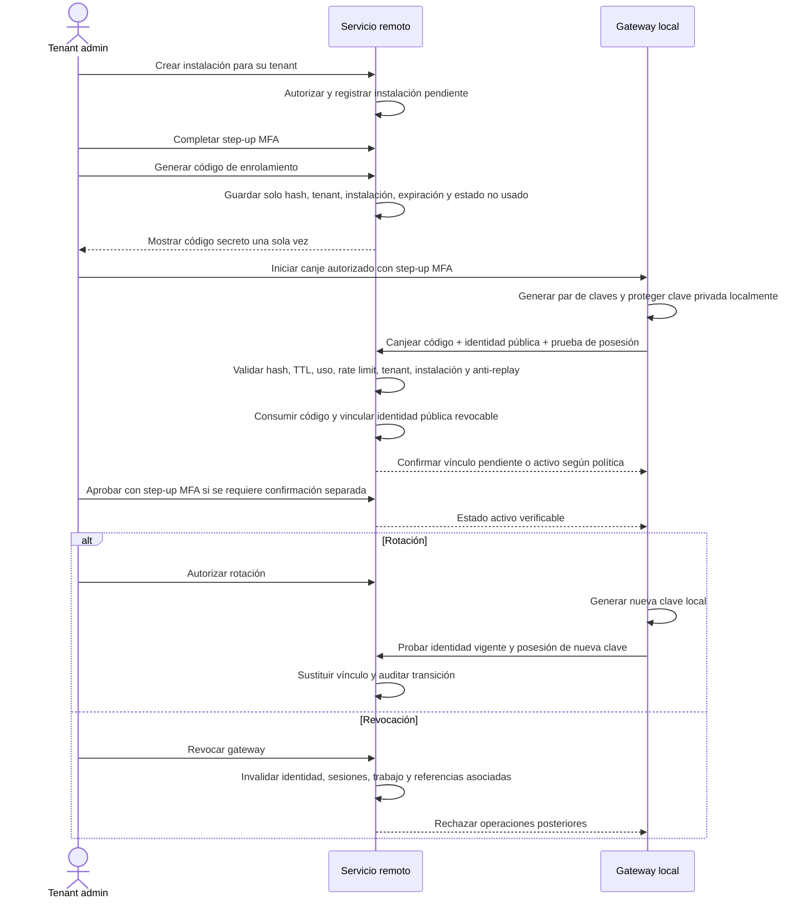

# LC-IA - Identidad, tenants, autorización y gateways del MVP

Este documento define el diseño mínimo de identidad, aislamiento por tenant, autorización sobre fuentes y confianza de gateways para el MVP. Auth0 gestionado actúa como broker de identidad humana; todas las formas de autenticación convergen en un actor interno estable de LC-IA, pertenecer a un tenant no concede acceso documental y la autoridad local del gateway reevalúa cada operación.

No es un artefacto SDD/OpenSpec, no afirma que exista una implementación y no prescribe clases, tablas ni APIs. La elección de Auth0 queda fijada, pero su plan y configuración deben validarse antes de implementar.

## 1. Propósito y alcance

### 1.1. Incluido

- autenticación humana gestionada por Auth0 para cuentas propias de LC-IA e identidades federadas con Microsoft o Google;
- credenciales de cuentas LC-IA, recuperación, federación y MFA/step-up gestionados por Auth0;
- vinculación de identidades externas con un actor interno estable;
- MFA opcional para usuarios normales y obligatorio para roles y operaciones privilegiadas;
- recuperación diferenciada para cuentas propias y federadas;
- membresías validadas, selección explícita del tenant activo y roles mínimos;
- administración de tenants y membresías;
- concesiones directas de fuentes a usuarios;
- acceso excepcional temporal y auditado para superadministradores;
- instalaciones y gateways múltiples por tenant;
- enrolamiento, activación, rotación y revocación de gateways;
- invalidación y auditoría de cambios de acceso.

### 1.2. Fuera del MVP

- grupos, reglas, herencia de permisos y ABAC;
- deducir membresía o tenant solo a partir del dominio de correo;
- autorización independiente por cada mecanismo de autenticación;
- acceso documental implícito para administradores;
- aprovisionamiento automático de membresías no validadas;
- Auth0 Organizations como fuente de verdad o dependencia necesaria del MVP;
- SSO empresarial configurado por organización;
- enrolamiento de gateways e identidad de dispositivos dentro de Auth0;
- construcción de una interfaz propia para captura, almacenamiento o recuperación de credenciales humanas;
- elección de framework, librería, JWT frente a sesión, PKI, base de datos, correo o custodia concreta de secretos;
- diseño detallado de pantallas;
- SLA, duraciones, TTL o retenciones no confirmados.

### 1.3. Fuentes y precedencia

Este diseño complementa:

- `docs/LC-IA-MVP-arquitectura-remota-local-v0.1.md`;
- `docs/LC-IA-piloto-recuperacion-documental-v0.1.md`;
- `docs/LC-IA-documento-maestro-contexto-requisitos-casos-uso-hitos-TDD-SDD-v0.5.md`.

Para este alcance prevalecen las decisiones confirmadas aquí. En particular, sustituyen las referencias anteriores que dejaban fuera la federación o suponían un único tenant por actor. Se conserva la separación remoto/local, la conexión saliente del gateway, la autorización en ambos límites y la minimización de información documental.

## 2. Estado de las decisiones

- **CONFIRMADO:** acordado y obligatorio para una implementación posterior.
- **PROPUESTO:** solución mínima recomendada que requiere aceptación antes de fijar contratos.
- **PENDIENTE:** decisión bloqueante que no debe resolverse por suposición.
- **FUERA DEL MVP:** capacidad excluida de esta versión.

## 3. Decisiones confirmadas

| ID | Decisión |
| --- | --- |
| C-01 | Auth0 gestionado es el broker de identidad humana del MVP para cuentas propias de LC-IA e identidades federadas con Microsoft o Google. |
| C-02 | Todos los mecanismos convergen en un único actor interno estable y un solo sistema de autorización. |
| C-03 | La identidad autenticada se reconoce por la combinación estable `issuer/provider + subject`; el email nunca es clave de identidad ni prueba suficiente de pertenencia. |
| C-04 | Un actor puede tener varias identidades externas vinculadas y pertenecer a varios tenants mediante membresías previamente validadas. |
| C-05 | El tenant activo se selecciona explícitamente y se valida en cada operación; no se deduce solo del dominio de correo ni de datos libres del cliente. |
| C-06 | El administrador de cada tenant valida y gestiona las membresías de su tenant. |
| C-07 | Un superadministrador central puede modificar tenants y membresías, con auditoría. |
| C-08 | El superadministrador no puede buscar, inferir ni descargar documentos de un tenant por su rol de plataforma. |
| C-09 | Cualquier acceso documental excepcional requiere una concesión explícita, temporal, limitada y auditada, y sigue sujeto a reevaluación local. |
| C-10 | Los roles mínimos son `user`, `tenant_admin` y `platform_superadmin`. Rol y tenant son controles independientes. |
| C-11 | Un tenant puede tener varios gateways, cada uno asociado a una instalación o entorno local concreto. |
| C-12 | Solo un `tenant_admin` puede crear una instalación y generar su código de enrolamiento de un solo uso y corta duración. |
| C-13 | El gateway genera sus claves localmente. La clave privada no sale del gateway; el servicio registra una identidad pública revocable vinculada a tenant e instalación. |
| C-14 | El `tenant_admin` puede activar, rotar o revocar gateways de su tenant; cada acción se audita. |
| C-15 | La autoridad local del gateway reevalúa toda operación, incluidas las autorizadas remotamente y las excepcionales. |
| C-16 | Cada usuario accede solo a fuentes concretas concedidas por un administrador del tenant. La membresía no concede todas las fuentes. |
| C-17 | El MVP usa concesiones directas usuario-fuente. Grupos, reglas, herencia y ABAC quedan fuera. |
| C-18 | Las fuentes no asignadas no aparecen en listados, búsquedas, conteos, errores ni sugerencias, y no deben ser inferibles por diferencias observables evitables. |
| C-19 | La gestión web de asignaciones debe ser sencilla e intuitiva. |
| C-20 | MFA mediante un número móvil verificado es opcional para usuarios normales. El móvil no es identificador, clave de actor, prueba de tenant ni canal de recuperación principal. |
| C-21 | MFA es obligatorio para `tenant_admin`, `platform_superadmin`, generación, canje o aprobación de enrolamiento de gateways y acceso documental excepcional. Las operaciones privilegiadas exigen step-up MFA. |
| C-22 | Auth0 gestiona la recuperación de cuentas propias de LC-IA mediante un enlace de un solo uso, de corta duración y enviado al correo previamente verificado. Completar la recuperación debe invalidar enlaces anteriores y las sesiones o credenciales aplicables. |
| C-23 | La recuperación de identidades federadas Microsoft o Google corresponde al proveedor de identidad. LC-IA no ofrece una recuperación local que eluda al proveedor. |
| C-24 | Microsoft y Google son proveedores de identidad federada a través de Auth0 y todos sus accesos convergen en la identidad interna existente mediante `issuer/provider + subject`. |
| C-25 | Auth0 gestiona autenticación humana, credenciales de cuentas LC-IA, recuperación, federación y MFA/step-up; LC-IA consume el resultado autenticado y la evidencia necesaria para autorizar. |
| C-26 | LC-IA sigue siendo la única fuente de verdad para actor interno, tenants, memberships, tenant activo, roles, source grants, superadministración y acceso excepcional. |
| C-27 | Auth0 Organizations no es fuente de verdad ni parte necesaria del MVP. Solo se reevaluará si aparece un requisito real de SSO empresarial por organización. |
| C-28 | No se vinculan identidades automáticamente por coincidencia de correo. La vinculación la inicia el usuario y exige reautenticar ambas identidades antes de asociarlas al mismo actor interno. |
| C-29 | El enrolamiento de gateways y la identidad de dispositivos permanecen fuera de Auth0 y conservan su ciclo de confianza independiente. |
| C-30 | Para operaciones privilegiadas, LC-IA solicita step-up a Auth0 y valida evidencia suficiente y reciente de MFA antes de autorizar; ACR, AMR y Actions son mecanismos conceptuales sujetos a validación técnica. |

## 4. Propuestas y pendientes

### 4.1. Propuestas mínimas

| ID | Propuesta | Motivo |
| --- | --- | --- |
| PR-01 | Tratar cuenta propia y federación como credenciales de entrada que resuelven el mismo actor interno. | Evita tres modelos de permisos y permite vincular o retirar un método sin cambiar la autorización. |
| PR-02 | Mantener un contexto de tenant activo por sesión o equivalente, renovado al cambiar de tenant y comprobado contra la membresía vigente en cada operación. | Reduce confusión entre tenants sin confiar en estado presentado por el navegador. |
| PR-03 | Gestionar fuentes con una lista de usuarios y un selector o checklist de fuentes autorizables, mostrando el estado guardado y confirmando altas o retiradas. | Cubre el control directo con una interacción reconocible, sin diseñar un panel completo. |
| PR-04 | Modelar el acceso excepcional como concesión JIT ligada a tenant, propósito, alcance documental, solicitante, aprobador, inicio y expiración. | Impide convertir soporte de plataforma en acceso permanente. |
| PR-05 | Invalidar de forma central el contexto afectado y exigir reevaluación local antes de continuar una operación en curso. | Aplica revocación en ambos límites sin asumir un mecanismo de sesión o protocolo. |
| PR-06 | Usar el login alojado y estándar de Auth0 para cuentas propias y federadas. | Evita construir y operar una interfaz propia de credenciales sin ampliar el alcance a diseño de pantallas. |

### 4.2. Pendientes bloqueantes

| ID | Pregunta pendiente |
| --- | --- |
| P-04 | ¿Cuál es el proceso exacto de invitación, aceptación, validación y notificación de membresías? |
| P-05 | ¿Quién aprueba el acceso excepcional, con qué separación de funciones y cómo puede revocarlo el tenant? |
| P-06 | ¿Cuánto duran los códigos de enrolamiento, las sesiones, los contextos de tenant y las concesiones excepcionales? |
| P-07 | ¿Qué almacenamiento seguro de claves debe usar el gateway en los entornos compatibles? |
| P-08 | ¿Cómo recibe y aplica un gateway desconectado una revocación, y qué operaciones se permiten mientras no puede comprobar vigencia? |
| P-09 | ¿Qué eventos se auditan, quién puede consultarlos, cuánto se retienen y cómo se protege su integridad? |
| P-10 | ¿Qué plan, región, límites y capacidades de Auth0 cumplen los requisitos comerciales, normativos y técnicos del MVP? |
| P-11 | ¿Qué protocolo exacto y qué vigencia de evidencia empleará LC-IA para solicitar y comprobar step-up MFA con Auth0, incluidos renovación de tokens y autenticación silenciosa? |
| P-12 | ¿Cómo se ejecutan desvinculación, recuperación ante pérdida de una identidad y resolución de conflictos sin permitir toma de cuenta? |

## 5. Modelo conceptual mínimo

El modelo expresa significado e invariantes; no define clases, tablas ni servicios.

| Concepto | Significado mínimo | Invariantes |
| --- | --- | --- |
| Identidad autenticada | Cuenta presentada a través de Auth0, ya sea propia de LC-IA, Microsoft o Google. | Se identifica por `issuer/provider + subject`. Email y nombre son atributos mutables, no claves ni permisos. |
| Actor interno | Identidad estable de la persona dentro de LC-IA. | Concentra identidades externas, membresías y trazabilidad; no cambia al cambiar el email o el método de acceso. |
| Factor móvil verificado | Número móvil validado que puede emplearse como factor adicional. | No identifica al actor, no prueba tenant, no concede permisos y no es el canal principal de recuperación. |
| Tenant | Organización aislada que administra membresías, instalaciones y fuentes. | Su contexto debe proceder de selección autenticada y validada. |
| Membership | Relación validada entre actor y tenant. | Tiene estado y rol en ese tenant; puede suspenderse o revocarse sin eliminar la identidad. |
| Active tenant context | Tenant seleccionado para una interacción autenticada. | Solo puede referir una membresía vigente y se revalida en cada operación. Cambiarlo no amplía permisos. |
| Role | Capacidad administrativa general. | Valores mínimos: `user`, `tenant_admin`, `platform_superadmin`; no sustituye una concesión documental. |
| Installation | Registro administrativo de un gateway previsto para un equipo o entorno local. | Pertenece a un tenant y delimita el enrolamiento. |
| Gateway identity | Identidad técnica pública de un gateway enrolado. | Está vinculada a una instalación y tenant, puede rotarse o revocarse y nunca implica exportar la clave privada. |
| Source | Repositorio local registrado y operado por un gateway. | Pertenece al ámbito de un tenant e instalación; no se crea a partir de una ruta aportada por el usuario. |
| Source grant | Concesión directa de una fuente concreta a un actor dentro de un tenant. | Requiere membership vigente; su ausencia implica no visibilidad y no acceso. |
| Exceptional access grant | Concesión JIT propuesta para acceso documental extraordinario de un actor de plataforma. | Está ligada a tenant, propósito, alcance, duración y aprobación explícita; nunca nace del rol `platform_superadmin`. |
| Audit event | Evidencia inmutable y minimizada de autenticación, administración o acceso. | Correlaciona actor, tenant, operación, decisión, objetivo y resultado sin registrar secretos ni contenido documental por defecto. |

### 5.1. Autenticación y autorización

Auth0 autentica las cuentas propias de LC-IA y actúa como broker para Microsoft y Google. Después de una autenticación válida, LC-IA valida el resultado de Auth0, resuelve `issuer/provider + subject` al actor interno existente y aplica su propio modelo de memberships, tenant activo, roles, source grants y acceso excepcional.

Auth0 no decide tenants ni permisos de LC-IA. Auth0 Organizations no participa en este modelo y no sustituye ninguna entidad de dominio. Un email coincidente no autoriza a fusionar actores, crear memberships ni seleccionar tenants.

Para usuarios normales, configurar MFA mediante móvil verificado es opcional. Acceder como `tenant_admin` o `platform_superadmin` y ejecutar cualquiera de las operaciones privilegiadas de C-21 exige MFA y step-up antes de autorizar la operación. LC-IA solicita el step-up a Auth0 y falla de forma cerrada si no puede validar evidencia suficiente y reciente; el contrato exacto de ACR, AMR, Actions y vigencia permanece pendiente de validación.

## 6. Matriz de autorización

`Permitido` significa que el rol puede iniciar la operación si además cumple tenant, estado y controles específicos. Toda operación falla de forma cerrada ante contexto inválido o concesión ausente.

| Operación | `user` | `tenant_admin` | `platform_superadmin` | Condición adicional |
| --- | --- | --- | --- | --- |
| Seleccionar o cambiar tenant activo | Permitido | Permitido | No aplicable por sí solo | Membership vigente en el tenant seleccionado. |
| Ver su propia membership y fuentes asignadas | Permitido | Permitido | No | Solo dentro del tenant activo. |
| Invitar, validar, suspender o revocar memberships | No | Permitido | Permitido | `tenant_admin` solo en su tenant; step-up MFA y auditoría obligatorios. |
| Cambiar roles de membership | No | Permitido | Permitido | Step-up MFA; no puede otorgar acceso documental implícito. |
| Crear una instalación y emitir código de enrolamiento | No | Permitido | No | Solo para el tenant administrado; step-up MFA para generar el código. |
| Canjear o aprobar un enrolamiento de gateway | No | Permitido | No | Tenant e instalación deben coincidir; step-up MFA y controles de enrolamiento obligatorios. |
| Activar, rotar o revocar gateway | No | Permitido | No | Solo gateways del tenant; step-up MFA y auditoría obligatorios. |
| Asignar o retirar fuentes a usuarios | No | Permitido | No | Usuario y fuente pertenecen al tenant; step-up MFA y concesión directa. |
| Ver una fuente asignada | Permitido | Permitido | No | Source grant vigente para el actor, incluso si es `tenant_admin`. |
| Buscar documentos | Permitido | Permitido | Prohibido por defecto | Tenant activo, membership y source grant vigentes; gateway local autoriza de nuevo. |
| Obtener o descargar un documento | Permitido | Permitido | Prohibido por defecto | Mismos controles de búsqueda, más autorización explícita de obtención y reevaluación local. |
| Solicitar acceso documental excepcional | No | No | Propuesto | Step-up MFA; debe indicar tenant, propósito, alcance y duración. |
| Aprobar acceso documental excepcional | PENDIENTE | PENDIENTE | PENDIENTE | Step-up MFA obligatorio; el aprobador y la separación de funciones no están decididos. |
| Buscar u obtener con acceso excepcional | No | No | Propuesto | Step-up MFA, concesión JIT vigente y aprobada, alcance limitado y reevaluación local. |
| Consultar auditoría | PENDIENTE | PENDIENTE | PENDIENTE | Alcance, minimización y retención por decidir. |

## 7. Flujos de identidad y membresía

### 7.1. Inicio de sesión y selección o cambio de tenant

1. La persona accede al login alojado y estándar de Auth0 y elige cuenta LC-IA, Microsoft o Google.
2. Auth0 autentica la cuenta propia o deriva la autenticación al proveedor federado y devuelve un resultado autenticado verificable.
3. LC-IA valida el resultado y resuelve `issuer/provider + subject` al actor interno existente; no usa email ni móvil como clave, membership o prueba de tenant.
4. El sistema obtiene solo las memberships vigentes y validadas del actor.
5. Si existe más de una, la persona selecciona explícitamente el tenant; si existe una sola, el sistema puede proponerla, pero debe fijar un contexto explícito y validado.
6. Cada operación comprueba actor, tenant activo, membership, rol y concesiones vigentes. Un tenant enviado por URL, cabecera o cuerpo no reemplaza esa validación.
7. Al cambiar de tenant, se emite o establece un contexto nuevo y se descartan resultados, referencias y estado sensible del tenant anterior.
8. Si el acceso corresponde a `tenant_admin` o `platform_superadmin`, o la operación está marcada como privilegiada, LC-IA solicita step-up a Auth0 y valida evidencia suficiente y reciente de MFA antes de autorizarla.

Si no existe membership vigente, no se crea acceso por coincidencia de dominio. La respuesta tampoco revela tenants a los que el actor no pertenece.

### 7.2. Recuperación de acceso

#### Cuenta propia de LC-IA

1. La persona solicita recuperar su cuenta sin que la respuesta confirme información innecesaria sobre su existencia.
2. Auth0 gestiona el flujo y envía al correo previamente verificado un enlace de recuperación de un solo uso y corta duración.
3. Al completar la recuperación, Auth0 invalida los enlaces anteriores y las credenciales aplicables; LC-IA invalida sus sesiones o contextos afectados.
4. El correo permite recuperar la cuenta, pero no actúa como clave estable de actor, membership ni prueba de tenant.

#### Identidad federada Microsoft o Google

1. Auth0 deriva la recuperación al proveedor de identidad correspondiente.
2. LC-IA no emite credenciales locales ni ofrece un flujo alternativo que eluda la recuperación del proveedor.
3. Tras recuperar el acceso con el proveedor, un nuevo inicio de sesión a través de Auth0 con el mismo `issuer/provider + subject` converge en el actor interno existente.

### 7.3. Vinculación de identidades

1. La persona autenticada inicia explícitamente la vinculación; una coincidencia de correo solo puede motivar una sugerencia, nunca ejecutar la asociación.
2. El flujo exige reautenticar la identidad ya vinculada y la identidad que se desea añadir.
3. Solo después de validar ambas autenticaciones se vincula la nueva identidad al mismo actor interno.
4. La vinculación no crea memberships, no cambia el tenant activo y no concede roles ni source grants.
5. Cada intento, resultado y desvinculación se audita sin registrar credenciales ni tokens.

### 7.4. Invitación, validación, suspensión y revocación

1. Un `tenant_admin` inicia una invitación o propuesta de membership para un actor identificable por el proceso que se acuerde.
2. La persona completa la autenticación o aceptación requerida.
3. El `tenant_admin` valida la membership antes de activarla; el proceso exacto permanece **PENDIENTE**.
4. La activación permite seleccionar el tenant, pero no concede fuentes.
5. El `tenant_admin` puede suspender temporalmente o revocar la membership; el `platform_superadmin` puede intervenir administrativamente y toda intervención se audita.
6. Suspensión o revocación invalida el contexto activo, sesiones o equivalentes ligados a esa membership, source grants efectivos, operaciones pendientes y referencias documentales reutilizables.

### 7.5. Asignación intuitiva de fuentes

1. El `tenant_admin` abre la relación de usuarios del tenant.
2. Selecciona un usuario y ve un selector o checklist únicamente con fuentes administrables de ese tenant.
3. Marca o desmarca fuentes y confirma el cambio con un resumen inequívoco.
4. El sistema valida que actor, membership, fuente e instalación pertenecen al tenant activo.
5. Cada alta o retirada produce auditoría y actualiza la lista visible del usuario.
6. Una retirada invalida operaciones, candidatos y referencias pendientes de esa fuente; el gateway vuelve a comprobar el acceso antes de buscar o transferir.

No se necesitan grupos, reglas ni un constructor de políticas para este flujo. Las fuentes no concedidas no se muestran como deshabilitadas ni se distinguen mediante conteos, autocompletado, errores o tiempos deliberadamente diferentes.

## 8. Enrolamiento y ciclo de vida del gateway

La activación puede coincidir con el canje o requerir confirmación separada; esa política debe cerrarse antes de implementar. Generar, canjear o aprobar el enrolamiento exige step-up MFA del actor humano autorizado; la prueba de posesión del gateway no sustituye ese factor. Rotar no permite que el servicio obtenga la clave privada anterior o nueva.

## 9. Garantías de seguridad

### 9.1. Identidad, MFA y recuperación

- Auth0 es el único broker de autenticación humana del MVP y gestiona cuentas LC-IA, federación con Microsoft y Google, recuperación y MFA/step-up.
- LC-IA valida el resultado autenticado y resuelve siempre `issuer/provider + subject` al actor interno existente antes de autorizar.
- Auth0 no es fuente de verdad para tenants, memberships, tenant activo, roles, source grants, superadministración ni acceso excepcional.
- Auth0 Organizations no sustituye el modelo multi-tenant de LC-IA ni es una dependencia del MVP.
- Email y móvil son atributos o canales verificados con funciones delimitadas; ninguno identifica por sí solo al actor, prueba tenant ni concede membership o permisos.
- La coincidencia de correo nunca vincula identidades automáticamente; el usuario inicia el proceso y reautentica ambas identidades.
- MFA móvil es opcional para usuarios normales y obligatorio para `tenant_admin`, `platform_superadmin` y las operaciones privilegiadas de C-21.
- LC-IA solicita step-up a Auth0, valida evidencia suficiente y reciente antes de autorizar una operación privilegiada y falla de forma cerrada si no puede demostrarla.
- La recuperación de una cuenta propia gestionada por Auth0 usa un enlace de un solo uso y corta duración enviado al correo previamente verificado; completar el proceso invalida los enlaces anteriores aplicables.
- Completar la recuperación de una cuenta propia invalida las credenciales gestionadas por Auth0 y las sesiones o contextos aplicables de LC-IA para impedir que el acceso anterior continúe vigente.
- La recuperación federada permanece bajo Microsoft o Google. LC-IA no sustituye ni elude los controles del proveedor mediante recuperación local.
- El enrolamiento y la identidad técnica de gateways permanecen fuera de Auth0.

### 9.2. Códigos e identidad del gateway

- Los códigos de enrolamiento se almacenan hasheados, nunca en claro.
- No se registran en logs, trazas, métricas, URLs ni auditoría.
- Son secretos de un solo uso, con TTL corto cuyo valor está **PENDIENTE**.
- Están vinculados a un tenant y una instalación concretos y no pueden canjearse para otro vínculo.
- El canje aplica rate limit, expiración, consumo atómico y protección anti-replay.
- Generación, canje y aprobación exigen step-up MFA del actor humano autorizado, además de los controles técnicos del código y la prueba de posesión.
- El gateway genera y protege su clave privada localmente; solo registra material público y prueba posesión.
- Activación, rotación, rechazo, expiración y revocación se auditan sin material secreto.
- La revocación conocida tiene efecto inmediato en el servicio y provoca rechazo en la siguiente comprobación local posible.

### 9.3. Autorización documental

- El servicio remoto autoriza con actor, tenant activo, membership, rol y source grant vigentes.
- El gateway autentica la orden, verifica su propio vínculo y reevalúa tenant, fuente, vigencia, replay y permiso local antes de acceder.
- Una autorización remota expresa intención; no obliga al gateway a ejecutar.
- Una fuente no asignada no se muestra, busca, cuenta, sugiere ni confirma, aunque exista o el usuario escriba una ruta correcta.
- `platform_superadmin` no implica source grants. El acceso excepcional propuesto no puede omitir step-up MFA, aprobación, propósito, alcance o expiración.
- La concesión excepcional debe poder revocarse antes de expirar y debe distinguir en auditoría solicitante, aprobador, actor efectivo y operaciones realizadas.

### 9.4. Invalidación y fallo cerrado

- Revocar o suspender una membership invalida sesiones o contextos equivalentes de ese tenant, operaciones pendientes, candidatos y referencias documentales del actor.
- Retirar un source grant invalida operaciones, candidatos y referencias ligados a esa fuente.
- Revocar un gateway invalida su identidad, canales, trabajo pendiente y referencias que dependan de él.
- Cambiar el tenant activo elimina del contexto cliente cualquier estado o resultado sensible del tenant anterior.
- Toda operación en curso vuelve a comprobar vigencia antes de buscar y antes de obtener bytes; si detecta revocación, se cancela y se eliminan buffers temporales aplicables.
- Si el gateway está desconectado y no puede conocer una revocación, se aplica la política de revocación offline aún **PENDIENTE**; no se presume continuidad indefinida.

## 10. Criterios de aceptación observables

| ID | Criterio |
| --- | --- |
| CA-01 | Dos accesos con el mismo `issuer/provider + subject` resuelven el mismo actor aunque cambie el email. |
| CA-02 | Compartir email entre proveedores no fusiona actores ni concede memberships automáticamente. |
| CA-03 | Un actor con dos memberships puede seleccionar cada tenant, pero una operación con contexto ausente, revocado o discrepante se deniega. |
| CA-04 | Cambiar el tenant activo elimina resultados y referencias utilizables del tenant anterior. |
| CA-05 | Activar una membership no hace visible ninguna fuente hasta crear un source grant explícito. |
| CA-06 | Un usuario solo enumera y busca fuentes asignadas; una fuente no asignada no aparece ni puede inferirse mediante respuestas funcionales. |
| CA-07 | Retirar un source grant impide nuevas búsquedas y obtenciones y cancela o deniega las pendientes en la siguiente reevaluación. |
| CA-08 | Un `tenant_admin` administra memberships, instalaciones, gateways y source grants solo de su tenant. |
| CA-09 | Un `platform_superadmin` puede administrar tenants y memberships, pero una búsqueda o descarga sin concesión excepcional se deniega. |
| CA-10 | Una concesión excepcional expirada, revocada, sin aprobación o fuera de propósito, tenant o alcance no autoriza acceso. |
| CA-11 | Un código de enrolamiento usado, vencido, repetido, alterado o aplicado a otra instalación se rechaza sin crear identidad de gateway. |
| CA-12 | El servicio puede validar posesión de la identidad del gateway sin recibir su clave privada. |
| CA-13 | Un gateway revocado deja de aceptar u obtener trabajo y sus operaciones pendientes no producen acceso documental. |
| CA-14 | El gateway rechaza una orden válida remotamente si su estado local, fuente, vínculo o autorización actual no la permite. |
| CA-15 | Invitaciones, cambios de membership o rol, source grants, acceso excepcional y ciclo de vida del gateway generan eventos de auditoría correlacionables y sin secretos. |
| CA-16 | La asignación de fuentes puede completarse seleccionando un usuario, marcando o desmarcando fuentes y confirmando el cambio, sin configurar reglas adicionales. |
| CA-17 | Un usuario normal puede acceder sin configurar MFA cuando ningún otro control lo exige, pero no puede ejecutar una operación privilegiada sin step-up MFA válido. |
| CA-18 | Un `tenant_admin` o `platform_superadmin` sin MFA no obtiene acceso administrativo, aunque su identidad primaria sea válida. |
| CA-19 | Generar, canjear o aprobar un enrolamiento y solicitar, aprobar o usar acceso documental excepcional se deniega sin step-up MFA. |
| CA-20 | Un móvil verificado no permite resolver por sí solo el actor, recuperar la cuenta, seleccionar tenant ni obtener permisos. |
| CA-21 | Recuperar una cuenta propia requiere un enlace vigente, de un solo uso y enviado al correo previamente verificado; completar el proceso invalida los enlaces anteriores aplicables. |
| CA-22 | Completar la recuperación de una cuenta propia invalida las sesiones o credenciales aplicables anteriores. |
| CA-23 | Una solicitud de recuperación federada se deriva a Microsoft o Google y LC-IA no ofrece credenciales locales alternativas. |
| CA-24 | Tras autenticarse de nuevo con el mismo `issuer/provider + subject`, un acceso federado resuelve el actor interno existente y no crea otro por cambios de email. |
| CA-25 | Los accesos con cuenta LC-IA, Microsoft y Google pasan por Auth0, pero la autorización final usa exclusivamente actor, tenant activo, membership, rol y concesiones vigentes de LC-IA. |
| CA-26 | Auth0 Organizations ausente o sin datos de organización no impide resolver memberships ni seleccionar el tenant activo en LC-IA. |
| CA-27 | Una coincidencia de correo no vincula identidades; la vinculación solo se completa tras iniciación explícita del usuario y reautenticación satisfactoria de ambas identidades. |
| CA-28 | Una operación privilegiada se deniega si LC-IA no puede validar evidencia suficiente y reciente de MFA emitida como resultado del step-up solicitado a Auth0. |
| CA-29 | Crear, enrolar, rotar o revocar una identidad de gateway no crea ni requiere un usuario, organización o identidad de dispositivo en Auth0. |

## 11. Gate de preparación para implementación

La implementación puede comenzar solo cuando todos los puntos aplicables tengan una respuesta verificable:

- [x] Auth0 gestionado elegido como broker para cuentas LC-IA, Microsoft y Google;
- [x] responsabilidades separadas: Auth0 autentica identidades humanas y LC-IA conserva toda la autorización y el modelo de tenant;
- [x] Auth0 Organizations excluido como fuente de verdad o dependencia necesaria del MVP;
- [ ] configuración de cuentas propias y garantías de almacenamiento de credenciales en Auth0 acordadas;
- [x] vinculación iniciada por el usuario, sin coincidencia automática por correo y con reautenticación de ambas identidades;
- [ ] proceso detallado de desvinculación y recuperación ante pérdida de una identidad aprobado;
- [x] recuperación diferenciada aprobada: enlace al correo verificado para cuentas propias y recuperación del proveedor para identidades federadas;
- [x] actores y operaciones que exigen MFA y step-up definidos;
- [ ] mecanismo técnico de MFA y de step-up definido sin debilitar las operaciones obligatorias;
- [ ] proceso exacto de invitación, aceptación, validación, suspensión y revocación acordado;
- [ ] aprobador y separación de funciones del acceso excepcional decididos;
- [ ] duraciones de códigos, sesiones, contextos y concesiones fijadas con justificación;
- [ ] custodia local de claves y entornos compatibles definidos;
- [ ] protocolo conceptual de enrolamiento, prueba de posesión, rotación y revocación aprobado;
- [ ] comportamiento ante gateway offline y revocación decidido;
- [ ] eventos, acceso, integridad y retención de auditoría aprobados;
- [ ] catálogo inicial de tenants, actores, instalaciones y fuentes del piloto identificado;
- [ ] responsables administrativos del piloto identificados;
- [ ] escenarios de aislamiento entre tenants, usuarios, fuentes y gateways preparados;
- [ ] criterios de aceptación de este documento revisados por responsables de seguridad y producto;
- [ ] ninguna elección tecnológica amplía el alcance con grupos, ABAC, UI detallada o acceso administrativo implícito.

### 11.1. Validación previa de Auth0

Estas comprobaciones son obligatorias antes de contratar o implementar. No se presuponen precios, regiones ni prestaciones incluidas en un plan concreto:

- [ ] verificar coste total, plan B2B aplicable y capacidades incluidas para el volumen y los entornos previstos;
- [ ] verificar disponibilidad, coste, cobertura, restricciones y mecanismo de SMS MFA;
- [ ] verificar opciones contractuales de residencia de datos y su adecuación normativa;
- [ ] verificar exportación y migración de usuarios, incluidos hashes o credenciales cuando proceda, dependencias y plan de salida;
- [ ] verificar dominio personalizado, remitentes, plantillas y entrega de correos de autenticación y recuperación;
- [ ] verificar eventos disponibles, acceso a logs, exportación, integraciones y periodos de retención;
- [ ] verificar límites, comportamiento, observabilidad y garantías de Actions y del flujo de step-up, incluida la evidencia ACR/AMR disponible y su comportamiento tras renovación de tokens o autenticación silenciosa;
- [ ] verificar protección frente a credenciales filtradas, alcance, respuesta y requisitos del plan.

Si falta una decisión sobre identidad estable, recuperación, aprobación excepcional, revocación o custodia de claves, no debe habilitarse acceso a documentos reales. Puede validarse el flujo administrativo con datos ficticios, pero no tratarlo como control de seguridad terminado.

## 12. Próximos pasos mínimos

1. Completar la validación comercial, normativa y técnica de Auth0 indicada en 11.1 antes de fijar contratos de integración.
2. Identificar tenants, administradores, usuarios, instalaciones y fuentes del piloto.
3. Cerrar vinculación y desvinculación, vigencia y evidencia de step-up, invitaciones, auditoría y parámetros aún no fijados.
4. Preparar escenarios de prueba para recuperación propia y federada, vinculación segura, MFA/step-up, multi-tenant, retirada de source grants, superadministración sin contenido y revocación de gateways.
5. Revisar el modelo de amenazas de autenticación, recuperación, MFA, vinculación, enrolamiento, claves, acceso excepcional e inferencia de fuentes.
6. Solo después de superar el gate, convertir este diseño en requisitos y contratos técnicos implementables.

## 13. Referencias oficiales mínimas

- Auth0, [Organizations](https://auth0.com/docs/manage-users/organizations).
- Auth0, [User Account Linking](https://auth0.com/docs/manage-users/user-accounts/user-account-linking).
- Auth0, [Configure Step-up Authentication for Web Apps](https://auth0.com/docs/secure/multi-factor-authentication/step-up-authentication/configure-step-up-authentication-for-web-apps).
