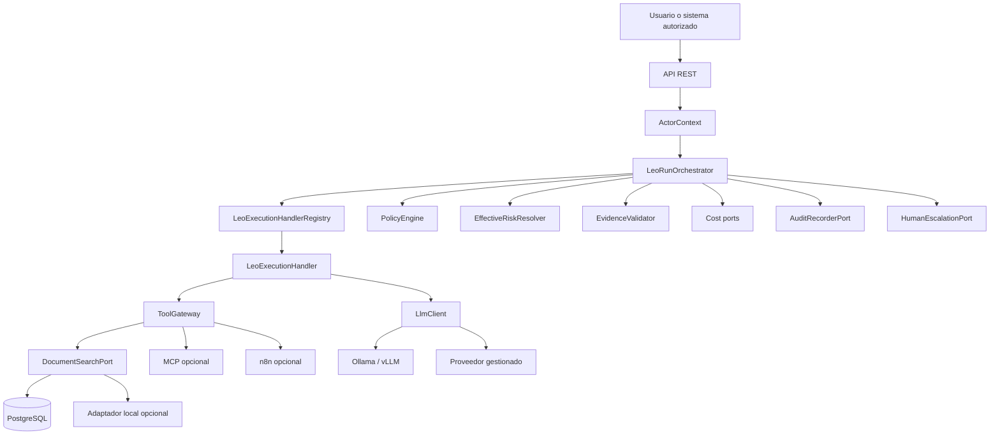
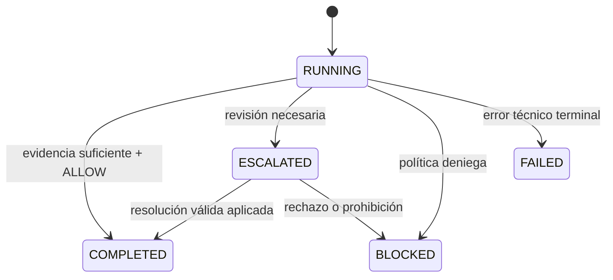

# LC-IA — Documento maestro de contexto, requisitos, casos de uso e implementación

> **Propósito.** Reestablecer una fuente de contexto única para retomar LC-IA, consolidar los requisitos del Leo Documental, incorporar las decisiones posteriores de arquitectura e integración, formalizar casos de uso y casos límite, y establecer hitos de construcción mediante desarrollo guiado por especificaciones (SDD) y desarrollo guiado por pruebas (TDD).
>
> **Importante.** Este documento no certifica qué partes están implementadas. Antes de aplicar cualquier cambio debe inspeccionarse el repositorio, sus migraciones, pruebas, paquetes, documentos SDD y configuración real.

## 0. Cómo interpretar este documento

### 0.1. Jerarquía de fuentes

Cuando exista conflicto, prevalece este orden:

1. decisiones explícitas y ADR aceptados;
2. `requirements.md` o análisis de requisitos vigente;
3. `design.md`;
4. `proposal.md`;
5. `tasks.md`;
6. `AGENTS.md`;
7. este documento consolidado cuando todavía no haya sido aceptado como nueva especificación;
8. comentarios, inferencias o propuestas no formalizadas.

### 0.2. Reconciliación de versiones

La base funcional más completa encontrada es **Leo Documental v0.4**, fechada el 18 de julio de 2026. Un documento posterior, denominado **LC-IA v0.2** y fechado el 19 de julio, añade el contrato formal de extensión mediante `LeoExecutionHandler`, `LeoExecutionHandlerRegistry`, `LeoExecutionContext` y `LeoExecutionResult`.

Aunque su numeración sea inferior, ese contenido es posterior y debe considerarse un incremento arquitectónico sobre v0.4. Este documento lo consolida como propuesta v0.5.

### 0.3. Etiquetas de decisión

- **CERRADO:** decisión ya consolidada en el proyecto.
- **PROPUESTO:** requisito nuevo derivado de análisis posteriores; necesita aceptación en SDD.
- **PENDIENTE:** no hay información suficiente o requiere validar el repositorio o el piloto.
- **FUERA DEL MVP:** no debe incorporarse sin una decisión explícita.

# 1. Contexto completo del proyecto

## 1.1. Identidad

**Nombre:** LC-IA — Plataforma de Leos.  
**Primer producto:** Leo Documental.  
**Tipo de sistema:** plataforma gobernada de trabajadores digitales para pymes.  
**Base técnica:** Java, Spring Boot, PostgreSQL, monolito modular y arquitectura hexagonal.  
**Idioma:** documentación funcional, técnica y operativa en español.

Un **Leo** es una unidad de software gobernada que ejecuta una capacidad empresarial concreta bajo identidad persistente, propietario conocido, mandato explícito, herramientas autorizadas, políticas deterministas, trazabilidad, control de coste, evidencia, revisión humana cuando corresponda y parada de emergencia.

Un Leo no es únicamente un chatbot, un prompt, una llamada a un LLM, una automatización RPA aislada ni un agente autónomo sin límites.

## 1.2. Problema de negocio

En muchas pymes, el conocimiento operativo está disperso entre manuales, contratos, correos, procedimientos, incidencias, expedientes, documentación de implantaciones y experiencia de personas concretas.

Buscar una respuesta consume tiempo, interrumpe a especialistas y puede producir decisiones basadas en información incompleta, antigua o perteneciente a otro cliente.

## 1.3. Hipótesis

> Un Leo Documental puede reducir tiempo y errores en un proceso documental repetitivo si responde únicamente con evidencia verificable, opera bajo un mandato explícito, mide su coste y escala a una persona cuando la situación no es segura o resoluble.

## 1.4. Pregunta central de validación

> ¿El Leo Documental reduce de forma medible el tiempo y los errores de un proceso documental real, manteniendo evidencia verificable, coste aceptable, aislamiento de datos y revisión humana cuando corresponde?

## 1.5. Primera victoria técnica

La primera victoria no es que el modelo redacte bien. Es demostrar que una ejecución:

1. pertenece a la organización autenticada;
2. utiliza identidad, mandato y contexto conocidos;
3. consulta solo documentos autorizados;
4. registra herramientas, modelo, políticas, evidencia, coste y latencia;
5. finaliza como `COMPLETED`, `ESCALATED`, `BLOCKED` o `FAILED`;
6. puede reconstruirse posteriormente.

## 1.6. Posición frente a una arquitectura Agentic AI

LC-IA pertenece a la familia de sistemas Agentic AI porque combina runtime de ejecución, modelo de IA, herramientas, conocimiento, memoria operativa, orquestación, guardrails, observabilidad y evaluación.

La diferencia es que el runtime del agente **no es la autoridad final**. El Leo produce artefactos, propuestas y señales; la plataforma decide permisos, riesgo, evidencia, coste y estado final.

# 2. Decisiones arquitectónicas consolidadas

## 2.1. Decisiones cerradas

1. Monolito modular hexagonal.
2. Java y Spring Boot como núcleo.
3. PostgreSQL primero, incluida la búsqueda léxica inicial.
4. Dominio desacoplado de proveedores LLM, bases vectoriales, MCP, n8n, OpenClaw, Nostr, Google ADK y SDK de infraestructura.
5. `LeoRunOrchestrator` coordina el ciclo común.
6. `LeoExecutionHandler` implementa el comportamiento específico de cada tipo de Leo.
7. `ToolGateway` es la única puerta de acceso a herramientas.
8. `PolicyEngine` toma decisiones deterministas.
9. El tenant procede del contexto autenticado.
10. El LLM no decide seguridad, riesgo, autorización, evidencia ni presupuesto.
11. La auditoría es de solo adición.
12. El coste se mide desde el primer día.
13. JSON inválido del LLM produce `ESCALATED`, no `FAILED`.
14. Una respuesta sin evidencia válida no puede ser `COMPLETED`.
15. El MVP es de lectura: sin escritura en ERP, envío de correo ni acciones irreversibles.
16. Documentación y mensajes de usuario en español.

## 2.2. Decisiones de integración

### OpenClaw

- No se utiliza como núcleo ni fuente de verdad.
- Se limita a experimentación, canal periférico o instalación aislada.
- No custodia identidad, mandato, auditoría, memoria corporativa, estado ni credenciales críticas.

### n8n

- Puede actuar como adaptador para triggers, normalización y conexión con ERP, CRM, correo o APIs.
- No es motor de políticas ni registro oficial.
- Los procesos largos deben ser asíncronos.
- Las acciones futuras usan comandos tipados, idempotentes y autorizados.

### LuzIA Local

- Puede ser adaptador de extracción, indexación, recuperación o inferencia local.
- Python, SQLite y Ollama aceleran prototipos, pero no sustituyen al núcleo gobernado.
- El adaptador devuelve fragmentos identificables; no decide el estado final.

### MCP

- Protocolo opcional detrás de `ToolGateway`.
- Nunca permite saltarse tenant, mandato, riesgo, coste o auditoría.

### Modelos

- Ollama, vLLM o una API gestionada implementan `LlmClient`.
- La estrategia puede ser local, privada o híbrida.
- El dominio no conoce el proveedor.

# 3. Alcance

## 3.1. Incluido en el MVP

- tenant y contexto autenticado;
- roles mínimos;
- identidad y propietario del Leo;
- mandato inmutable;
- kill switch por Leo y tenant;
- `LeoRun` y `LeoStep`;
- contrato formal de extensión;
- corpus documental y fragmentos;
- instantánea del conocimiento;
- búsqueda documental controlada;
- `ToolGateway`;
- `LlmClient`;
- respuesta estructurada;
- evidencia y procedencia;
- riesgo efectivo;
- políticas P-001..P-012;
- intervención humana;
- auditoría append-only;
- coste estimado y real;
- minimización de datos;
- configuración del piloto;
- clasificación y extracción opcionales;
- pruebas con dos tenants;
- pruebas de arquitectura y seguridad.

## 3.2. Fuera del MVP

- escritura en ERP;
- envío automático de correo;
- acciones irreversibles;
- colaboración multi-Leo;
- autonomía avanzada;
- marketplace;
- microservicios;
- Kafka o bus distribuido;
- base vectorial dedicada;
- memoria conversacional compleja;
- panel corporativo completo;
- federación;
- identidad criptográfica;
- Nostr, NIP-26, Google ADK y Policy Relay;
- firma externa;
- calendario regional completo;
- alto volumen distribuido.

## 3.3. Condiciones antes de datos reales

- proveedor de identidad y claim de tenant;
- roles reales;
- RLS o segunda barrera;
- gestión de secretos;
- cifrado;
- retención y borrado;
- backup y restauración;
- canal de escalaciones;
- pruebas de seguridad;
- rollback y desactivación;
- inventario de datos y base jurídica cuando corresponda.

# 4. Arquitectura objetivo

## 4.1. Vista lógica



## 4.2. Regla de dependencias

```text
Dominio
  ↑
Aplicación y casos de uso
  ↑
Puertos
  ↑
Adaptadores REST, JPA, autenticación, LLM, documentos e integraciones
```

El dominio no depende de Spring MVC, JPA, PostgreSQL, HTTP, SDK de proveedor, MCP, n8n, OpenClaw ni Ollama.

## 4.3. Ciclo común y ciclo especializado

### `LeoRunOrchestrator`

Debe resolver `ActorContext`, cargar `LeoIdentity`, capturar snapshots, crear y cerrar el run, aplicar políticas y coste, resolver el handler, integrar resultado, evidencia y riesgo, crear escalaciones y garantizar un estado final.

No debe contener ramas por `leo_type`, depender de handlers concretos, implementar lógica documental, ejecutar SQL, llamar directamente al proveedor LLM, autorizarse tools ni aceptar tenant del cliente.

### `LeoExecutionHandler`

```java
public interface LeoExecutionHandler {
    LeoType supportedType();
    LeoExecutionResult execute(LeoExecutionContext context);
}
```

Debe declarar un tipo, validar la entrada específica, usar puertos, invocar tools mediante `ToolGateway`, invocar modelos mediante `LlmClient` y devolver artefactos, evidencia, señales y metadatos.

No fija el estado final, no devuelve una decisión de política autoritativa, no rebaja riesgo, no elude auditoría/coste/HITL y no crea flujos multi-Leo ocultos.

### `LeoExecutionHandlerRegistry`

- exactamente un handler por `LeoType`;
- duplicados impiden el arranque;
- tipo inexistente falla antes de tool o LLM;
- añadir otro Leo no modifica `LeoRunOrchestrator`.

# 5. Actores y permisos

| Actor / rol | Responsabilidad |
|---|---|
| `TENANT_ADMIN` | configura Leos, mandato, owners, piloto y kill switch |
| `LEO_OPERATOR` | crea ejecuciones y consulta resultados |
| `HUMAN_REVIEWER` | revisa escalaciones de su alcance |
| `AUDITOR` | consulta auditoría |
| Sistema externo | solicita ejecuciones mediante adaptador autenticado |
| Operador de plataforma | mantiene infraestructura sin acceso implícito a contenido |

Reglas:

- rol y tenant son controles distintos;
- `{tenantId}` expresa scope, pero no autoridad;
- ausencia de autorización devuelve `403`;
- operaciones administrativas se auditan;
- un revisor no resuelve otro tenant o scope.


# 6. Modelo de dominio

## 6.1. Entidades existentes

| Entidad | Responsabilidad |
|---|---|
| `Tenant` | organización aislada |
| `ActorContext` | principal autenticado, tenant y roles |
| `LeoIdentity` | identidad, owner, tipo, límites y estado |
| `MandateSnapshot` | autorización inmutable usada por una ejecución |
| `LeoRun` | ejecución completa |
| `LeoStep` | paso trazable |
| `ExecutionContextSnapshot` | versiones y configuración utilizadas |
| `DocumentSource` | documento fuente |
| `DocumentChunk` | fragmento recuperable |
| `KnowledgeSnapshot` | estado versionado del corpus |
| `ToolCall` | invocación de una herramienta |
| `LlmCall` | llamada a un modelo |
| `StructuredAnswer` | salida parseada y validada |
| `Evidence` | fuente que respalda una afirmación |
| `PolicyDecision` | `ALLOW`, `ESCALATE` o `BLOCK` |
| `HumanEscalation` | intervención humana |
| `AuditEvent` | evento append-only |
| `PilotValidationConfig` | configuración y métricas del piloto |

## 6.2. Nuevos conceptos propuestos

### `DocumentAccessScope` o `KnowledgeScope`

**PROPUESTO.** El tenant puede contener documentación de distintos clientes, departamentos o expedientes. Debe existir un ámbito interno que limite el corpus consultable.

Campos conceptuales:

- `scope_id`;
- `tenant_id`;
- tipo: cliente, expediente, proyecto, departamento o corpus;
- reglas de acceso;
- sensibilidad;
- estado;
- versión.

### `DocumentIndexVersion`

**PROPUESTO.** Identifica la versión técnica del índice:

- extractor;
- estrategia de chunking;
- modelo de embedding si existe;
- esquema;
- fecha;
- documentos;
- hash agregado.

Evita mezclar chunks creados con configuraciones incompatibles.

# 7. Requisitos de validación de negocio

## RVB1. Proceso real

Debe existir un proceso repetitivo, documentado y con responsables.

**Aceptación:** descripción, volumen, actores, tiempo actual y al menos diez preguntas reales.

## RVB2. Métricas

Debe definirse una métrica primaria y al menos dos secundarias.

Ejemplos:

- tiempo de búsqueda;
- porcentaje de respuestas con evidencia válida;
- ratio de escalado correcto;
- correcciones;
- coste por consulta;
- reducción de interrupciones.

## RVB3. Criterio de parada

Debe existir una condición explícita para detener, pivotar o replantear el piloto.

## RVB4. Configuración versionada

`PilotValidationConfig` conserva preguntas, métricas, umbrales, riesgo permitido, criterio de parada y capacidades opcionales.

## RVB5. Línea base

**PROPUESTO.** Antes de evaluar el Leo debe medirse el mismo proceso sin IA.

# 8. Requisitos funcionales consolidados

## RF0. Tenant y contexto autenticado

- Todo `LeoRun` tiene tenant.
- El tenant se deriva de autenticación.
- `X-Tenant-Id` solo se permite en `dev/test`.
- La discrepancia URL/autenticación produce `403`.
- El tenant aportado por el cliente nunca es autoridad.

## RF1. Identidad del Leo

`LeoIdentity` contiene tipo, owner, estado, versión, política, tools permitidas y riesgo máximo.

Estados: `ACTIVE`, `PAUSED`, `DISABLED`.

## RF2. Mandato inmutable

Cada ejecución referencia un `MandateSnapshot` con capacidades, prohibiciones, tools, revisión requerida, límites, vigencia, autor, motivo, hash y referencia previa.

## RF3. Ejecución `LeoRun`

Conserva actor, objetivo, estado, snapshots, riesgo, modelo, coste, tiempos y motivo final.

Estados finales: `COMPLETED`, `ESCALATED`, `BLOCKED`, `FAILED`.

## RF4. Pasos `LeoStep`

Tipos mínimos:

- `POLICY_CHECK`;
- `COST_CHECK`;
- `TOOL_CALL`;
- `AI_CALL`;
- `OUTPUT_VALIDATION`;
- `EVIDENCE_VALIDATION`;
- `ESCALATION`;
- `AUDIT`.

## RF5. Corpus documental

`DocumentSource` y `DocumentChunk` incluyen tenant, estado, checksum, versión, localización y borrado lógico.

## RF6. Instantánea del conocimiento

Cada ejecución referencia un `KnowledgeSnapshot` reproducible.

## RF7. `ToolGateway`

Toda herramienta pasa por el gateway, que vuelve a verificar tenant, mandato, tool, operación, riesgo, estado, límites e idempotencia.

## RF8. Búsqueda documental

Primera versión con PostgreSQL, `ILIKE` o full-text search. La entrada pública no contiene tenant. La salida identifica documento, chunk, título, fecha, puntuación, extracto y localización.

## RF9. Cliente LLM desacoplado

`LlmClient` devuelve salida bruta y metadatos, nunca una decisión de negocio.

## RF10. Respuesta estructurada

Incluye respuesta, fuentes, afirmaciones, unsupported claims, contradicciones, señales, motivos y riesgo declarado por el LLM.

JSON inválido genera `INVALID_ANSWER` y P-006.

## RF11. Validación de evidencia

La evidencia debe:

- pertenecer al tenant y scope;
- apuntar a documento y chunk activos;
- respaldar una afirmación;
- respetar vigencia;
- no ser duplicado disfrazado;
- no presentar contradicción no resuelta.

## RF12. Riesgo efectivo

Solo `effectiveRiskLevel`, calculado por reglas, alimenta P-010/P-011.

## RF13. Motor de políticas

Devuelve decisión, regla, versión, razones y acción requerida. Orden y short-circuit deterministas.

## RF14. Intervención humana

Toda escalación conserva tenant, run, motivo, prioridad, owner, SLA, estado y resolución. Si falta owner se usa `UNASSIGNED` y `configuration_required=true`.

## RF15. Kill switch

Debe existir por Leo y tenant. Cuando está activo no se llama a tool ni a LLM.

## RF16. Auditoría

Append-only, minimizada y, cuando proceda, encadenada mediante hashes.

## RF17. Coste

`PreCostGuard` comprueba presupuesto antes de llamadas caras; después se reconcilia el coste real. Los fakes usan coste no nulo marcado como sintético.

## RF18. Clasificación opcional

Desactivada por defecto. Requiere etiqueta, fuente, versión y posibilidad de revisión.

## RF19. Extracción opcional

Desactivada por defecto. Cada campo requiere valor, fuente, ubicación, validación y estado.

## RF20. Extensibilidad de tipos de Leo

Un nuevo tipo se incorpora mediante `LeoExecutionHandler` registrado declarativamente, sin modificar el orquestador.

## RF21. Ámbito documental interno

**PROPUESTO.**

- Cada búsqueda se limita a un `DocumentAccessScope`.
- El scope se deriva de autorización o asignación segura.
- No se acepta un `clientId` libre como autoridad.
- `ToolGateway` vuelve a validar scope.
- Dos clientes dentro del mismo tenant deben aislarse en pruebas.

## RF22. Ciclo de vida del índice

**PROPUESTO.**

El sistema maneja altas, modificaciones, renombrados, movimientos, eliminaciones, cambios de extractor, chunking, embedding y reindexaciones fallidas.

Un documento borrado invalida chunks, índices, resúmenes y evidencias futuras.

## RF23. Abstención explícita

**PROPUESTO.** El Leo puede abstenerse cuando la pregunta sea ambigua, el corpus insuficiente o la respuesta no sea verificable. Se convierte en aclaración o escalación, nunca en invención.

## RF24. Evaluación reproducible

**PROPUESTO.** Debe existir un conjunto versionado de consultas y resultados esperados para comparar modelos, prompts y estrategias de búsqueda.

# 9. Requisitos no funcionales

## RNF1. Seguridad

- fail closed;
- RBAC;
- tenant y scope isolation;
- defensa en profundidad;
- secretos fuera del dominio;
- logs sin secretos;
- pruebas de prompt injection;
- RLS antes de piloto real multi-tenant.

## RNF2. Reproducibilidad

Toda ejecución conserva versiones de mandato, políticas, conocimiento, prompt, tools, modelo, precios y minimización.

## RNF3. Mantenibilidad

- módulos por capacidad;
- dominio sin infraestructura;
- migraciones Flyway aditivas;
- ADR;
- commits pequeños;
- no mezclar refactors con funcionalidad.

## RNF4. Observabilidad

Por ejecución: estado, duración, modelo, tool, políticas, fuentes, coste, escalación, error y versiones.

## RNF5. Rendimiento

No se fija un SLA sin datos. El piloto mide P50/P95, tiempo hasta primer token, búsqueda, memoria y concurrencia.

## RNF6. Privacidad

No almacenar prompts o documentos completos en auditoría salvo necesidad justificada. Usar identificadores, hashes y resúmenes minimizados.

## RNF7. Recuperación

Fallos de proveedor terminan de forma controlada. Backup, restore y rollback se prueban antes de producción.

## RNF8. Portabilidad

Cambiar LLM, búsqueda, protocolo o proveedor no modifica dominio ni estados.

## RNF9. Testabilidad

Fakes de LLM, búsqueda, auditoría, reloj y coste. Arquitectura verificable con ArchUnit.

# 10. Políticas deterministas

| Regla | Condición | Decisión |
|---|---|---|
| P-001 | Leo pausado o deshabilitado | `BLOCK` |
| P-002 | tenant pausado o deshabilitado | `BLOCK` |
| P-003 | herramienta no autorizada | `BLOCK` |
| P-004 | evidencia insuficiente o afirmación no soportada | `ESCALATE` |
| P-005 | acceso entre tenants o scopes | `BLOCK` |
| P-006 | salida estructurada inválida | `ESCALATE` |
| P-007 | contradicción documental | `ESCALATE` |
| P-008 | dato sensible que exige revisión | `ESCALATE` |
| P-009 | inyección o manipulación | `ESCALATE` o `BLOCK` |
| P-010 | `effectiveRiskLevel = HIGH` | `ESCALATE` |
| P-011 | riesgo crítico o acción irreversible | `BLOCK` |
| P-012 | coste supera umbral | `ESCALATE` o `BLOCK` |

Reglas obligatorias:

- el LLM no decide políticas;
- el orden se documenta;
- cada decisión contiene razón y versión;
- un refactor exige tests de caracterización;
- P-010 y P-011 nunca usan riesgo del modelo.

# 11. Estados

## 11.1. `LeoRun`



- `COMPLETED`: respuesta válida, respaldada y permitida.
- `ESCALATED`: resultado controlado que necesita humano.
- `BLOCKED`: política prohíbe.
- `FAILED`: infraestructura o dependencia impide ejecutar.

## 11.2. `LeoStep`

`PENDING`, `RUNNING`, `COMPLETED`, `FAILED`, `SKIPPED`, `BLOCKED`.

## 11.3. `HumanEscalation`

`PENDING`, `IN_REVIEW`, `APPROVED`, `REJECTED`, `RESOLVED`, `EXPIRED`.


# 12. Casos de uso formales

## CU01. Consulta con evidencia suficiente

**Actor:** `LEO_OPERATOR`.  
**Precondiciones:** usuario autenticado, Leo activo, mandato válido, corpus disponible y tool autorizada.

**Flujo:**

1. El actor envía una pregunta.
2. LC-IA crea el `LeoRun` con clave de idempotencia.
3. Captura mandato, conocimiento y configuración.
4. Pasa controles previos de política y coste.
5. `LeoDocumentalExecutionHandler` solicita `document.search`.
6. `ToolGateway` valida tenant, scope, mandato y tool.
7. Se recuperan chunks.
8. Se inspecciona contenido no confiable.
9. `LlmClient` produce salida bruta.
10. Se valida el contrato estructurado.
11. `EvidenceValidator` vincula claims con chunks.
12. `PolicyEngine` devuelve `ALLOW`.
13. El run termina `COMPLETED`.

**Postcondición:** respuesta, fuentes, coste, duración, pasos y auditoría reconstruibles.  
**Pruebas TDD:** happy path unitario con fakes; integración PostgreSQL; E2E con dos tenants.

## CU02. Consulta sin evidencia suficiente

**Resultado:** `ESCALATED` con `INSUFFICIENT_EVIDENCE`.

No se inventa respuesta. La escalación conserva pregunta, chunks recuperados, motivo y owner.

## CU03. Pregunta ambigua

Faltan datos esenciales.

**Resultado:** solicitud de aclaración si el canal lo permite; si no, `ESCALATED`. No se consume otra llamada costosa sin control de presupuesto.

## CU04. Contradicción documental

Se recuperan fuentes vigentes y relevantes que se contradicen.

**Resultado:** P-007 → `ESCALATED`. El revisor recibe ambas fuentes, fechas y ubicaciones.

## CU05. Documento con instrucciones maliciosas

Un chunk intenta cambiar el system prompt, el riesgo o las tools.

**Resultado:** señal de inyección; P-009 escala o bloquea. El documento nunca se interpreta como instrucción de plataforma.

## CU06. Intento de acceso entre tenants

La URL, el body, una tool o un resultado intenta usar datos de otro tenant.

**Resultado:** `403` o `BLOCKED`, evento de seguridad y cero llamadas posteriores.

## CU07. Intento de acceso a otro cliente del mismo tenant

**PROPUESTO.** El actor pertenece a Leovinci, pero solo tiene acceso al cliente o expediente A.

**Resultado:** `BLOCKED` por `DocumentAccessScope` y auditoría de incidente.

## CU08. Leo o tenant pausado

P-001/P-002 bloquean antes de búsqueda o LLM.

**Resultado:** `BLOCKED`; se registra actor y motivo del kill switch.

## CU09. Proveedor LLM no disponible

La llamada falla por timeout, indisponibilidad o error técnico.

**Resultado:** `FAILED`. No se confunde con incertidumbre de negocio.

## CU10. Salida estructurada inválida

El proveedor responde, pero no cumple el esquema.

**Resultado:** `INVALID_ANSWER`, P-006 y `ESCALATED`. No se ejecutan tools ni acciones derivadas.

## CU11. Coste por encima del umbral

`PreCostGuard` detecta que el coste estimado supera el límite.

**Resultado:** P-012 escala o bloquea antes de la llamada. Si el coste real excede la reserva, se reconcilia y audita.

## CU12. Revisión humana

1. Se crea `HumanEscalation`.
2. Se asigna owner o `UNASSIGNED`.
3. El revisor abre el caso.
4. Aprueba, rechaza o solicita información.
5. La decisión se aplica y audita.
6. Solo entonces queda `RESOLVED`.

## CU13. Reintento idempotente

El cliente repite una petición con la misma clave.

**Resultado:** se devuelve el `runId` existente; no se duplican coste, tools ni acciones.

## CU14. Cambio de mandato durante una ejecución

El admin crea una nueva versión mientras el run está activo.

**Resultado:** el run continúa con su snapshot original; nuevas ejecuciones usan la versión nueva.

## CU15. Borrado o modificación de documento

Al eliminar o modificar una fuente se invalidan chunks, índice, derivados y futuras instantáneas.

**Resultado:** una ejecución histórica conserva su referencia; una nueva no recupera contenido eliminado.

## CU16. Clasificación opcional

Solo se ejecuta si `PilotValidationConfig` la activa. La etiqueta requiere evidencia y no altera permisos.

## CU17. Extracción opcional

Solo se ejecuta si está habilitada. Cada campo se vincula a documento, chunk y ubicación.

## CU18. Registro de un segundo tipo de Leo

Se añade un handler de prueba para otro `LeoType`.

**Resultado:** el registry lo resuelve sin modificar `LeoRunOrchestrator`. Duplicado o ausencia falla antes de tool o LLM.

## CU19. Consulta sensible

Una consulta legal, fiscal, laboral o contractual alcanza riesgo `HIGH`.

**Resultado:** P-010 → `ESCALATED`, aunque el LLM declare riesgo bajo.

## CU20. Adaptador local documental

LC-IA usa un adaptador local para extraer o recuperar chunks.

**Resultado:** el adaptador devuelve contratos tipados; LC-IA controla autorización, evidencia, estado, coste y auditoría.

# 13. Casos límite y amenazas

| Código | Escenario | Resultado esperado | Prueba principal |
|---|---|---|---|
| CL01 | documento sin fuente identificable | escalar o bloquear | unitaria |
| CL02 | fuente antigua frente a reciente | usar vigencia; escalar si no es clara | unitaria |
| CL03 | documentos duplicados | no contar como evidencia independiente | unitaria |
| CL04 | documentos contradictorios | `ESCALATED` | unitaria |
| CL05 | chunk de otro tenant | bloquear y auditar | integración |
| CL06 | pregunta ambigua | aclarar o escalar | unitaria |
| CL07 | consulta legal/fiscal/laboral | riesgo alto y revisión | unitaria |
| CL08 | acción irreversible | bloquear | unitaria |
| CL09 | tool no autorizada | bloquear también en gateway | unitaria + integración |
| CL10 | JSON inválido | `INVALID_ANSWER` y escalado | unitaria |
| CL11 | coste excesivo | P-012 antes de LLM | unitaria |
| CL12 | escalación no atendida | `EXPIRED`, alertar, no éxito | integración |
| CL13 | documento borrado aún indexado | invalidar índice y derivados | integración |
| CL14 | cliente fuerza otro tenant | `403` + auditoría | seguridad |
| CL15 | unsupported claims | escalar | unitaria |
| CL16 | proveedor no disponible | `FAILED` | contrato |
| CL17 | timeout de tool | fallo controlado o reintento idempotente | integración |
| CL18 | documento muy largo | fragmentar y limitar contexto | integración |
| CL19 | mandato cambia en ejecución | usar snapshot original | unitaria |
| CL20 | reintento duplica ejecución | devolver existente | integración |
| CL21 | revisor de otro tenant | `403` + auditoría | seguridad |
| CL22 | prompt intenta reducir riesgo | ignorar; usar riesgo efectivo | unitaria |
| CL23 | acceso a otro cliente del mismo tenant | bloquear por scope | seguridad |
| CL24 | mismo documento renombrado | conservar identidad o reindexar sin duplicar | integración |
| CL25 | mismo contenido en dos rutas | deduplicar evidencia por checksum | unitaria |
| CL26 | checksum cambia sin fecha modificada | detectar modificación | integración |
| CL27 | extractor se bloquea | timeout y estado de indexación fallida | contrato |
| CL28 | PDF escaneado sin OCR | marcar no extraíble; no afirmar ausencia | integración |
| CL29 | JSON válido pero incoherente | invalidar contrato y escalar | unitaria |
| CL30 | cita chunk no recuperado | evidencia inválida y escalado | unitaria |
| CL31 | kill switch a mitad del run | cancelar antes de siguiente dependencia | integración |
| CL32 | dos admins cambian mandato | control de versión optimista | integración |
| CL33 | dos handlers para el mismo tipo | fallo de arranque | arquitectura |
| CL34 | handler inexistente | fallo seguro sin tool/LLM | unitaria |
| CL35 | adaptador devuelve otro tenant | gateway rechaza y audita | seguridad |
| CL36 | falla la auditoría | no declarar éxito silenciosamente | integración |
| CL37 | coste real difiere de reserva | reconciliar y registrar desviación | unitaria |
| CL38 | escalación sin owner | `UNASSIGNED` + alerta | integración |
| CL39 | SLA vencido | `EXPIRED` + `SLA_BREACHED` | unitaria |
| CL40 | dos revisores resuelven a la vez | una resolución efectiva; conflicto controlado | integración |
| CL41 | log contiene PII innecesaria | test de minimización falla | seguridad |
| CL42 | migración falla parcialmente | transacción o rollback | migración |
| CL43 | cambio de modelo de embedding | nueva versión del índice | integración |
| CL44 | adaptador local no disponible | fallo técnico controlado | contrato |
| CL45 | respuesta supera timeout HTTP | proceso asíncrono o consulta por `runId` | E2E |
| CL46 | corpus vacío | escalar sin LLM innecesario | unitaria |
| CL47 | documento protegido o corrupto | error de ingestión visible | integración |
| CL48 | tool devuelve demasiados chunks | límite y minimización | unitaria |
| CL49 | prompt/documento contiene secretos | no registrar contenido completo | seguridad |
| CL50 | fuente se desactiva durante run | snapshot para histórico; nuevas consultas no la usan | integración |


# 14. Estrategia TDD estricta

## 14.1. Reglas obligatorias

1. No se escribe código productivo sin una prueba que falle por el comportamiento que se quiere añadir.
2. La prueba debe fallar por la razón esperada, no por configuración rota.
3. Se implementa la mínima solución que haga pasar la prueba.
4. Se refactoriza solo con la suite verde.
5. Un bug se reproduce primero con una prueba.
6. Un refactor de comportamiento existente empieza con tests de caracterización.
7. No se valida una funcionalidad solo con mocks.
8. Las reglas de negocio se prueban sin Spring.
9. Los adaptadores se validan mediante pruebas de contrato.
10. PostgreSQL y migraciones se prueban con Testcontainers.
11. Las fronteras modulares se verifican con ArchUnit.
12. Cada requisito enlaza al menos un test y un criterio de aceptación.

## 14.2. Ciclo por tarea

```text
RED
→ escribir un test del comportamiento
→ comprobar que falla por la causa correcta

GREEN
→ implementar lo mínimo
→ ejecutar test focalizado
→ ejecutar suite del módulo

REFACTOR
→ eliminar duplicación
→ mejorar nombres y diseño
→ ejecutar suite completa
→ actualizar documentación y trazabilidad
```

## 14.3. Tipos de prueba

### Unitarias

- value objects;
- estados y transiciones;
- `PolicyEngine`;
- `EffectiveRiskResolver`;
- evidencia;
- parser;
- coste;
- idempotencia;
- registry;
- contratos de handler.

### Integración

- repositorios tenant-scoped;
- migraciones;
- búsqueda;
- auditoría;
- escalaciones;
- API;
- bloqueo optimista;
- borrado e invalidación;
- Testcontainers PostgreSQL.

### Contrato

- `LlmClient`;
- `DocumentSearchPort`;
- adaptador local;
- notificación;
- futuras integraciones n8n/MCP.

### Seguridad funcional

- dos tenants;
- dos scopes dentro de un tenant;
- roles;
- bypass del gateway;
- prompt injection;
- logs;
- cross-tenant;
- revisor no autorizado.

### Arquitectura

- `run` no depende de `documental`;
- orquestador no referencia handlers concretos;
- dominio no depende de Spring/JPA/SDK;
- handlers no acceden a tools fuera del gateway;
- un nuevo Leo no modifica el orquestador.

### End-to-end

- happy path;
- evidencia insuficiente;
- JSON inválido;
- proveedor caído;
- kill switch;
- revisión humana;
- reconstrucción histórica.

## 14.4. Dobles de prueba

Preferir:

- `FakeLlmClient`;
- `FakeDocumentSearch`;
- `InMemoryAuditRecorder`;
- `FakeCostEstimator`;
- `FixedClock`;
- `FakeHumanEscalationPort`.

Usar mocks para interacciones de frontera concretas, no para simular todo el dominio.

## 14.5. Gates de CI

No se integra si falla cualquiera de estos gates aplicables:

- compilación;
- unitarias;
- integración;
- migraciones;
- ArchUnit;
- seguridad funcional;
- formato y análisis estático;
- documentación y trazabilidad;
- ausencia de tests deshabilitados sin justificar.

La cobertura es una señal, no el objetivo. No se acepta código sin comportamiento probado aunque aumente el porcentaje global.

## 14.6. Definition of Done

Una funcionalidad está terminada cuando:

- cumple el requisito;
- tiene test previo;
- respeta tenant y scope;
- tiene autorización;
- audita;
- mide coste si consume recursos;
- maneja errores;
- actualiza SDD;
- actualiza OpenAPI si aplica;
- no amplía alcance incidentalmente;
- no rompe arquitectura;
- puede revisarse en un cambio pequeño y coherente.

# 15. Implementación SDD con OpenSpec

## 15.1. Flujo obligatorio

```text
explore
→ proposal
→ spec / requirements
→ design
→ tasks
→ apply
→ verify
→ archive
```

No se entra en `apply` si existen contradicciones, requisitos huérfanos, decisiones críticas pendientes o tareas sin test.

## 15.2. Artefactos mínimos

```text
openspec/changes/<change-name>/
├── proposal.md
├── requirements.md
├── design.md
├── tasks.md
├── verification.md
└── evidence/
```

Cuando proceda:

- `openapi.yaml`;
- `policy-catalog.md`;
- `data-dictionary.md`;
- `threat-model.md`;
- ADR;
- migraciones;
- runbook.

## 15.3. Contenido por fase

### Explore

- estado real del repositorio;
- clases, paquetes y migraciones;
- riesgos;
- decisiones abiertas;
- alternativas;
- pruebas actuales.

### Proposal

- problema;
- objetivo;
- alcance;
- no objetivos;
- impacto;
- criterios de éxito;
- riesgos.

### Requirements

- requisitos numerados;
- casos de uso;
- casos límite;
- criterios observables.

### Design

- módulos;
- contratos;
- secuencias;
- datos;
- seguridad;
- errores;
- pruebas;
- rollback.

### Tasks

Cada tarea indica requisito, test RED, implementación mínima, refactor, documentación, dependencias y criterio de salida.

### Apply

- tareas en orden;
- commits pequeños;
- suite verde;
- sin alcance nuevo.

### Verify

- trazabilidad requisito → test → código;
- pruebas completas;
- revisión independiente en cambios de alto riesgo;
- evidencias de seguridad y arquitectura;
- no declarar listo por cortesía.

### Archive

- decisión final;
- ADR;
- documentación vigente;
- riesgos residuales;
- deuda explícita.

## 15.4. Matriz de trazabilidad

| Requisito | Caso de uso | Caso límite | Diseño | Tarea | Test | Estado |
|---|---|---|---|---|---|---|

Un requisito sin test o una tarea sin requisito bloquea `apply`.

## 15.5. Tamaño de cambio

Preferir cambios verticales pequeños y verificables. No mezclar renombrado de paquetes, nueva funcionalidad, migración, cambio de proveedor y refactor masivo.

# 16. Hitos de construcción

> Los hitos no son semanas. Cada uno se inicia cuando el anterior cumple sus gates.

## H0. Rebaseline del proyecto

**Cambio sugerido:** `lc-ia-rebaseline-mvp`.

**Objetivo:** comprobar el estado real y aceptar esta consolidación.

**Entregables:**

- inventario del repositorio;
- package root, Java y Spring reales;
- migraciones y pruebas;
- mapa de documentos SDD;
- decisiones cerradas y pendientes;
- requisitos v0.5 aceptados o corregidos;
- baseline de build verde.

**TDD:** no se implementa funcionalidad; tests de caracterización si existe código heredado.

**Gate:** ninguna afirmación de implementación basada solo en documentos.

## H1. Esqueleto modular y harness de pruebas

**Cambio:** `lc-ia-modular-foundation`.

**Objetivo:** asegurar fronteras antes de crecer.

**Incluye:** módulos, errores comunes, reloj inyectable, IDs, Testcontainers, ArchUnit y configuración de test.

**RED primero:**

- dominio no depende de Spring/JPA;
- run no depende de documental;
- migración inicial válida.

**Gate:** build reproducible y reglas de arquitectura verdes.

## H2. Tenant, autenticación y RBAC

**Cambio:** `lc-ia-tenant-security-context`.

**Requisitos:** RF0, RNF1.

**Incluye:** `ActorContext`, tenant, roles, comprobación URL/auth, `ProblemDetail`, repositorios tenant-scoped y auditoría mínima.

**Pruebas:**

- tenant A no consulta B;
- rol sin permiso recibe `403`;
- header dev deshabilitado en producción;
- actor sin tenant no crea run.

**Gate:** dos tenants aislados.

## H3. Identidad, mandato y kill switch

**Cambio:** `lc-ia-identity-mandate-killswitch`.

**Requisitos:** RF1, RF2, RF15.

**Incluye:** `LeoIdentity`, estados, owner, `MandateSnapshot`, versionado y pause/resume.

**Pruebas:**

- Leo pausado no llama dependencias;
- mandato inmutable;
- cambio crea versión;
- kill switch auditado.

## H4. Ejecución trazable y contrato de extensión

**Cambio:** `lc-ia-run-extension-contract`.

**Requisitos:** RF3, RF4, RF20.

**Incluye:** `LeoRun`, `LeoStep`, estados, idempotencia, handler, registry, orquestador y handler de prueba.

**Pruebas:**

- duplicado impide arranque;
- handler ausente falla seguro;
- handler no fija estado;
- segundo Leo no cambia orquestador;
- reintento devuelve run existente.

## H5. Corpus, ámbitos y snapshots

**Cambio:** `lc-ia-document-corpus-scopes`.

**Requisitos:** RF5, RF6, RF21, RF22.

**Incluye:** documentos, chunks, checksum, borrado lógico, `KnowledgeSnapshot`, scope y ciclo de vida del índice.

**Pruebas:**

- tenant y scope isolation;
- borrado no aparece;
- duplicados no cuentan dos veces;
- modificación crea versión;
- snapshot histórico reconstruible.

## H6. `ToolGateway` y búsqueda

**Cambio:** `lc-ia-document-search-gateway`.

**Requisitos:** RF7, RF8.

**Incluye:** `ToolExecutionContext`, `document.search`, full-text, límites, filtros y `ToolCall`.

**Pruebas:**

- tool no autorizada bloqueada;
- tenant fuera del input público;
- resultado de otro tenant rechazado;
- timeout controlado;
- límite de chunks.

## H7. LLM, salida estructurada y coste

**Cambio:** `lc-ia-llm-structured-cost`.

**Requisitos:** RF9, RF10, RF17, RF23.

**Incluye:** `LlmClient`, fake, adaptador inicial, parser, schema, `PreCostGuard`, `LlmCall` y abstención.

**Pruebas:**

- JSON inválido escala;
- proveedor caído falla;
- fake registra coste;
- coste excesivo evita llamada;
- JSON semánticamente inválido escala.

## H8. Evidencia, riesgo, políticas y contenido no confiable

**Cambio:** `lc-ia-evidence-policy-guardrails`.

**Requisitos:** RF11, RF12, RF13 y P-001..P-012.

**Incluye:** `EvidenceValidator`, `EffectiveRiskResolver`, `PolicyEngine`, short-circuit, señales, unsupported claims y contradicciones.

**Pruebas:**

- cada política;
- falta de evidencia;
- citas inventadas;
- inyección;
- riesgo LOW del LLM no rebaja CRITICAL;
- caracterización antes de refactor.

## H9. Intervención humana y SLA

**Cambio:** `lc-ia-human-escalation`.

**Requisitos:** RF14.

**Incluye:** escalación, owner, estados, autorización, `BusinessCalendar`, SLA y eventos.

**Pruebas:**

- owner ausente visible;
- revisor de otro tenant bloqueado;
- doble resolución;
- SLA vencido;
- escalación pendiente no permite éxito.

## H10. API, auditoría y observabilidad

**Cambio:** `lc-ia-api-observability-audit`.

**Requisitos:** RF16, RNF4 y API mínima.

**Incluye:** endpoints, OpenAPI, logs, métricas, cadena de auditoría y consultas de auditor.

**Pruebas:**

- contratos HTTP;
- no exponer JPA;
- no stack traces;
- minimización;
- reconstrucción de un run.

## H11. Validación integral del piloto

**Cambio:** `lc-ia-documental-pilot-validation`.

**Requisitos:** RVB1-RVB5, RF24.

**Incluye:** corpus, preguntas reales, línea base, E2E, evaluación de modelos/búsqueda e informe.

**Pruebas y métricas:**

- happy path;
- no evidence;
- contradicción;
- inyección;
- dos tenants;
- dos scopes;
- coste;
- latencia;
- escalado;
- calidad de fuentes.

**Gate:** decisión `CONTINUE`, `PIVOT` o `STOP`.

## H12. Adaptador local documental, solo si se justifica

**Cambio:** `lc-ia-local-document-adapter`.

**Objetivo:** integrar aprendizajes de LuzIA Local sin acoplar el dominio.

**Incluye posibles adaptadores:** extracción Python, Ollama, embeddings e índice local.

**Pruebas:** contratos tipados, aislamiento, timeout, versión del índice, borrado y comparación contra full-text.

**Gate:** se mantiene solo si mejora una métrica acordada.

## H13. Preparación para cliente real

**Cambio:** `lc-ia-production-readiness`.

**Incluye:** identidad real, RLS, cifrado, secretos, backup/restore, rollback, runbook, threat model, carga y alertas.

**Gate:** checklist de seguridad y operación aprobado.

# 17. Trazabilidad resumida

| Grupo | Requisitos | Casos de uso | Hitos |
|---|---|---|---|
| Seguridad | RF0, RF21, RNF1 | CU06, CU07 | H2, H5 |
| Gobierno | RF1, RF2, RF15 | CU08, CU14 | H3 |
| Ejecución | RF3, RF4, RF20 | CU13, CU18 | H4 |
| Conocimiento | RF5, RF6, RF22 | CU15, CU20 | H5 |
| Tools | RF7, RF8 | CU01, CU05 | H6 |
| Modelo/coste | RF9, RF10, RF17, RF23 | CU09-CU11 | H7 |
| Evidencia/política | RF11-RF13 | CU02-CU05, CU19 | H8 |
| HITL | RF14 | CU12 | H9 |
| Auditoría/API | RF16, RNF4 | todos | H10 |
| Opcionales | RF18, RF19 | CU16, CU17 | después de H8 |
| Validación | RVB1-RVB5, RF24 | CU01-CU20 | H11 |
| Adaptador local | RF8/RF9/RF22 | CU20 | H12 |

# 18. Decisiones pendientes

1. Estado real del repositorio y package root.
2. Versión real de Java y Spring Boot.
3. Proceso piloto.
4. Tenant, usuarios y revisores.
5. Corpus autorizado.
6. Diez o más preguntas reales.
7. Métrica primaria y criterio de parada.
8. Modelo de `DocumentAccessScope`.
9. Proveedor de identidad y claim.
10. Configuración inicial de búsqueda.
11. Adaptador LLM inicial.
12. Esquema definitivo de `StructuredAnswer`.
13. Algoritmo mínimo de suficiencia de evidencia.
14. Orden de P-001..P-012.
15. Tratamiento si falla auditoría.
16. Coste para modelos locales.
17. Canal de escalaciones.
18. API síncrona o `202 + runId`.
19. Momento de activar RLS.
20. Necesidad real de LuzIA Local, embeddings, MCP o n8n.

# 19. Próximo paso recomendado

No comenzar implementando el LLM ni el RAG.

Ejecutar H0:

1. inspeccionar repositorio;
2. localizar artefactos SDD;
3. ejecutar build y tests;
4. contrastar código con este documento;
5. crear `lc-ia-rebaseline-mvp`;
6. aceptar o corregir v0.5;
7. producir matriz de trazabilidad;
8. decidir si procede H1.

> El Leo propone y ejecuta dentro de límites; la plataforma conoce el contexto, aplica las reglas, conserva la evidencia y permite que una persona mantenga la autoridad final.
