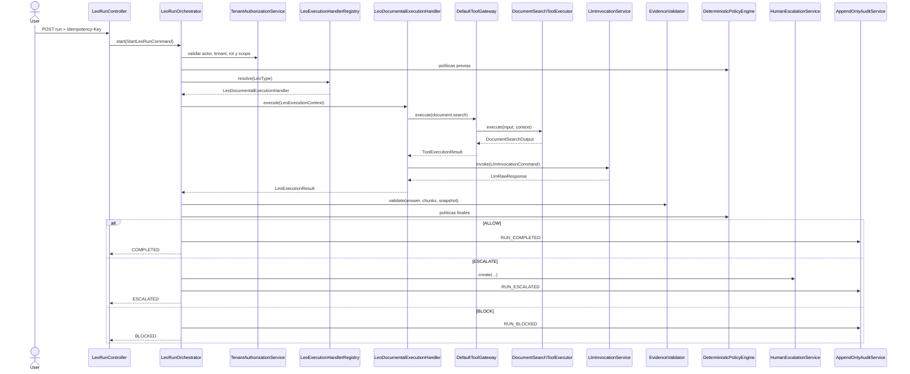

# LC-IA — Inventario de modelos, clases, métodos, servicios y controladores

> **Naturaleza del documento.** Este es un inventario de diseño objetivo derivado de los requisitos consolidados. No afirma que estas clases existan ya en el repositorio. Antes de implementar debe ejecutarse el hito H0, contrastar el código real y ajustar nombres, paquetes, migraciones y contratos mediante SDD.

## 1. Convenciones

### 1.1. Raíz de paquetes

Raíz preferida:

```text
com.leovinci.leos
```

Si el repositorio usa todavía `com.leovinci.aiworkers`, el cambio de raíz se tratará como un refactor independiente.

### 1.2. Estructura por capacidad

```text
<capacidad>
├── domain
├── application
│   ├── command
│   ├── query
│   ├── service
│   └── dto
├── ports
│   ├── in
│   └── out
└── adapters
    ├── in
    │   └── rest
    └── out
        ├── persistence
        └── integration
```

### 1.3. Reglas de diseño

- El dominio no depende de Spring, JPA, HTTP, PostgreSQL, Ollama, n8n, MCP ni SDK de proveedor.
- Los controladores solo traducen HTTP a puertos de entrada.
- Los servicios de aplicación coordinan; las invariantes viven en agregados y value objects.
- No se exponen entidades JPA en la API.
- El tenant se deriva de `ActorContext`; nunca del body como autoridad.
- Los métodos públicos devuelven tipos explícitos; no `Map<String, Object>`.
- Los estados, decisiones, eventos, herramientas y códigos de error no se representan con strings libres.
- `LeoRunOrchestrator` no contiene ramas por tipo de Leo.

### 1.4. Etiquetas

- **MVP:** necesario para el Leo Documental gobernado.
- **PROPUESTO:** derivado de RF21-RF24; debe aceptarse en SDD.
- **OPCIONAL:** capacidad desactivada por defecto.
- **FUTURO:** no implementar dentro del MVP.

---

# 2. Vista general de módulos

```text
com.leovinci.leos
├── shared
├── tenant
├── leo
├── run
├── step
├── document
├── tool
├── llm
├── answer
├── evidence
├── policy
├── escalation
├── audit
├── cost
├── minimization
├── pilot
├── classification
└── extraction
```

| Módulo | Responsabilidad principal | Hito inicial |
|---|---|---|
| `shared` | IDs, reloj, errores y contratos transversales mínimos | H1 |
| `tenant` | frontera de organización, autenticación contextual y roles | H2 |
| `leo` | identidad, tipo, owner, mandato y kill switch | H3 |
| `run` | ejecución, idempotencia, orquestación y contrato de extensión | H4 |
| `step` | pasos trazables de la ejecución | H4 |
| `document` | corpus, scopes, chunks, snapshots e índice | H5 |
| `tool` | autorización defensiva y ejecución de herramientas | H6 |
| `llm` | inferencia desacoplada y metadatos de proveedor | H7 |
| `answer` | salida estructurada y validación de contrato | H7 |
| `evidence` | procedencia y validación de afirmaciones | H8 |
| `policy` | riesgo efectivo y políticas P-001..P-012 | H8 |
| `escalation` | intervención humana, owner y SLA | H9 |
| `audit` | auditoría append-only y consulta | H2/H10 |
| `cost` | estimación, reserva, reconciliación y precios | H7 |
| `minimization` | reducción de datos en logs, prompts y auditoría | H8/H10 |
| `pilot` | configuración y evaluación reproducible del piloto | H11 |
| `classification` | clasificación opcional con evidencia | posterior a H8 |
| `extraction` | extracción estructurada opcional con evidencia | posterior a H8 |

---

# 3. Inventario de modelos de dominio

## 3.1. `shared.domain`

| Tipo | Nombre | Responsabilidad | Métodos públicos mínimos |
|---|---|---|---|
| Value object | `CorrelationId` | correlación extremo a extremo | `static of(String)`, `static random()`, `value()` |
| Value object | `IdempotencyKey` | deduplicación dentro de tenant y operación | `static of(String)`, `value()` |
| Value object | `VersionNumber` | versión positiva e inmutable | `initial()`, `next()`, `compareTo(...)` |
| Value object | `ContentHash` | hash de mandato, documento, chunk o evento | `static sha256(byte[])`, `matches(...)`, `value()` |
| Value object | `UtcTimestamp` | instante normalizado | `static now(ClockPort)`, `value()` |
| Enum | `SensitivityLevel` | clasificación del dato | `PUBLIC`, `INTERNAL`, `CONFIDENTIAL`, `RESTRICTED` |
| Interface | `DomainEvent` | contrato base de eventos de dominio | `occurredAt()`, `aggregateId()` |
| Exception | `DomainException` | error de invariantes | `code()`, `details()` |
| Enum | `ErrorCode` | códigos estables y neutrales | catálogo versionado |

> Evitar una jerarquía genérica `BaseEntity` salvo necesidad demostrada. Los IDs deben ser tipos propios por agregado.

## 3.2. `tenant.domain`

### Modelos

| Tipo | Nombre | Estado | Responsabilidad |
|---|---|---|---|
| Aggregate | `Tenant` | MVP | organización aislada, estado y kill switch |
| Value object | `TenantId` | MVP | identificador no predecible |
| Enum | `TenantStatus` | MVP | `ACTIVE`, `PAUSED`, `DISABLED` |
| Record | `ActorContext` | MVP | actor autenticado, tenant, roles y scopes |
| Value object | `ActorId` | MVP | identidad del principal |
| Enum | `Role` | MVP | `TENANT_ADMIN`, `LEO_OPERATOR`, `HUMAN_REVIEWER`, `AUDITOR` |
| Record | `ScopeGrant` | PROPUESTO | permiso sobre `DocumentAccessScope` |

### Métodos de `Tenant`

```java
public final class Tenant {
    public static Tenant create(TenantId id, String name, ActorId createdBy, Instant now);

    public void activate(ActorId actor, Instant now);
    public void pause(ActorId actor, String reason, Instant now);
    public void disable(ActorId actor, String reason, Instant now);

    public void enableKillSwitch(ActorId actor, String reason, Instant now);
    public void disableKillSwitch(ActorId actor, String reason, Instant now);

    public void changeDefaultEscalationOwner(ActorId owner, ActorId actor, Instant now);

    public boolean allowsNewRuns();
    public boolean isKillSwitchEnabled();
}
```

### Métodos de `ActorContext`

```java
public record ActorContext(
    ActorId actorId,
    TenantId tenantId,
    Set<Role> roles,
    Set<ScopeGrant> scopeGrants,
    CorrelationId correlationId
) {
    public boolean hasRole(Role role);
    public void requireRole(Role role);
    public void requireTenant(TenantId requestedTenant);
    public boolean canAccess(DocumentAccessScopeId scopeId);
}
```

## 3.3. `leo.domain`

### Modelos

| Tipo | Nombre | Estado | Responsabilidad |
|---|---|---|---|
| Aggregate | `LeoIdentity` | MVP | identidad, owner, tipo, estado, límites y tools |
| Value object | `LeoId` | MVP | identificador del Leo |
| Value object | `LeoType` | MVP | tipo extensible, por ejemplo `DOCUMENTAL` |
| Enum | `LeoStatus` | MVP | `ACTIVE`, `PAUSED`, `DISABLED` |
| Value object | `ToolPermission` | MVP | tool, operación y restricciones autorizadas |
| Aggregate/Entity | `MandateSnapshot` | MVP | mandato inmutable usado por un run |
| Value object | `MandateSnapshotId` | MVP | identificador de snapshot |
| Record | `MandateLimits` | MVP | coste, riesgo, tools y restricciones |
| Record | `MandateValidity` | MVP | vigencia temporal |

### Métodos de `LeoIdentity`

```java
public final class LeoIdentity {
    public static LeoIdentity create(
        LeoId id,
        TenantId tenantId,
        LeoType type,
        ActorId owner,
        RiskLevel maxRisk,
        Set<ToolPermission> allowedTools,
        ActorId createdBy,
        Instant now
    );

    public void activate(ActorId actor, Instant now);
    public void pause(ActorId actor, String reason, Instant now);
    public void disable(ActorId actor, String reason, Instant now);
    public void changeOwner(ActorId newOwner, ActorId actor, Instant now);
    public void changeAllowedTools(Set<ToolPermission> tools, ActorId actor, Instant now);
    public void changeMaximumRisk(RiskLevel risk, ActorId actor, Instant now);
    public void enableKillSwitch(ActorId actor, String reason, Instant now);
    public void disableKillSwitch(ActorId actor, String reason, Instant now);

    public boolean allowsExecution();
    public boolean allows(ToolName tool, ToolOperation operation);
}
```

### Métodos de `MandateSnapshot`

```java
public final class MandateSnapshot {
    public static MandateSnapshot issue(
        MandateSnapshotId id,
        TenantId tenantId,
        LeoId leoId,
        VersionNumber version,
        Set<BusinessCapability> capabilities,
        Set<BusinessProhibition> prohibitions,
        Set<ToolPermission> allowedTools,
        MandateLimits limits,
        MandateValidity validity,
        ActorId author,
        String reason,
        MandateSnapshotId previousId,
        Instant now
    );

    public boolean isValidAt(Instant instant);
    public boolean permits(ToolName tool, ToolOperation operation);
    public ContentHash hash();
}
```

## 3.4. `run.domain`

### Modelos

| Tipo | Nombre | Estado | Responsabilidad |
|---|---|---|---|
| Aggregate | `LeoRun` | MVP | ejecución gobernada completa |
| Value object | `LeoRunId` | MVP | identificador del run |
| Enum | `LeoRunStatus` | MVP | `RUNNING`, `COMPLETED`, `ESCALATED`, `BLOCKED`, `FAILED` |
| Value object | `RunGoal` | MVP | objetivo sanitizado de la ejecución |
| Enum | `RunFinalReason` | MVP | motivo final estable |
| Record | `RunConfigurationSnapshot` | MVP | versiones exactas utilizadas |
| Record | `RunTiming` | MVP | inicio, fin y duración |
| Record | `RunOutcome` | MVP | resultado final normalizado |
| Record | `RunCreateRequest` | interno | datos validados para crear run |
| Record | `LeoExecutionContext` | MVP | contexto entregado al handler |
| Record | `LeoExecutionResult` | MVP | artefactos, señales, evidencia candidata y metadatos |
| Record | `ExecutionSignal` | MVP | señal no autoritativa del handler |

### Métodos de `LeoRun`

```java
public final class LeoRun {
    public static LeoRun start(
        LeoRunId id,
        TenantId tenantId,
        LeoId leoId,
        ActorId actorId,
        RunGoal goal,
        IdempotencyKey idempotencyKey,
        RunConfigurationSnapshot snapshots,
        Instant now
    );

    public void recordStep(LeoStepId stepId);
    public void registerModel(ModelReference model);
    public void registerEffectiveRisk(RiskLevel risk);
    public void addCost(CostAmount cost);

    public void complete(StructuredAnswerId answerId, PolicyDecision decision, Instant now);
    public void escalate(HumanEscalationId escalationId, RunFinalReason reason, Instant now);
    public void block(PolicyDecision decision, RunFinalReason reason, Instant now);
    public void fail(TechnicalFailure failure, Instant now);

    public void resumeAfterApprovedEscalation(ActorId reviewer, Instant now);
    public void resolveAsBlockedAfterRejection(ActorId reviewer, Instant now);

    public boolean isRunning();
    public boolean isTerminal();
    public void requireRunning();
}
```

### Contrato de extensión

```java
public interface LeoExecutionHandler {
    LeoType supportedType();
    LeoExecutionResult execute(LeoExecutionContext context);
}
```

```java
public final class LeoExecutionHandlerRegistry {
    public LeoExecutionHandlerRegistry(Collection<LeoExecutionHandler> handlers);
    public LeoExecutionHandler resolve(LeoType type);
    public Set<LeoType> supportedTypes();
}
```

Invariantes del registry:

- un único handler por `LeoType`;
- duplicado: fallo de arranque;
- tipo ausente: fallo seguro antes de tool o LLM.

## 3.5. `step.domain`

| Tipo | Nombre | Responsabilidad |
|---|---|---|
| Entity | `LeoStep` | paso trazable y temporizado |
| Value object | `LeoStepId` | identificador |
| Enum | `LeoStepType` | `POLICY_CHECK`, `COST_CHECK`, `TOOL_CALL`, `AI_CALL`, `OUTPUT_VALIDATION`, `EVIDENCE_VALIDATION`, `ESCALATION`, `AUDIT` |
| Enum | `LeoStepStatus` | `PENDING`, `RUNNING`, `COMPLETED`, `FAILED`, `SKIPPED`, `BLOCKED` |
| Record | `StepFailure` | código técnico y datos minimizados |

```java
public final class LeoStep {
    public static LeoStep pending(LeoStepId id, LeoRunId runId, LeoStepType type, Instant createdAt);
    public void start(Instant now);
    public void complete(StepResultSummary result, Instant now);
    public void fail(StepFailure failure, Instant now);
    public void skip(String reason, Instant now);
    public void block(String policyCode, Instant now);
    public Duration duration();
}
```

## 3.6. `document.domain`

### Modelos

| Tipo | Nombre | Estado | Responsabilidad |
|---|---|---|---|
| Aggregate | `DocumentSource` | MVP | fuente documental y ciclo de vida |
| Entity | `DocumentChunk` | MVP | fragmento recuperable y verificable |
| Aggregate | `KnowledgeSnapshot` | MVP | conjunto reproducible de conocimiento |
| Aggregate | `DocumentAccessScope` | PROPUESTO | aislamiento interno por cliente/expediente/corpus |
| Aggregate | `DocumentIndexVersion` | PROPUESTO | versión técnica compatible del índice |
| Value object | `DocumentId` | MVP | identificador estable del documento |
| Value object | `DocumentChunkId` | MVP | identificador del fragmento |
| Value object | `KnowledgeSnapshotId` | MVP | identificador del snapshot |
| Value object | `DocumentAccessScopeId` | PROPUESTO | identificador del scope |
| Value object | `DocumentIndexVersionId` | PROPUESTO | identificador de versión |
| Enum | `DocumentStatus` | MVP | `ACTIVE`, `INACTIVE`, `DELETED`, `INDEXING_FAILED` |
| Enum | `ScopeType` | PROPUESTO | `CLIENT`, `CASE`, `PROJECT`, `DEPARTMENT`, `CORPUS` |
| Record | `DocumentLocation` | MVP | ruta, página, hoja, celda o sección |
| Record | `ExtractionMetadata` | MVP | extractor, versión, fecha y errores |
| Record | `ChunkingMetadata` | MVP | estrategia, tamaño, solape y versión |

### Métodos de `DocumentSource`

```java
public final class DocumentSource {
    public static DocumentSource register(
        DocumentId id,
        TenantId tenantId,
        DocumentAccessScopeId scopeId,
        String title,
        DocumentLocation origin,
        ContentHash checksum,
        SensitivityLevel sensitivity,
        Instant now
    );

    public void markIndexed(DocumentIndexVersionId indexVersionId, Instant now);
    public void registerNewContentVersion(ContentHash checksum, Instant now);
    public void markIndexingFailed(String errorCode, Instant now);
    public void deactivate(ActorId actor, String reason, Instant now);
    public void deleteLogically(ActorId actor, String reason, Instant now);

    public boolean isUsableAt(Instant instant);
    public boolean belongsTo(TenantId tenantId, DocumentAccessScopeId scopeId);
}
```

### Métodos de `DocumentChunk`

```java
public final class DocumentChunk {
    public static DocumentChunk create(
        DocumentChunkId id,
        DocumentId documentId,
        TenantId tenantId,
        DocumentAccessScopeId scopeId,
        int ordinal,
        String content,
        ContentHash contentHash,
        DocumentLocation location,
        DocumentIndexVersionId indexVersionId,
        Instant now
    );

    public void deactivate(Instant now);
    public boolean isActive();
    public boolean hasSameContent(DocumentChunk other);
}
```

### Métodos de `KnowledgeSnapshot`

```java
public final class KnowledgeSnapshot {
    public static KnowledgeSnapshot capture(
        KnowledgeSnapshotId id,
        TenantId tenantId,
        DocumentAccessScopeId scopeId,
        DocumentIndexVersionId indexVersionId,
        Set<DocumentVersionRef> documents,
        Instant now
    );

    public boolean contains(DocumentId documentId, ContentHash checksum);
    public ContentHash aggregateHash();
}
```

### Métodos de `DocumentAccessScope`

```java
public final class DocumentAccessScope {
    public static DocumentAccessScope create(
        DocumentAccessScopeId id,
        TenantId tenantId,
        ScopeType type,
        String name,
        SensitivityLevel sensitivity,
        ActorId createdBy,
        Instant now
    );

    public void activate(ActorId actor, Instant now);
    public void deactivate(ActorId actor, String reason, Instant now);
    public void grant(ActorId actorId, Set<ScopePermission> permissions, ActorId admin, Instant now);
    public void revoke(ActorId actorId, ActorId admin, Instant now);
    public boolean permits(ActorContext actor, ScopePermission permission);
}
```

## 3.7. `tool.domain`

| Tipo | Nombre | Responsabilidad |
|---|---|---|
| Aggregate | `ToolCall` | invocación persistida y auditable |
| Value object | `ToolCallId` | identificador |
| Value object | `ToolName` | nombre estable, por ejemplo `document.search` |
| Enum | `ToolOperation` | `READ`, `WRITE`, `SEND`, `DELETE`, `APPROVE` |
| Enum | `ToolCallStatus` | `REQUESTED`, `RUNNING`, `SUCCEEDED`, `FAILED`, `BLOCKED` |
| Record | `ToolExecutionContext` | tenant, Leo, run, mandato, scope, riesgo y presupuesto |
| Interface | `ToolInput` | marcador de entrada tipada |
| Interface | `ToolOutput` | marcador de salida tipada |
| Record | `ToolInvocation<I>` | comando de ejecución tipado |
| Record | `ToolExecutionResult<O>` | salida, coste, latencia y metadatos |
| Record | `DocumentSearchInput` | pregunta, scope, filtros y límite |
| Record | `DocumentSearchOutput` | chunks recuperados y metadatos |
| Record | `RetrievedDocumentChunk` | chunk identificado, puntuación y localización |

```java
public final class ToolCall {
    public static ToolCall request(
        ToolCallId id,
        TenantId tenantId,
        LeoId leoId,
        LeoRunId runId,
        ToolName tool,
        ToolOperation operation,
        IdempotencyKey idempotencyKey,
        Instant now
    );

    public void start(Instant now);
    public void succeed(ToolExecutionMetadata metadata, Instant now);
    public void fail(TechnicalFailure failure, Instant now);
    public void block(PolicyDecision decision, Instant now);
}
```

## 3.8. `llm.domain`

| Tipo | Nombre | Responsabilidad |
|---|---|---|
| Aggregate | `LlmCall` | llamada persistida, tokens, coste y latencia |
| Value object | `LlmCallId` | identificador |
| Value object | `ProviderId` | proveedor lógico |
| Value object | `ModelId` | modelo y variante |
| Record | `ModelReference` | proveedor, modelo, versión y despliegue |
| Record | `LlmRequest` | instrucciones, contexto minimizado y schema esperado |
| Record | `LlmRawResponse` | salida bruta y metadatos, sin decisión de negocio |
| Record | `TokenUsage` | tokens de entrada y salida |
| Enum | `LlmCallStatus` | `REQUESTED`, `SUCCEEDED`, `FAILED`, `TIMED_OUT` |
| Enum | `CostNature` | `REAL`, `ESTIMATED`, `SYNTHETIC` |

```java
public final class LlmCall {
    public static LlmCall request(
        LlmCallId id,
        TenantId tenantId,
        LeoRunId runId,
        ModelReference model,
        Instant now
    );

    public void succeed(TokenUsage usage, CostAmount cost, Duration latency, ContentHash outputHash, Instant now);
    public void fail(TechnicalFailure failure, Duration latency, Instant now);
}
```

## 3.9. `answer.domain`

| Tipo | Nombre | Estado | Responsabilidad |
|---|---|---|---|
| Aggregate | `StructuredAnswer` | MVP | respuesta parseada conforme al contrato |
| Value object | `StructuredAnswerId` | MVP | identificador |
| Entity | `AnswerClaim` | MVP | afirmación verificable |
| Entity | `SourceCitation` | MVP | referencia propuesta por el modelo |
| Entity | `UnsupportedClaim` | MVP | afirmación sin soporte |
| Entity | `DocumentContradiction` | MVP | conflicto entre fuentes |
| Record | `AnswerSignals` | MVP | inyección, manipulación, abstención y otras señales |
| Enum | `AnswerValidationStatus` | MVP | `VALID`, `INVALID_SCHEMA`, `INVALID_SEMANTICS` |
| Enum | `AbstentionReason` | PROPUESTO | `AMBIGUOUS_QUERY`, `EMPTY_CORPUS`, `INSUFFICIENT_CONTEXT`, `UNVERIFIABLE` |

```java
public final class StructuredAnswer {
    public static StructuredAnswer create(
        StructuredAnswerId id,
        String answer,
        List<AnswerClaim> claims,
        List<SourceCitation> citations,
        List<UnsupportedClaim> unsupportedClaims,
        List<DocumentContradiction> contradictions,
        AnswerSignals signals,
        RiskLevel llmReportedRisk,
        Instant now
    );

    public boolean hasUnsupportedClaims();
    public boolean hasContradictions();
    public boolean isAbstention();
    public Set<DocumentChunkId> citedChunkIds();
}
```

## 3.10. `evidence.domain`

| Tipo | Nombre | Responsabilidad |
|---|---|---|
| Entity | `Evidence` | vínculo entre claim y fuente válida |
| Value object | `EvidenceId` | identificador |
| Enum | `EvidenceStatus` | `VALID`, `INVALID`, `STALE`, `CONTRADICTED` |
| Enum | `EvidenceIssueCode` | motivo estable de invalidación |
| Record | `EvidenceValidationResult` | evidencias válidas, incidencias y cobertura |
| Record | `ClaimCoverage` | grado de cobertura de una afirmación |

```java
public final class Evidence {
    public static Evidence link(
        EvidenceId id,
        StructuredAnswerId answerId,
        ClaimId claimId,
        DocumentId documentId,
        DocumentChunkId chunkId,
        DocumentLocation location,
        ContentHash documentHash,
        ContentHash chunkHash,
        Instant now
    );

    public void validate(Instant now);
    public void invalidate(EvidenceIssueCode reason, Instant now);
    public boolean supports(AnswerClaim claim, DocumentChunk chunk);
}
```

## 3.11. `policy.domain`

| Tipo | Nombre | Responsabilidad |
|---|---|---|
| Enum | `PolicyDecisionType` | `ALLOW`, `ESCALATE`, `BLOCK` |
| Aggregate/Record | `PolicyDecision` | decisión, regla, versión, razones y acción |
| Value object | `PolicyCode` | P-001..P-012 |
| Value object | `PolicyVersion` | versión del catálogo |
| Enum | `RiskLevel` | `LOW`, `MEDIUM`, `HIGH`, `CRITICAL` |
| Record | `PolicyContext` | hechos verificados para evaluar políticas |
| Record | `RiskEvaluationContext` | herramienta, sensibilidad, reversibilidad y mandato |
| Interface | `PolicyRule` | regla determinista individual |
| Record | `PolicyEvaluationTrace` | orden, reglas evaluadas y short-circuit |
| Record | `InjectionSignal` | señal de contenido no confiable |

```java
public record PolicyDecision(
    PolicyDecisionType type,
    PolicyCode rule,
    PolicyVersion version,
    List<String> reasons,
    RequiredAction requiredAction
) {
    public boolean allows();
    public boolean escalates();
    public boolean blocks();
}
```

```java
public interface PolicyRule {
    PolicyCode code();
    int order();
    Optional<PolicyDecision> evaluate(PolicyContext context);
}
```

## 3.12. `escalation.domain`

| Tipo | Nombre | Responsabilidad |
|---|---|---|
| Aggregate | `HumanEscalation` | revisión humana y resolución |
| Value object | `HumanEscalationId` | identificador |
| Enum | `EscalationStatus` | `PENDING`, `IN_REVIEW`, `APPROVED`, `REJECTED`, `RESOLVED`, `EXPIRED` |
| Enum | `EscalationPriority` | `LOW`, `MEDIUM`, `HIGH` |
| Value object | `EscalationReason` | motivo estable |
| Record | `EscalationResolution` | decisión humana, comentario y artefactos |
| Record | `SlaDeadline` | vencimiento calculado |

```java
public final class HumanEscalation {
    public static HumanEscalation request(
        HumanEscalationId id,
        TenantId tenantId,
        LeoRunId runId,
        EscalationReason reason,
        EscalationPriority priority,
        ActorId owner,
        boolean configurationRequired,
        SlaDeadline deadline,
        Instant now
    );

    public void startReview(ActorId reviewer, Instant now);
    public void approve(ActorId reviewer, EscalationResolution resolution, Instant now);
    public void reject(ActorId reviewer, EscalationResolution resolution, Instant now);
    public void resolve(ActorId actor, Instant now);
    public void expire(Instant now);

    public boolean isPendingDecision();
    public boolean isOverdue(Instant now);
}
```

## 3.13. `audit.domain`

| Tipo | Nombre | Responsabilidad |
|---|---|---|
| Aggregate/Entity | `AuditEvent` | evento inmutable de solo adición |
| Value object | `AuditEventId` | identificador |
| Enum | `AuditEventType` | catálogo estable de eventos |
| Record | `AuditMetadata` | metadatos minimizados |
| Record | `AuditChainLink` | `eventHash` y `previousEventHash` |

Eventos mínimos:

```text
LEO_RUN_CREATED
POLICY_CHECKED
COST_CHECKED
TOOL_CALLED
LLM_CALLED
OUTPUT_VALIDATED
EVIDENCE_VALIDATED
RUN_COMPLETED
RUN_ESCALATED
RUN_BLOCKED
RUN_FAILED
HUMAN_ESCALATION_CREATED
HUMAN_ESCALATION_RESOLVED
KILL_SWITCH_APPLIED
CLIENT_SUPPLIED_TENANT_REJECTED
SLA_BREACHED
```

```java
public final class AuditEvent {
    public static AuditEvent append(
        AuditEventId id,
        TenantId tenantId,
        LeoId leoId,
        LeoRunId runId,
        AuditEventType type,
        String action,
        String result,
        AuditMetadata metadata,
        ContentHash previousHash,
        Instant now
    );

    public ContentHash calculateHash();
}
```

## 3.14. `cost.domain`

| Tipo | Nombre | Responsabilidad |
|---|---|---|
| Value object | `CostAmount` | importe y moneda, nunca negativo |
| Entity | `CostReservation` | presupuesto reservado antes de operar |
| Entity | `CostReconciliation` | diferencia entre estimación y coste real |
| Aggregate | `PricingSnapshot` | precios versionados por modelo/tool |
| Value object | `PricingSnapshotId` | identificador |
| Record | `CostEstimate` | estimación desglosada |
| Enum | `BudgetDecision` | `ALLOW`, `ESCALATE`, `BLOCK` |

```java
public record CostAmount(BigDecimal amount, Currency currency, CostNature nature) {
    public CostAmount add(CostAmount other);
    public boolean exceeds(CostAmount limit);
    public static CostAmount zero(Currency currency, CostNature nature);
}
```

```java
public final class CostReservation {
    public static CostReservation reserve(
        CostReservationId id,
        TenantId tenantId,
        LeoRunId runId,
        CostEstimate estimate,
        CostAmount limit,
        Instant now
    );

    public void consume(CostAmount actual, Instant now);
    public CostReconciliation reconcile(CostAmount actual, Instant now);
}
```

## 3.15. `minimization.domain`

| Tipo | Nombre | Responsabilidad |
|---|---|---|
| Aggregate | `MinimizationConfig` | versión y reglas de minimización |
| Enum | `ContentRetentionMode` | `NONE`, `HASH_ONLY`, `SUMMARY`, `FULL_JUSTIFIED` |
| Record | `MinimizedContent` | contenido transformado y razón |
| Record | `SensitiveFieldRule` | campo, tratamiento y versión |

## 3.16. `pilot.domain`

| Tipo | Nombre | Estado | Responsabilidad |
|---|---|---|---|
| Aggregate | `PilotValidationConfig` | MVP | preguntas, métricas, umbrales y parada |
| Entity | `PilotQuestion` | MVP | consulta real versionada |
| Entity | `MetricDefinition` | MVP | definición de métrica |
| Entity | `BaselineMeasurement` | PROPUESTO | medición sin IA |
| Aggregate | `EvaluationRun` | PROPUESTO | ejecución reproducible de evaluación |
| Record | `EvaluationResult` | PROPUESTO | calidad, coste, latencia y errores |
| Enum | `PilotDecision` | PROPUESTO | `CONTINUE`, `PIVOT`, `STOP` |

## 3.17. `classification.domain` — opcional

| Tipo | Nombre | Responsabilidad |
|---|---|---|
| Record | `ClassificationRequest` | contenido y catálogo permitido |
| Record | `ClassificationResult` | etiqueta, confianza, fuente y versión |
| Value object | `ClassificationLabel` | etiqueta estable |
| Enum | `ClassificationStatus` | `PROPOSED`, `VALIDATED`, `REJECTED` |

## 3.18. `extraction.domain` — opcional

| Tipo | Nombre | Responsabilidad |
|---|---|---|
| Record | `ExtractionRequest` | schema de campos habilitado |
| Record | `ExtractedField` | campo, valor, fuente, ubicación y estado |
| Record | `ExtractionResult` | colección de campos y errores |
| Enum | `ExtractedFieldStatus` | `VALID`, `INVALID`, `REQUIRES_REVIEW` |

---

# 4. Inventario de servicios de aplicación

## 4.1. Servicios nucleares

### `LeoRunOrchestrator`

**Paquete:** `run.application.service`

```java
public final class LeoRunOrchestrator implements StartLeoRunUseCase, ApplyEscalationResolutionUseCase {
    public StartLeoRunResult start(StartLeoRunCommand command);
    public ApplyEscalationResolutionResult applyResolution(ApplyEscalationResolutionCommand command);
}
```

Responsabilidades internas, expresadas como métodos privados o colaboradores explícitos:

```java
private ActorContext resolveAndAuthorizeActor(...);
private LeoIdentity loadExecutableLeo(...);
private MandateSnapshot loadMandateSnapshot(...);
private KnowledgeSnapshot captureKnowledgeSnapshot(...);
private RunConfigurationSnapshot captureConfiguration(...);
private PolicyDecision evaluatePrePolicies(...);
private CostReservation reserveCost(...);
private LeoExecutionHandler resolveHandler(...);
private LeoExecutionResult executeHandler(...);
private StructuredAnswer validateOutput(...);
private EvidenceValidationResult validateEvidence(...);
private RiskLevel resolveEffectiveRisk(...);
private PolicyDecision evaluateFinalPolicies(...);
private HumanEscalation createEscalation(...);
private LeoRun finalizeRun(...);
```

> Estos métodos no deben convertirse en ramas por tipo de Leo. El comportamiento específico reside en handlers.

### `LeoDocumentalExecutionHandler`

**Paquete:** `document.application.service`

```java
public final class LeoDocumentalExecutionHandler implements LeoExecutionHandler {
    @Override public LeoType supportedType();
    @Override public LeoExecutionResult execute(LeoExecutionContext context);
}
```

Colaboradores:

- `ToolGateway`;
- `PromptInjectionInspector`;
- `DocumentalPromptFactory`;
- `LlmInvocationService`;
- `StructuredAnswerParser`.

No usa directamente repositorios JPA ni SDK de Ollama.

### `TenantAuthorizationService`

```java
public final class TenantAuthorizationService {
    public void requireTenantMatch(ActorContext actor, TenantId requested);
    public void requireRole(ActorContext actor, Role role);
    public void requireScope(ActorContext actor, DocumentAccessScopeId scope, ScopePermission permission);
}
```

### `LeoAdministrationService`

```java
public final class LeoAdministrationService
    implements ChangeLeoStatusUseCase, ChangeLeoOwnerUseCase, ApplyLeoKillSwitchUseCase {

    public LeoView changeStatus(ChangeLeoStatusCommand command);
    public LeoView changeOwner(ChangeLeoOwnerCommand command);
    public LeoView applyKillSwitch(ApplyLeoKillSwitchCommand command);
}
```

### `MandateApplicationService`

```java
public final class MandateApplicationService implements CreateMandateVersionUseCase {
    public MandateSnapshotView createVersion(CreateMandateVersionCommand command);
    public MandateSnapshotView getActive(GetActiveMandateQuery query);
}
```

## 4.2. Ejecución y consulta

### `LeoRunQueryService`

```java
public final class LeoRunQueryService implements GetLeoRunUseCase, ListLeoRunStepsUseCase {
    public LeoRunView get(GetLeoRunQuery query);
    public List<LeoStepView> listSteps(ListLeoRunStepsQuery query);
}
```

### `RunIdempotencyService`

```java
public final class RunIdempotencyService {
    public Optional<LeoRun> findExisting(TenantId tenantId, IdempotencyKey key);
    public void reserve(TenantId tenantId, IdempotencyKey key, LeoRunId runId);
}
```

### `LeoStepService`

```java
public final class LeoStepService {
    public LeoStep start(LeoRunId runId, LeoStepType type);
    public void complete(LeoStep step, StepResultSummary result);
    public void fail(LeoStep step, TechnicalFailure failure);
    public void block(LeoStep step, PolicyDecision decision);
}
```

## 4.3. Documentación

### `DocumentIngestionService`

```java
public final class DocumentIngestionService
    implements RegisterDocumentUseCase, ReindexDocumentUseCase, DeleteDocumentUseCase {

    public DocumentView register(RegisterDocumentCommand command);
    public DocumentIndexingResult reindex(ReindexDocumentCommand command);
    public void delete(DeleteDocumentCommand command);
}
```

### `KnowledgeSnapshotService`

```java
public final class KnowledgeSnapshotService {
    public KnowledgeSnapshot capture(TenantId tenantId, DocumentAccessScopeId scopeId);
    public KnowledgeSnapshot get(KnowledgeSnapshotId id, TenantId tenantId);
}
```

### `DocumentSearchService`

Implementa el puerto de búsqueda sobre PostgreSQL; no sustituye a `ToolGateway`.

```java
public final class DocumentSearchService implements DocumentSearchPort {
    public DocumentSearchOutput search(DocumentSearchQuery query);
}
```

### `DocumentScopeService` — PROPUESTO

```java
public final class DocumentScopeService
    implements CreateDocumentScopeUseCase, GrantScopeAccessUseCase, RevokeScopeAccessUseCase {

    public DocumentScopeView create(CreateDocumentScopeCommand command);
    public void grant(GrantScopeAccessCommand command);
    public void revoke(RevokeScopeAccessCommand command);
}
```

### `DocumentIndexLifecycleService` — PROPUESTO

```java
public final class DocumentIndexLifecycleService {
    public DocumentIndexVersion createVersion(CreateIndexVersionCommand command);
    public IndexingPlan planReindex(ReindexReason reason, DocumentIndexVersion current, IndexConfiguration target);
    public void invalidateDocument(DocumentId documentId, String reason);
    public void handleMovedDocument(DocumentMoveDetected event);
    public void handleDeletedDocument(DocumentDeletionDetected event);
}
```

## 4.4. Herramientas

### `DefaultToolGateway`

```java
public final class DefaultToolGateway implements ToolGateway {
    public <I extends ToolInput, O extends ToolOutput>
        ToolExecutionResult<O> execute(ToolInvocation<I> invocation, Class<O> outputType);
}
```

Secuencia obligatoria:

1. validar tenant y scope;
2. cargar identidad y mandato;
3. verificar tool y operación;
4. comprobar riesgo, kill switch, presupuesto e idempotencia;
5. crear `ToolCall`;
6. resolver `ToolExecutor`;
7. ejecutar;
8. validar que la salida no cruza tenant/scope;
9. registrar coste, estado y auditoría.

### `ToolExecutorRegistry`

```java
public final class ToolExecutorRegistry {
    public ToolExecutorRegistry(Collection<ToolExecutor<?, ?>> executors);
    public ToolExecutor<?, ?> resolve(ToolName name);
}
```

### `DocumentSearchToolExecutor`

```java
public final class DocumentSearchToolExecutor
    implements ToolExecutor<DocumentSearchInput, DocumentSearchOutput> {

    public ToolName toolName();
    public Class<DocumentSearchInput> inputType();
    public Class<DocumentSearchOutput> outputType();
    public DocumentSearchOutput execute(DocumentSearchInput input, ToolExecutionContext context);
}
```

## 4.5. LLM y respuestas

### `LlmInvocationService`

```java
public final class LlmInvocationService {
    public LlmRawResponse invoke(LlmInvocationCommand command);
}
```

Coordina:

- selección del cliente/modelo permitido;
- reserva de coste;
- creación de `LlmCall`;
- timeout;
- reconciliación;
- auditoría minimizada.

### `StructuredAnswerParser`

```java
public final class StructuredAnswerParser {
    public ParseResult<StructuredAnswer> parse(LlmRawResponse raw, AnswerSchemaVersion schemaVersion);
}
```

### `StructuredAnswerContractValidator`

```java
public final class StructuredAnswerContractValidator {
    public AnswerContractValidation validate(StructuredAnswer answer);
}
```

Debe diferenciar:

- JSON no parseable;
- schema inválido;
- JSON válido pero semánticamente incoherente.

### `DocumentalPromptFactory`

```java
public final class DocumentalPromptFactory {
    public LlmRequest create(
        RunGoal goal,
        List<RetrievedDocumentChunk> chunks,
        MandateSnapshot mandate,
        MinimizationConfig minimization,
        AnswerSchemaVersion schema
    );
}
```

## 4.6. Evidencia, riesgo y políticas

### `EvidenceValidator`

```java
public final class EvidenceValidator {
    public EvidenceValidationResult validate(
        StructuredAnswer answer,
        List<RetrievedDocumentChunk> retrieved,
        KnowledgeSnapshot snapshot,
        EvidenceValidationContext context
    );
}
```

Comprobaciones mínimas:

- tenant y scope;
- documento y chunk activos en el snapshot;
- cita recuperada realmente;
- checksum y ubicación;
- soporte de cada claim;
- duplicados por contenido;
- vigencia;
- contradicciones.

### `EffectiveRiskResolver`

```java
public final class EffectiveRiskResolver {
    public RiskLevel resolve(RiskEvaluationContext context);
}
```

No acepta el riesgo informado por el LLM como autoridad.

### `DeterministicPolicyEngine`

```java
public final class DeterministicPolicyEngine implements PolicyEngine {
    public PolicyDecision evaluate(PolicyContext context);
    public PolicyEvaluationTrace explainLastEvaluation();
}
```

Implementación recomendada: colección ordenada de `PolicyRule` con short-circuit documentado.

### Reglas concretas

```text
P001LeoAvailabilityRule
P002TenantAvailabilityRule
P003ToolAuthorizationRule
P004EvidenceSufficiencyRule
P005IsolationRule
P006StructuredOutputRule
P007ContradictionRule
P008SensitiveDataReviewRule
P009InjectionManipulationRule
P010HighRiskRule
P011CriticalOrIrreversibleRule
P012BudgetRule
```

### `PromptInjectionInspector`

```java
public final class PromptInjectionInspector {
    public Set<InjectionSignal> inspectRetrievedChunks(List<RetrievedDocumentChunk> chunks);
    public Set<InjectionSignal> inspectFinalPrompt(LlmRequest request);
    public Set<InjectionSignal> inspectRawOutput(LlmRawResponse response);
    public Set<InjectionSignal> inspectStructuredAnswer(StructuredAnswer answer);
}
```

El inspector produce señales; no fija el estado final.

## 4.7. Coste

### `PreCostGuard`

```java
public final class PreCostGuard {
    public PreCostDecision check(PreCostRequest request);
    public CostReservation reserve(PreCostRequest request);
}
```

### `CostReconciliationService`

```java
public final class CostReconciliationService {
    public CostReconciliation reconcile(CostReservation reservation, CostAmount actual);
    public CostSummary summarizeRun(LeoRunId runId, TenantId tenantId);
}
```

### `ModelPricingService`

```java
public final class ModelPricingService {
    public CostEstimate estimate(ModelReference model, EstimatedUsage usage, PricingSnapshot snapshot);
    public PricingSnapshot currentSnapshot();
}
```

## 4.8. Escalación humana

### `HumanEscalationService`

```java
public final class HumanEscalationService
    implements CreateHumanEscalationUseCase,
               StartEscalationReviewUseCase,
               ResolveHumanEscalationUseCase {

    public HumanEscalationView create(CreateHumanEscalationCommand command);
    public HumanEscalationView startReview(StartEscalationReviewCommand command);
    public HumanEscalationView resolve(ResolveHumanEscalationCommand command);
}
```

### `EscalationOwnerResolver`

```java
public final class EscalationOwnerResolver {
    public EscalationOwnerResolution resolve(Tenant tenant, LeoIdentity leo, EscalationReason reason);
}
```

Si no encuentra owner devuelve `UNASSIGNED` y `configurationRequired=true`.

### `SlaService`

```java
public final class SlaService {
    public SlaDeadline calculate(EscalationPriority priority, Instant createdAt);
    public List<HumanEscalationId> findExpired(Instant now);
    public void expireOverdue(Instant now);
}
```

## 4.9. Auditoría y minimización

### `AppendOnlyAuditService`

```java
public final class AppendOnlyAuditService implements AuditRecorderPort {
    public AuditEventId record(AuditRecordCommand command);
    public boolean verifyChain(TenantId tenantId, AuditEventId from, AuditEventId to);
}
```

### `AuditQueryService`

```java
public final class AuditQueryService implements SearchAuditEventsUseCase {
    public Page<AuditEventView> search(SearchAuditEventsQuery query);
    public RunAuditTrailView reconstructRun(ReconstructRunQuery query);
}
```

### `DataMinimizationService`

```java
public final class DataMinimizationService {
    public MinimizedContent forAudit(SensitiveContent content, MinimizationConfig config);
    public MinimizedContent forLogs(SensitiveContent content, MinimizationConfig config);
    public MinimizedContent forLlm(SensitiveContent content, MinimizationConfig config);
}
```

## 4.10. Piloto y evaluación

### `PilotConfigurationService`

```java
public final class PilotConfigurationService {
    public PilotValidationConfigView create(CreatePilotConfigCommand command);
    public PilotValidationConfigView publish(PublishPilotConfigCommand command);
    public PilotValidationConfig getActive(TenantId tenantId, LeoId leoId);
}
```

### `PilotEvaluationService`

```java
public final class PilotEvaluationService {
    public EvaluationRunId start(StartEvaluationCommand command);
    public EvaluationResult executeQuestion(EvaluationQuestionCommand command);
    public PilotReport buildReport(EvaluationRunId runId);
    public PilotDecision decide(PilotReport report, PilotValidationConfig config);
}
```

## 4.11. Clasificación y extracción opcionales

```java
public interface ClassificationService {
    ClassificationResult classify(ClassificationRequest request);
}
```

```java
public interface ExtractionService {
    ExtractionResult extract(ExtractionRequest request);
}
```

Ambas capacidades deben comprobar que están activadas en `PilotValidationConfig` y vincular cada resultado con fuentes.

---

# 5. Inventario de puertos

## 5.1. Puertos de entrada

| Puerto | Método principal | Implementación |
|---|---|---|
| `StartLeoRunUseCase` | `StartLeoRunResult start(StartLeoRunCommand)` | `LeoRunOrchestrator` |
| `GetLeoRunUseCase` | `LeoRunView get(GetLeoRunQuery)` | `LeoRunQueryService` |
| `ListLeoRunStepsUseCase` | `List<LeoStepView> listSteps(...)` | `LeoRunQueryService` |
| `ChangeLeoStatusUseCase` | `LeoView changeStatus(...)` | `LeoAdministrationService` |
| `ChangeLeoOwnerUseCase` | `LeoView changeOwner(...)` | `LeoAdministrationService` |
| `ApplyLeoKillSwitchUseCase` | `LeoView applyKillSwitch(...)` | `LeoAdministrationService` |
| `CreateMandateVersionUseCase` | `MandateSnapshotView createVersion(...)` | `MandateApplicationService` |
| `RegisterDocumentUseCase` | `DocumentView register(...)` | `DocumentIngestionService` |
| `ReindexDocumentUseCase` | `DocumentIndexingResult reindex(...)` | `DocumentIngestionService` |
| `DeleteDocumentUseCase` | `void delete(...)` | `DocumentIngestionService` |
| `CreateHumanEscalationUseCase` | `HumanEscalationView create(...)` | `HumanEscalationService` |
| `StartEscalationReviewUseCase` | `HumanEscalationView startReview(...)` | `HumanEscalationService` |
| `ResolveHumanEscalationUseCase` | `HumanEscalationView resolve(...)` | `HumanEscalationService` |
| `SearchAuditEventsUseCase` | `Page<AuditEventView> search(...)` | `AuditQueryService` |
| `ReconstructRunUseCase` | `RunAuditTrailView reconstructRun(...)` | `AuditQueryService` |
| `CreateDocumentScopeUseCase` | `DocumentScopeView create(...)` | `DocumentScopeService` |
| `GrantScopeAccessUseCase` | `void grant(...)` | `DocumentScopeService` |
| `RevokeScopeAccessUseCase` | `void revoke(...)` | `DocumentScopeService` |

## 5.2. Puertos de salida y repositorios

### Seguridad y tiempo

```java
public interface ActorContextResolverPort {
    ActorContext resolve();
}

public interface ClockPort {
    Instant now();
}
```

### Persistencia

```java
public interface TenantRepository {
    Optional<Tenant> findById(TenantId id);
    Tenant save(Tenant tenant);
}

public interface LeoIdentityRepository {
    Optional<LeoIdentity> findByTenantAndId(TenantId tenantId, LeoId leoId);
    LeoIdentity save(LeoIdentity leo);
}

public interface MandateSnapshotRepository {
    Optional<MandateSnapshot> findByTenantAndId(TenantId tenantId, MandateSnapshotId id);
    Optional<MandateSnapshot> findActiveFor(TenantId tenantId, LeoId leoId, Instant at);
    MandateSnapshot save(MandateSnapshot mandate);
}

public interface LeoRunRepository {
    Optional<LeoRun> findByTenantAndId(TenantId tenantId, LeoRunId runId);
    Optional<LeoRun> findByIdempotencyKey(TenantId tenantId, IdempotencyKey key);
    LeoRun save(LeoRun run);
}

public interface LeoStepRepository {
    List<LeoStep> findByTenantAndRun(TenantId tenantId, LeoRunId runId);
    LeoStep save(LeoStep step);
}

public interface DocumentSourceRepository {
    Optional<DocumentSource> findByTenantAndId(TenantId tenantId, DocumentId documentId);
    List<DocumentSource> findActiveByScope(TenantId tenantId, DocumentAccessScopeId scopeId);
    DocumentSource save(DocumentSource document);
}

public interface DocumentChunkRepository {
    Optional<DocumentChunk> findActiveByTenantAndId(TenantId tenantId, DocumentChunkId chunkId);
    List<DocumentChunk> findActiveByDocument(TenantId tenantId, DocumentId documentId);
    void deactivateByDocument(TenantId tenantId, DocumentId documentId, Instant at);
    List<DocumentChunk> saveAll(List<DocumentChunk> chunks);
}

public interface KnowledgeSnapshotRepository {
    Optional<KnowledgeSnapshot> findByTenantAndId(TenantId tenantId, KnowledgeSnapshotId id);
    KnowledgeSnapshot save(KnowledgeSnapshot snapshot);
}

public interface DocumentAccessScopeRepository {
    Optional<DocumentAccessScope> findByTenantAndId(TenantId tenantId, DocumentAccessScopeId id);
    DocumentAccessScope save(DocumentAccessScope scope);
}

public interface DocumentIndexVersionRepository {
    Optional<DocumentIndexVersion> findCurrent(TenantId tenantId, DocumentAccessScopeId scopeId);
    DocumentIndexVersion save(DocumentIndexVersion version);
}

public interface ToolCallRepository {
    Optional<ToolCall> findByTenantAndIdempotencyKey(TenantId tenantId, IdempotencyKey key);
    ToolCall save(ToolCall call);
}

public interface LlmCallRepository {
    LlmCall save(LlmCall call);
    List<LlmCall> findByRun(TenantId tenantId, LeoRunId runId);
}

public interface StructuredAnswerRepository {
    StructuredAnswer save(StructuredAnswer answer);
    Optional<StructuredAnswer> findByTenantAndId(TenantId tenantId, StructuredAnswerId id);
}

public interface EvidenceRepository {
    List<Evidence> saveAll(List<Evidence> evidence);
    List<Evidence> findByAnswer(TenantId tenantId, StructuredAnswerId answerId);
}

public interface HumanEscalationRepository {
    Optional<HumanEscalation> findByTenantAndId(TenantId tenantId, HumanEscalationId id);
    Optional<HumanEscalation> findForUpdate(TenantId tenantId, HumanEscalationId id);
    List<HumanEscalation> findPendingBefore(Instant deadline);
    HumanEscalation save(HumanEscalation escalation);
}

public interface AuditEventRepository {
    Optional<AuditEvent> findLastForTenant(TenantId tenantId);
    AuditEvent append(AuditEvent event);
    Page<AuditEvent> search(AuditSearchCriteria criteria, PageRequest page);
}

public interface PricingSnapshotRepository {
    Optional<PricingSnapshot> findCurrent();
    PricingSnapshot save(PricingSnapshot snapshot);
}

public interface PilotValidationConfigRepository {
    Optional<PilotValidationConfig> findActive(TenantId tenantId, LeoId leoId);
    PilotValidationConfig save(PilotValidationConfig config);
}
```

### Integraciones

```java
public interface ToolGateway {
    <I extends ToolInput, O extends ToolOutput>
    ToolExecutionResult<O> execute(ToolInvocation<I> invocation, Class<O> outputType);
}

public interface ToolExecutor<I extends ToolInput, O extends ToolOutput> {
    ToolName toolName();
    Class<I> inputType();
    Class<O> outputType();
    O execute(I input, ToolExecutionContext context);
}

public interface DocumentSearchPort {
    DocumentSearchOutput search(DocumentSearchQuery query);
}

public interface DocumentExtractionPort {
    ExtractedDocument extract(DocumentExtractionRequest request);
}

public interface LlmClient {
    LlmRawResponse generate(LlmRequest request);
}

public interface AuditRecorderPort {
    AuditEventId record(AuditRecordCommand command);
}

public interface HumanEscalationPort {
    HumanEscalationId request(EscalationRequest request);
    EscalationStatus check(HumanEscalationId id);
}

public interface BusinessCalendarPort {
    Instant addBusinessDuration(Instant from, BusinessDuration duration, ZoneId zone);
    boolean isBusinessTime(Instant instant, ZoneId zone);
}

public interface ModelPricingPort {
    CostEstimate estimate(ModelReference model, EstimatedUsage usage, PricingSnapshot snapshot);
}

public interface CostLedgerPort {
    CostReservation reserve(CostReservationRequest request);
    CostReconciliation reconcile(CostReconciliationRequest request);
    CostSummary summarize(TenantId tenantId, LeoRunId runId);
}
```

### Adaptadores futuros, no MVP

```java
public interface GovernancePublisherPort {
    void publish(GovernanceEvent event);
}

public interface CryptographicIdentityPort {
    Signature sign(LeoIdentity leo, SignablePayload payload);
}

public interface MandateVerificationPort {
    MandateDecision verify(ActionIntent intent);
}

public interface ExecutionAttestationPort {
    Attestation attest(ExecutionContext context);
}
```

---

# 6. Inventario de adaptadores

| Adaptador | Implementa | Estado | Observaciones |
|---|---|---|---|
| `SpringSecurityActorContextAdapter` | `ActorContextResolverPort` | MVP | JWT/claims; tenant fiable |
| `SystemClockAdapter` | `ClockPort` | MVP | usa UTC |
| `JpaTenantRepositoryAdapter` | `TenantRepository` | MVP | tenant-scoped |
| `JpaLeoIdentityRepositoryAdapter` | `LeoIdentityRepository` | MVP | sin consultas genéricas por ID |
| `JpaMandateSnapshotRepositoryAdapter` | `MandateSnapshotRepository` | MVP | snapshots inmutables |
| `JpaLeoRunRepositoryAdapter` | `LeoRunRepository` | MVP | idempotencia única por tenant |
| `JpaLeoStepRepositoryAdapter` | `LeoStepRepository` | MVP | orden temporal estable |
| `JpaDocumentRepositoryAdapter` | repositorios documentales | MVP | borrado lógico y checksums |
| `PostgresFullTextDocumentSearchAdapter` | `DocumentSearchPort` | MVP | `ILIKE`/FTS, GIN cuando proceda |
| `JpaToolCallRepositoryAdapter` | `ToolCallRepository` | MVP | coste y estado |
| `JpaLlmCallRepositoryAdapter` | `LlmCallRepository` | MVP | tokens y modelo |
| `JpaAnswerRepositoryAdapter` | respuestas/evidencia | MVP | no persistir raw sensible sin razón |
| `JpaHumanEscalationRepositoryAdapter` | `HumanEscalationRepository` | MVP | locking optimista/pesimista controlado |
| `JpaAuditEventRepositoryAdapter` | `AuditEventRepository` | MVP | solo `INSERT` |
| `OllamaLlmClientAdapter` | `LlmClient` | H7/H12 | modelo local, timeout y metadata |
| `ManagedLlmClientAdapter` | `LlmClient` | opcional | proveedor permitido por configuración |
| `LocalPythonDocumentExtractionAdapter` | `DocumentExtractionPort` | H12 | posible reutilización de LuzIA Local |
| `LocalVectorSearchAdapter` | `DocumentSearchPort` | H12 | solo si supera métricas de FTS |
| `McpToolExecutorAdapter` | `ToolExecutor` | FUTURO | siempre detrás de `ToolGateway` |
| `N8nCommandAdapter` | futuro puerto de integración | FUTURO | acciones tipadas e idempotentes |
| `EmailEscalationNotificationAdapter` | notificación, no dominio | opcional | no sustituye repositorio de escalación |

---

# 7. Inventario de controladores REST

> Los controladores dependen de puertos de entrada y mappers. No contienen reglas de dominio, acceso JPA ni llamadas a LLM/tools.

## 7.1. `LeoRunController`

**Base:** `/api/v1/tenants/{tenantId}`

```java
@RestController
@RequestMapping("/api/v1/tenants/{tenantId}")
public final class LeoRunController {
    @PostMapping("/leos/{leoId}/runs")
    public ResponseEntity<StartLeoRunResponse> startRun(...);

    @GetMapping("/leo-runs/{runId}")
    public LeoRunResponse getRun(...);

    @GetMapping("/leo-runs/{runId}/steps")
    public List<LeoStepResponse> listSteps(...);
}
```

### Contratos

`POST /leos/{leoId}/runs`

- Roles: `LEO_OPERATOR` o permiso equivalente de sistema.
- Header: `Idempotency-Key` obligatorio.
- Body: objetivo/pregunta y referencia segura al scope; nunca `tenantId` autoritativo.
- Respuesta recomendada: `202 Accepted` con `runId`, especialmente si el LLM es lento.

```java
public record StartLeoRunRequest(
    String goal,
    String documentScopeReference,
    Map<String, String> allowedParameters
) {}

public record StartLeoRunResponse(
    String runId,
    String status,
    Instant createdAt,
    URI statusUrl
) {}
```

## 7.2. `LeoAdministrationController`

```java
@RestController
@RequestMapping("/api/v1/tenants/{tenantId}/leos")
public final class LeoAdministrationController {
    @PatchMapping("/{leoId}/status")
    public LeoResponse changeStatus(...);

    @PatchMapping("/{leoId}/kill-switch")
    public LeoResponse changeKillSwitch(...);

    @PatchMapping("/{leoId}/owner")
    public LeoResponse changeOwner(...);

    @GetMapping("/{leoId}")
    public LeoResponse getLeo(...);
}
```

Rol: `TENANT_ADMIN` para cambios; lectura según política.

## 7.3. `MandateController`

```java
@RestController
@RequestMapping("/api/v1/tenants/{tenantId}/leos/{leoId}/mandates")
public final class MandateController {
    @PostMapping
    public ResponseEntity<MandateSnapshotResponse> createVersion(...);

    @GetMapping("/active")
    public MandateSnapshotResponse getActive(...);

    @GetMapping("/{mandateId}")
    public MandateSnapshotResponse getById(...);
}
```

No existe endpoint para editar un snapshot. Un cambio crea una nueva versión.

## 7.4. `DocumentController`

```java
@RestController
@RequestMapping("/api/v1/tenants/{tenantId}/document-scopes/{scopeId}/documents")
public final class DocumentController {
    @PostMapping
    public ResponseEntity<DocumentResponse> register(...);

    @PostMapping("/{documentId}/reindex")
    public ResponseEntity<DocumentIndexingResponse> reindex(...);

    @DeleteMapping("/{documentId}")
    public ResponseEntity<Void> delete(...);

    @GetMapping("/{documentId}")
    public DocumentResponse get(...);
}
```

Este controlador administra metadatos/ingestión; no expone una búsqueda que eluda `ToolGateway` para ejecuciones de Leo.

## 7.5. `DocumentScopeController` — PROPUESTO

```java
@RestController
@RequestMapping("/api/v1/tenants/{tenantId}/document-scopes")
public final class DocumentScopeController {
    @PostMapping
    public DocumentScopeResponse create(...);

    @PostMapping("/{scopeId}/grants")
    public ResponseEntity<Void> grant(...);

    @DeleteMapping("/{scopeId}/grants/{actorId}")
    public ResponseEntity<Void> revoke(...);

    @GetMapping
    public Page<DocumentScopeResponse> list(...);
}
```

## 7.6. `HumanEscalationController`

```java
@RestController
@RequestMapping("/api/v1/tenants/{tenantId}/human-escalations")
public final class HumanEscalationController {
    @GetMapping
    public Page<HumanEscalationResponse> search(...);

    @GetMapping("/{escalationId}")
    public HumanEscalationResponse get(...);

    @PostMapping("/{escalationId}/review")
    public HumanEscalationResponse startReview(...);

    @PatchMapping("/{escalationId}")
    public HumanEscalationResponse resolve(...);
}
```

Rol: `HUMAN_REVIEWER`. Debe volver a comprobar tenant, scope y asignación.

```java
public record ResolveEscalationRequest(
    EscalationResolutionAction action,
    String comment,
    Map<String, String> correctedData,
    long expectedVersion
) {}
```

`expectedVersion` permite controlar doble resolución.

## 7.7. `AuditController`

```java
@RestController
@RequestMapping("/api/v1/tenants/{tenantId}/audit-events")
public final class AuditController {
    @GetMapping
    public Page<AuditEventResponse> search(...);

    @GetMapping("/runs/{runId}/trail")
    public RunAuditTrailResponse reconstructRun(...);

    @GetMapping("/chain/verify")
    public AuditChainVerificationResponse verifyChain(...);
}
```

Rol: `AUDITOR`; solo lectura.

## 7.8. `PilotValidationController`

```java
@RestController
@RequestMapping("/api/v1/tenants/{tenantId}/pilots")
public final class PilotValidationController {
    @PostMapping
    public PilotValidationConfigResponse create(...);

    @PostMapping("/{pilotId}/publish")
    public PilotValidationConfigResponse publish(...);

    @PostMapping("/{pilotId}/evaluations")
    public ResponseEntity<EvaluationRunResponse> startEvaluation(...);

    @GetMapping("/{pilotId}/reports/{evaluationRunId}")
    public PilotReportResponse getReport(...);
}
```

No es necesario exponerlo antes de H11.

## 7.9. `TenantAdministrationController`

```java
@RestController
@RequestMapping("/api/v1/tenants/{tenantId}")
public final class TenantAdministrationController {
    @PatchMapping("/status")
    public TenantResponse changeStatus(...);

    @PatchMapping("/kill-switch")
    public TenantResponse changeKillSwitch(...);

    @PatchMapping("/default-escalation-owner")
    public TenantResponse changeDefaultEscalationOwner(...);
}
```

---

# 8. DTOs, comandos, queries y mappers

## 8.1. Comandos principales

```text
StartLeoRunCommand
ApplyEscalationResolutionCommand
ChangeLeoStatusCommand
ChangeLeoOwnerCommand
ApplyLeoKillSwitchCommand
CreateMandateVersionCommand
RegisterDocumentCommand
ReindexDocumentCommand
DeleteDocumentCommand
CreateDocumentScopeCommand
GrantScopeAccessCommand
RevokeScopeAccessCommand
CreateHumanEscalationCommand
StartEscalationReviewCommand
ResolveHumanEscalationCommand
CreatePilotConfigCommand
PublishPilotConfigCommand
StartEvaluationCommand
```

Todos los comandos internos deben incluir, directa o indirectamente:

- `ActorContext` o `ActorId` ya resuelto;
- `TenantId` validado;
- `CorrelationId`;
- `Instant` obtenido mediante `ClockPort` cuando corresponda;
- versión esperada para operaciones concurrentes.

## 8.2. Queries principales

```text
GetLeoRunQuery
ListLeoRunStepsQuery
GetLeoQuery
GetActiveMandateQuery
GetDocumentQuery
ListDocumentScopesQuery
GetHumanEscalationQuery
SearchHumanEscalationsQuery
SearchAuditEventsQuery
ReconstructRunQuery
GetPilotReportQuery
```

## 8.3. Views de aplicación

```text
TenantView
LeoView
MandateSnapshotView
LeoRunView
LeoStepView
DocumentView
DocumentScopeView
HumanEscalationView
AuditEventView
RunAuditTrailView
PilotValidationConfigView
EvaluationResultView
```

## 8.4. Mappers

```text
LeoRunRestMapper
LeoAdministrationRestMapper
MandateRestMapper
DocumentRestMapper
DocumentScopeRestMapper
HumanEscalationRestMapper
AuditRestMapper
PilotRestMapper
```

Los mappers REST no deben reconstruir invariantes del dominio.

---

# 9. Errores y `ProblemDetail`

## 9.1. Excepciones de aplicación

```text
TenantMismatchException
ForbiddenOperationException
LeoNotFoundException
LeoNotExecutableException
MandateNotFoundException
MandateExpiredException
RunNotFoundException
DuplicateIdempotencyKeyException
HandlerNotFoundException
DuplicateHandlerException
ToolNotAuthorizedException
ToolExecutionException
LlmUnavailableException
StructuredAnswerInvalidException
EvidenceInsufficientException
ScopeAccessDeniedException
ConcurrentResolutionException
BudgetExceededException
AuditPersistenceException
```

## 9.2. `GlobalProblemDetailHandler`

```java
@RestControllerAdvice
public final class GlobalProblemDetailHandler {
    @ExceptionHandler(DomainException.class)
    public ProblemDetail handleDomain(DomainException ex, HttpServletRequest request);

    @ExceptionHandler(ApplicationException.class)
    public ProblemDetail handleApplication(ApplicationException ex, HttpServletRequest request);

    @ExceptionHandler(Exception.class)
    public ProblemDetail handleUnexpected(Exception ex, HttpServletRequest request);
}
```

Campos mínimos:

```text
type
title
status
code
detail
correlationId
runId, si existe
timestamp
```

Nunca incluir stack trace, prompt completo, secreto o documento sensible.

---

# 10. Inventario de pruebas TDD

## 10.1. Fakes obligatorios

```text
FakeClock
FakeActorContextResolver
InMemoryTenantRepository
InMemoryLeoIdentityRepository
InMemoryMandateSnapshotRepository
InMemoryLeoRunRepository
InMemoryLeoStepRepository
FakeDocumentSearchPort
FakeToolGateway
FakeLlmClient
FakeAuditRecorder
FakeCostLedger
FakeHumanEscalationPort
FakeBusinessCalendar
```

Los fakes de LLM y coste deben devolver coste no nulo y marcarlo como `SYNTHETIC`.

## 10.2. Tests unitarios nucleares

```text
TenantTest
ActorContextTest
LeoIdentityTest
MandateSnapshotTest
LeoRunStateMachineTest
LeoStepStateMachineTest
LeoExecutionHandlerRegistryTest
DocumentSourceLifecycleTest
DocumentAccessScopeTest
KnowledgeSnapshotTest
ToolGatewayAuthorizationTest
StructuredAnswerParserTest
StructuredAnswerContractValidatorTest
EvidenceValidatorTest
EffectiveRiskResolverTest
DeterministicPolicyEngineTest
P001...P012RuleTest
HumanEscalationStateMachineTest
PreCostGuardTest
CostReconciliationServiceTest
DataMinimizationServiceTest
```

## 10.3. Tests de integración

```text
TenantIsolationIT
ScopeIsolationIT
LeoRunIdempotencyIT
MandateVersioningIT
KnowledgeSnapshotReconstructionIT
DocumentLifecycleIT
PostgresFullTextSearchIT
ToolGatewayOutputIsolationIT
LlmCallPersistenceIT
AuditAppendOnlyIT
AuditChainIntegrityIT
HumanEscalationConcurrencyIT
FlywayMigrationIT
```

## 10.4. Tests de arquitectura

```text
DomainMustNotDependOnSpringArchTest
DomainMustNotDependOnJpaArchTest
RunMustNotDependOnDocumentHandlerArchTest
ControllersDependOnlyOnInputPortsArchTest
AdaptersMustNotBeReferencedByDomainArchTest
NoWorkerPrefixArchTest
LeoRunOrchestratorMustNotReferenceConcreteHandlersArchTest
```

## 10.5. Tests de contrato

```text
LlmClientContractTest
DocumentSearchPortContractTest
DocumentExtractionPortContractTest
ToolExecutorContractTest
AuditRecorderContractTest
HumanEscalationPortContractTest
```

## 10.6. E2E mínimos

```text
DocumentalHappyPathE2ETest
InsufficientEvidenceEscalationE2ETest
InvalidJsonEscalationE2ETest
CrossTenantDeniedE2ETest
CrossScopeDeniedE2ETest
KillSwitchBlocksDependenciesE2ETest
LlmUnavailableFailedE2ETest
HumanResolutionCompletesRunE2ETest
```

---

# 11. Secuencia principal de clases



---

# 12. Distribución por hitos

| Hito | Clases y contratos principales |
|---|---|
| H0 | inventario real del repositorio; tests de caracterización |
| H1 | IDs, `ClockPort`, errores, ArchUnit, Testcontainers |
| H2 | `Tenant`, `ActorContext`, roles, autorización, repositorios y auditoría mínima |
| H3 | `LeoIdentity`, `MandateSnapshot`, kill switches, administración |
| H4 | `LeoRun`, `LeoStep`, orquestador, handler, registry, idempotencia |
| H5 | `DocumentSource`, `DocumentChunk`, `KnowledgeSnapshot`, scopes e índice |
| H6 | `ToolGateway`, registry de tools, `DocumentSearchPort`, FTS y `ToolCall` |
| H7 | `LlmClient`, `LlmCall`, parser, respuesta estructurada, coste y abstención |
| H8 | evidencia, riesgo, P-001..P-012 e inspección de contenido no confiable |
| H9 | `HumanEscalation`, owner, calendario, SLA y control de concurrencia |
| H10 | controladores, OpenAPI, auditoría completa, métricas y reconstrucción |
| H11 | configuración y evaluación del piloto |
| H12 | adaptadores Python/Ollama/vectoriales si mejoran métricas |
| H13 | IdP real, RLS, cifrado, secretos, backup, restore, carga y alertas |

---

# 13. Clases que no deben existir en el MVP

Evitar las siguientes formas porque contradicen las decisiones del proyecto:

```text
OpenClawAgentService como núcleo
N8nOrchestrator como motor de negocio
OllamaService llamado desde dominio
GenericAgentService con switch por leoType
LeoRunOrchestrator con if/else por cada Leo
DocumentRepository.findById(id) sin tenant
ToolService que evita ToolGateway
PolicyPrompt decidido por el LLM
GlobalMemory compartida sin tenant/scope
AuditService que actualiza o borra eventos
Controller que usa EntityManager/JpaRepository
Respuesta libre del LLM expuesta sin parser ni evidencia
```

También quedan fuera del MVP:

```text
MultiLeoCoordinator
AgentMarketplace
KafkaEventBus
NostrIdentityAdapter
CryptographicMandateSigner
AutonomousPlanningEngine
LongTermConversationalMemory
```

---

# 14. Decisiones que deben cerrarse antes de generar código

1. Package root real del repositorio.
2. Versión real de Java y Spring Boot.
3. Si `LeoRun` incluye los steps como parte del agregado o se persisten mediante repositorio independiente.
4. Estrategia de mapeo dominio/JPA: entidades separadas o mapeo directo cuidadosamente aislado.
5. Representación definitiva de `LeoType`: value object extensible recomendado frente a enum.
6. Nombre definitivo: `DocumentAccessScope` o `KnowledgeScope`.
7. Mecanismo inicial de autenticación y claims.
8. API síncrona o `202 + runId`; se recomienda asíncrona.
9. Esquema JSON exacto de `StructuredAnswer`.
10. Granularidad y persistencia de claims/evidencias.
11. Orden y short-circuit exacto de P-001..P-012.
12. Tratamiento de fallo de auditoría antes de declarar éxito.
13. Estrategia de locking para mandato y escalaciones.
14. Persistencia de contenido de chunks y política de cifrado/retención.
15. Alcance inicial del controlador documental y método de ingestión.

---

# 15. Criterio de aceptación de este inventario

El inventario queda listo para convertirse en SDD cuando:

- se ha comparado con el repositorio real;
- cada clase propuesta se vincula a un RF/RNF/CU;
- se eliminan duplicidades entre servicios;
- se cierran las decisiones de la sección 14;
- cada método público tiene una prueba RED planificada;
- las migraciones se diseñan después de estabilizar agregados y relaciones;
- `LeoRunOrchestrator`, `ToolGateway` y `PolicyEngine` conservan fronteras claras;
- no se incorpora ninguna capacidad fuera del MVP por conveniencia técnica.

